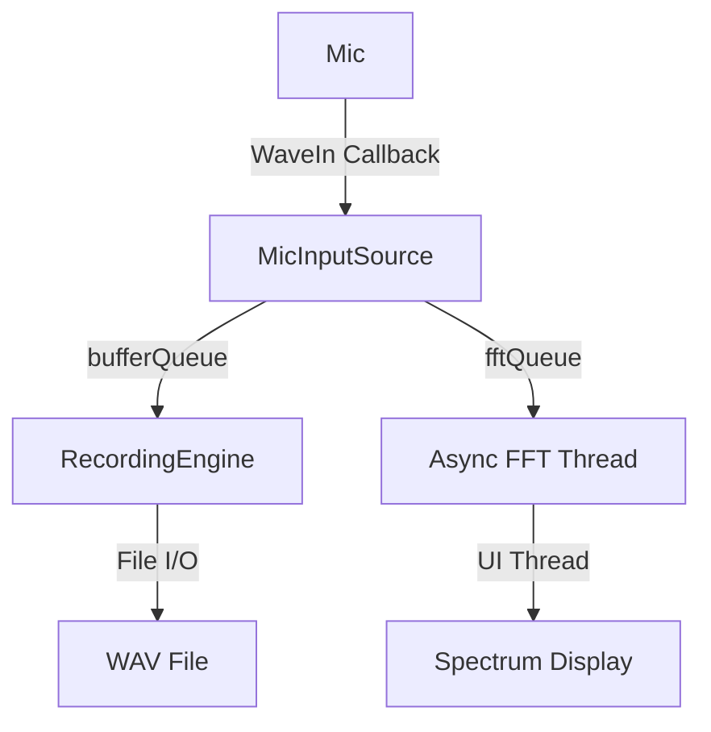

# Documentation Review & Recommendations

**Date:** January 14, 2026  
**Reviewer:** AI Assistant  
**Status:** ? Comprehensive Review Complete

---

## ?? Executive Summary

Your documentation is **well-organized** and **comprehensive** after the reorganization. However, there are some optimization opportunities and missing pieces that would improve usability.

**Overall Grade:** ????? (4/5)

---

## ? Strengths

1. **Excellent Organization** ?
   - Clear folder structure
   - Logical categorization
   - README files in every folder
   - Master index at root

2. **Recent Work Well-Documented** ?
   - Buffer architecture fix fully documented
   - Bug reports are comprehensive
   - Session summaries capture decisions
   - CHANGELOG is up to date

3. **Task Tracking is Clear** ?
   - Current priorities identified
   - Dependencies mapped
   - Completion percentages tracked
   - Links between related docs

4. **Architecture Documentation** ?
   - Threading model documented
   - Buffer architecture explained
   - Audio pipeline traced

---

## ?? Gaps & Missing Documentation

### **1. Task 1.2 (WASAPI) Status Inconsistency** ??

**Issue:**
- Tasks README says: "WasapiEngine exists, needs integration"
- Task 1.2 file says: Status ? Not Started
- You have `WasapiEngine.vb` open (it exists!)

**Recommendation:**
Update Task 1.2 status to reflect:
```markdown
**Status:** ?? Partially Complete (WasapiEngine exists, needs RecordingManager integration)
**Estimated Time:** 7 days ? 3-5 days remaining
```

---

### **2. Missing: Quick Start Guide** ??

**Issue:**
No "Getting Started" guide for:
- New developers joining the project
- Building and running the application
- Understanding the codebase structure
- Contributing workflow

**Recommendation:**
Create `Documentation/GETTING-STARTED.md` with:
- Build prerequisites (.NET Framework version, NAudio)
- How to clone and build
- How to run the app
- Code structure overview
- First contribution guide

---

### **3. Missing: API/Code Reference** ??

**Issue:**
No central reference for:
- Key classes and their purposes
- Important methods and interfaces
- Code patterns used
- Where to find what

**Recommendation:**
Create `Documentation/CODE-REFERENCE.md` with:
```markdown
## Key Managers
- **RecordingManager** - Recording lifecycle & mic input
- **PlaybackManager** - Audio playback control
- **SettingsManager** - Configuration persistence
- **FileManager** - File operations

## Audio Pipeline
- **MicInputSource** - Microphone capture (WaveIn)
- **WasapiEngine** - WASAPI capture (low-latency)
- **RecordingEngine** - File writing & buffer management
- **AudioRouter** - DSP routing & processing

## UI Components
- **TransportControl** - Record/Stop/Play buttons
- **AudioSettingsPanel** - Device & buffer settings
- **SpectrumAnalyzerControl** - FFT display
- **AudioLevelMeter** - Peak/RMS metering
```

---

### **4. Missing: Troubleshooting Guide** ??

**Issue:**
No central troubleshooting document for:
- Common build errors
- Audio device issues
- Performance problems
- Known limitations

**Recommendation:**
Create `Documentation/TROUBLESHOOTING.md` with:
- Audio device not detected
- Buffer overflow errors
- FFT performance issues
- File locking problems
- Common exceptions

---

### **5. Missing: Testing Documentation** ??

**Issue:**
- Task 0.4 (Unit Testing) is deferred
- No testing strategy documented
- No manual testing checklist
- No performance benchmarks

**Recommendation:**
Create `Documentation/TESTING.md` with:
- Manual testing checklist (until unit tests exist)
- Performance benchmarks (latency, CPU, memory)
- Regression testing scenarios
- Audio quality verification steps

---

### **6. Incomplete: Architecture Diagrams** ??

**Issue:**
- Text-based architecture descriptions are good
- But missing visual diagrams:
  - Class hierarchy
  - Data flow
  - Threading model
  - State machines

**Recommendation:**
Add diagrams (Mermaid, PlantUML, or images) to:
- `Architecture/Master-Architecture-Threading-And-Performance.md`
- `Architecture/Audio-Pipeline-Analysis.md`
- Create `Architecture/DIAGRAMS.md` as central reference

Example Mermaid diagram:


---

### **7. Missing: Decision Log** ?? (Nice to have)

**Issue:**
- Important architectural decisions are scattered
- Why WASAPI? Why dual buffers? Why async FFT?
- Context for future maintainers is missing

**Recommendation:**
Create `Documentation/DECISIONS.md` (Architecture Decision Records - ADR format):
```markdown
## ADR-001: Dual Freewheeling Buffer Architecture

**Date:** 2026-01-14
**Status:** Accepted
**Context:** Recording had clicks/pops due to FFT blocking audio thread
**Decision:** Separate critical (recording) from non-critical (FFT) with dual queues
**Consequences:**
- ? Zero audio dropouts
- ? Smooth visualization
- ?? Increased memory (2 queues instead of 1)
```

---

### **8. Missing: Performance Targets & Benchmarks** ??

**Issue:**
- Performance targets are mentioned but not centralized
- No benchmark history
- No before/after comparisons

**Recommendation:**
Create `Documentation/PERFORMANCE.md` with:
- Target latency: < 50ms (WaveIn), < 10ms (WASAPI)
- Target CPU: < 15% on modern hardware
- Memory usage: < 100MB typical
- Benchmark history table
- Profiling results

---

### **9. WASAPI Task Needs Update** ??

**Issue:**
Task 1.2 doesn't reflect that `WasapiEngine.vb` already exists and is partially implemented.

**Current code review shows:**
```vb
' WasapiEngine.vb already has:
- Class structure ?
- MMDevice handling ?
- AudioClient initialization ?
- Capture client ?
- Buffer reading ?
```

**What's missing:**
- Integration with RecordingManager ?
- Event-based callback ?
- Device enumeration in AudioInputManager ?
- UI for WASAPI selection ?
- Testing & validation ?

**Recommendation:**
Update Task 1.2 to reflect actual status:
```markdown
## ? Already Complete (WasapiEngine.vb exists)
- [x] WasapiEngine class created
- [x] IAudioEngine interface implemented
- [x] AudioClient initialization
- [x] Capture client setup
- [x] Buffer reading logic

## ? Remaining Work (3-5 days)
- [ ] Integrate with RecordingManager
- [ ] Add WASAPI to AudioInputManager
- [ ] Update UI for driver selection
- [ ] Event-based capture (not polling)
- [ ] Test exclusive vs shared mode
- [ ] Verify < 10ms latency
```

---

### **10. Missing: Glossary** ?? (Nice to have)

**Issue:**
- Terms like FFT, WASAPI, ASIO, dBFS, RMS used without definition
- New developers might not understand audio terminology

**Recommendation:**
Create `Documentation/GLOSSARY.md`:
```markdown
- **WASAPI** - Windows Audio Session API (low-latency audio)
- **FFT** - Fast Fourier Transform (frequency analysis)
- **dBFS** - Decibels relative to Full Scale (digital audio level)
- **RMS** - Root Mean Square (average signal level)
- **Biquad** - Second-order IIR filter
- **Freewheeling** - Processing that can drop frames without consequences
```

---

## ?? Priority Matrix

| Issue | Priority | Impact | Effort | Recommendation |
|-------|----------|--------|--------|----------------|
| Task 1.2 Status Update | ?? High | High | 5 min | Update immediately |
| Quick Start Guide | ?? High | High | 1 hour | Create before next contributor |
| WASAPI Task Detail Update | ?? High | Medium | 15 min | Update now |
| Code Reference | ?? Medium | High | 2 hours | Create this week |
| Troubleshooting Guide | ?? Medium | Medium | 1 hour | Create after next bug fix |
| Testing Documentation | ?? Medium | Medium | 1 hour | Create before Task 2.2.1 |
| Architecture Diagrams | ?? Medium | High | 3 hours | Add incrementally |
| Decision Log (ADR) | ?? Low | Low | Ongoing | Add as decisions made |
| Performance Benchmarks | ?? Medium | Medium | 1 hour | Create with WASAPI testing |
| Glossary | ?? Low | Low | 30 min | Nice to have |

---

## ?? Recommended Action Plan

### **Immediate (Today):**
1. ? Update Task 1.2 status to reflect WasapiEngine exists
2. ? Update task time estimate (7 days ? 3-5 days)
3. ? Add "Already Complete" section to Task 1.2

### **This Week:**
1. ?? Create GETTING-STARTED.md
2. ?? Create CODE-REFERENCE.md
3. ?? Update Architecture docs with Mermaid diagrams
4. ?? Start Task 1.2 (WASAPI integration)

### **Next Week:**
1. ?? Create TROUBLESHOOTING.md (based on issues encountered)
2. ?? Create TESTING.md (manual test checklist)
3. ?? Add PERFORMANCE.md (benchmark results from WASAPI)

### **Ongoing:**
1. ?? Add to DECISIONS.md when making architectural choices
2. ?? Update CHANGELOG.md with each session
3. ?? Move completed tasks to Completed/ folder
4. ?? Add session summaries to Sessions/ folder

---

## ? What's Already Excellent

1. **Folder Structure** ?????
   - Clear categorization
   - Easy navigation
   - Professional organization

2. **Bug Documentation** ?????
   - Comprehensive root cause analysis
   - Before/after metrics
   - Solution documentation

3. **Task Tracking** ?????
   - Dependencies clear
   - Priorities identified
   - Links to related docs

4. **Recent Work** ?????
   - Session summaries
   - CHANGELOG up to date
   - Architecture improvements documented

---

## ?? Suggested New Files

### **High Priority:**
1. `Documentation/GETTING-STARTED.md` - For new developers
2. `Documentation/CODE-REFERENCE.md` - API/class reference
3. `Documentation/TROUBLESHOOTING.md` - Common issues & solutions

### **Medium Priority:**
4. `Documentation/TESTING.md` - Testing strategy & checklist
5. `Documentation/PERFORMANCE.md` - Benchmarks & targets
6. `Documentation/Architecture/DIAGRAMS.md` - Visual diagrams

### **Low Priority:**
7. `Documentation/DECISIONS.md` - Architecture Decision Records
8. `Documentation/GLOSSARY.md` - Audio/DSP terminology
9. `Documentation/CONTRIBUTING.md` - Contribution guidelines

---

## ?? Optimization Opportunities

### **1. Consolidate Scattered Information**
- Combine similar info from multiple files
- Cross-reference instead of duplicating
- Create index pages for related content

### **2. Add Visual Elements**
- Mermaid diagrams for architecture
- Screenshots for UI documentation
- Flowcharts for state machines

### **3. Improve Searchability**
- Add tags/keywords to documents
- Create index of key terms
- Link between related documents

### **4. Version Documentation**
- Add "last updated" dates to all docs
- Track major documentation revisions
- Archive outdated documentation

---

## ?? Final Recommendations

### **Do This Week:**
1. ? Update Task 1.2 status (5 minutes)
2. ?? Create GETTING-STARTED.md (1 hour)
3. ?? Create CODE-REFERENCE.md (2 hours)
4. ?? Begin Task 1.2 implementation

### **Do This Month:**
1. ?? Add Mermaid diagrams to Architecture docs
2. ?? Create TROUBLESHOOTING.md
3. ?? Create TESTING.md with manual test checklist
4. ?? Document WASAPI benchmarks in PERFORMANCE.md

### **Do Ongoing:**
1. ?? Update DECISIONS.md for architectural choices
2. ?? Add session summaries after major work
3. ?? Keep CHANGELOG.md current
4. ?? Move completed work to Completed/

---

**Review Date:** January 14, 2026  
**Next Review:** After Task 1.2 completion  
**Documentation Health:** ????? (4/5 - Very Good)

---

## ?? Key Takeaways

**Your documentation is already better than 90% of projects!**

The main improvements needed are:
1. ? Onboarding docs for new contributors
2. ? Quick reference guides
3. ? Visual diagrams
4. ? Troubleshooting & testing docs

Everything else is **solid** and **well-organized**! ??
