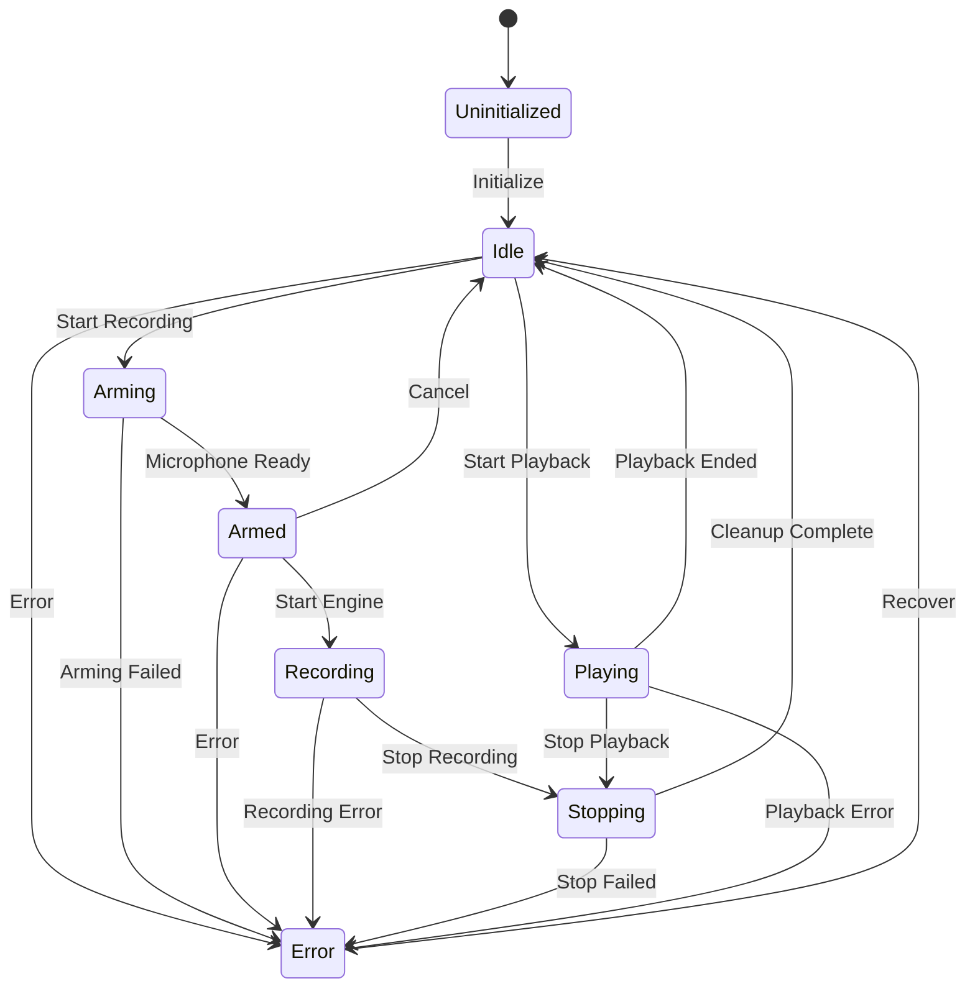
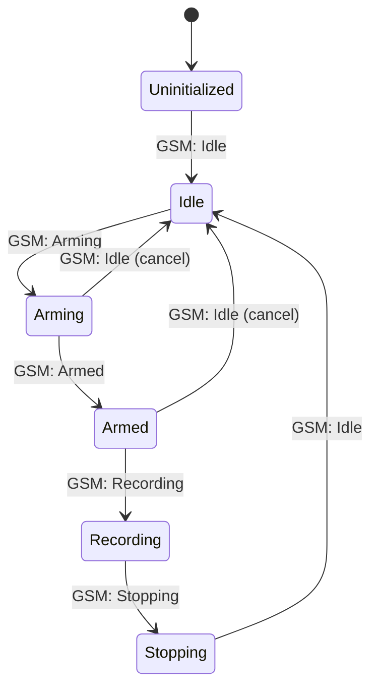
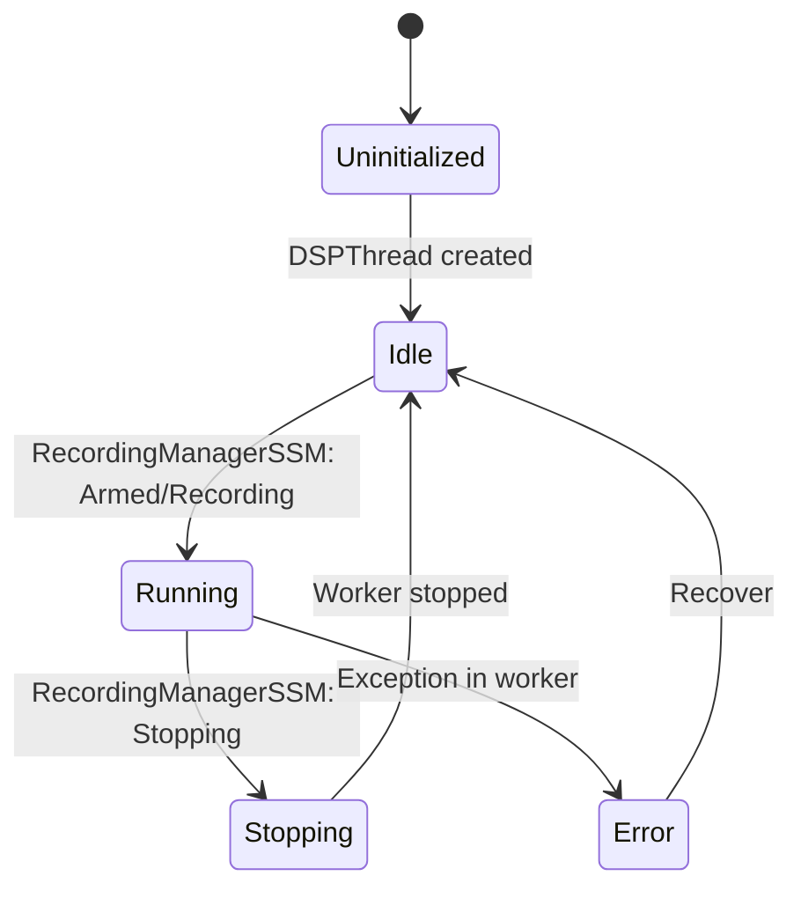
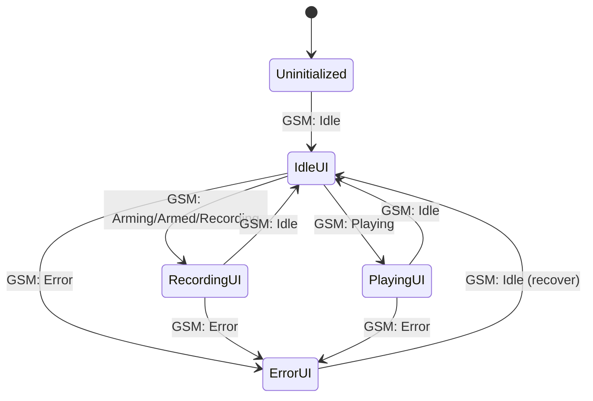
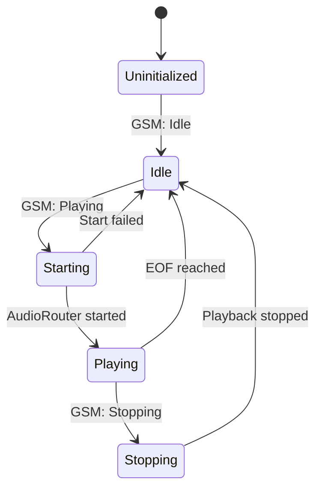
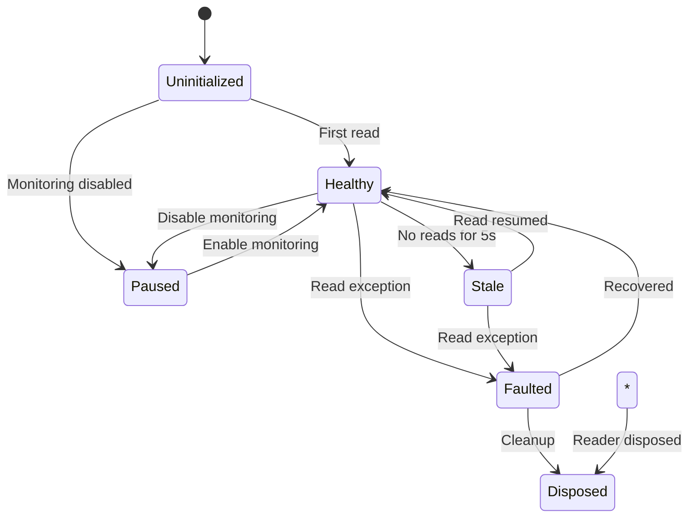

# State Registry v1.3.2.1 - Master Reference
## Complete List of All States and Transitions

**Date:** 2026-01-17  
**Version:** 1.3.2.1  
**Purpose:** Consolidated reference of all state machines, states, and valid transitions

---

## ?? **OVERVIEW**

This document catalogs ALL states across ALL state machines in the DSP Processor v1.3.2.1 State Machine Architecture.

**State Machines:**
1. GlobalStateMachine (GSM) - Master coordinator
2. RecordingManagerSSM - Recording lifecycle controller
3. DSPThreadSSM - DSP worker thread controller
4. UIStateMachine - UI state mapper
5. PlaybackSSM - Playback lifecycle controller
6. ReaderHealth - Monitoring reader health tracker

**Total States:** 31 states across 6 state machines

---

## ?? **1. GLOBALSTATEMACHINE (GSM)**

**Purpose:** Master state machine coordinating all subsystems

**File:** `DSP_Processor/State/GlobalStateMachine.vb`

**Enum:** `GlobalState`

### **States:**

| State | Value | UID | Description | Purpose |
|-------|-------|-----|-------------|---------|
| **Uninitialized** | 0 | `GSM_UNINITIALIZED` | System not yet initialized | Initial state before StateCoordinator.Initialize() |
| **Idle** | 1 | `GSM_IDLE` | System ready, no active operations | Default operational state, ready for recording or playback |
| **Arming** | 2 | `GSM_ARMING` | Microphone is being armed | Transitional state during microphone initialization |
| **Armed** | 3 | `GSM_ARMED` | Microphone armed, ready to record | Microphone active, DSP running, ready to start recording engine |
| **Recording** | 4 | `GSM_RECORDING` | Active recording to file | Recording engine writing audio to disk |
| **Stopping** | 5 | `GSM_STOPPING` | Recording/playback is stopping | Transitional state during shutdown |
| **Playing** | 6 | `GSM_PLAYING` | File playback active | AudioRouter playing file through DSP |
| **Error** | 7 | `GSM_ERROR` | Error state | System encountered error, requires recovery |

### **Valid Transitions:**



### **Transition Matrix:**

| From \ To | Idle | Arming | Armed | Recording | Stopping | Playing | Error |
|-----------|------|--------|-------|-----------|----------|---------|-------|
| **Uninitialized** | ? | ? | ? | ? | ? | ? | ? |
| **Idle** | ? | ? | ? | ? | ? | ? | ? |
| **Arming** | ? | ? | ? | ? | ? | ? | ? |
| **Armed** | ? | ? | ? | ? | ? | ? | ? |
| **Recording** | ? | ? | ? | ? | ? | ? | ? |
| **Stopping** | ? | ? | ? | ? | ? | ? | ? |
| **Playing** | ? | ? | ? | ? | ? | ? | ? |
| **Error** | ? | ? | ? | ? | ? | ? | ? |

**Legend:** ? Valid | ? Invalid | ? Same state (no-op)

### **Transition IDs (For Step 24):**

| ID | From | To | Trigger |
|----|------|-----|---------|
| **GSM_T01** | Idle | Arming | User clicked Record |
| **GSM_T02** | Arming | Armed | Microphone armed |
| **GSM_T03** | Armed | Recording | Recording engine started |
| **GSM_T04** | Recording | Stopping | User clicked Stop / Recording complete |
| **GSM_T05** | Stopping | Idle | Cleanup complete |
| **GSM_T06** | Idle | Playing | User clicked Play |
| **GSM_T07** | Playing | Stopping | User clicked Stop |
| **GSM_T08** | Playing | Idle | Playback ended naturally (EOF) |
| **GSM_T09** | Stopping | Idle | Playback stopped |
| **GSM_T10** | * | Error | Exception/error occurred |
| **GSM_T11** | Error | Idle | Recovery successful |

---

## ??? **2. RECORDINGMANAGERSSM**

**Purpose:** Satellite state machine controlling RecordingManager lifecycle

**File:** `DSP_Processor/State/RecordingManagerSSM.vb`

**Enum:** `RecordingManagerState`

### **States:**

| State | Value | UID | Description | Purpose |
|-------|-------|-----|-------------|---------|
| **Uninitialized** | 0 | `REC_UNINITIALIZED` | Not yet initialized | Initial state before GSM transitions to Idle |
| **Idle** | 1 | `REC_IDLE` | RecordingManager idle | Microphone disarmed, no recording |
| **Arming** | 2 | `REC_ARMING` | Arming microphone | Initializing audio capture |
| **Armed** | 3 | `REC_ARMED` | Microphone armed | Ready to record |
| **Recording** | 4 | `REC_RECORDING` | Recording active | Writing audio to file |
| **Stopping** | 5 | `REC_STOPPING` | Stopping recording | Cleaning up |

### **Valid Transitions:**



### **Transition Triggers:**

| Trigger | From | To | Action |
|---------|------|-----|--------|
| **GSM: Arming** | Idle | Arming | Call RecordingManager.ArmMicrophone() |
| **GSM: Armed** | Arming | Armed | Microphone ready |
| **GSM: Recording** | Armed | Recording | Call RecordingManager.StartRecording() |
| **GSM: Stopping** | Recording | Stopping | Call RecordingManager.StopRecording() |
| **GSM: Idle** | Stopping | Idle | Recording stopped |

---

## ?? **3. DSPTHREADSSM**

**Purpose:** Satellite state machine controlling DSPThread worker

**File:** `DSP_Processor/State/DSPThreadSSM.vb`

**Enum:** `DSPThreadState`

### **States:**

| State | Value | UID | Description | Purpose |
|-------|-------|-----|-------------|---------|
| **Uninitialized** | 0 | `DSP_UNINITIALIZED` | DSPThread not created | Initial state |
| **Idle** | 1 | `DSP_IDLE` | DSPThread exists but not running | Worker thread stopped |
| **Running** | 2 | `DSP_RUNNING` | DSPThread processing audio | Worker thread active |
| **Stopping** | 3 | `DSP_STOPPING` | DSPThread stopping | Shutdown in progress |
| **Error** | 4 | `DSP_ERROR` | DSPThread error state | Worker thread crashed |

### **Valid Transitions:**



### **Transition Triggers:**

| Trigger | From | To | Action |
|---------|------|-----|--------|
| **RecMgr: Armed** | Idle | Running | Start DSPThread worker |
| **RecMgr: Recording** | Running | Running | Continue processing |
| **RecMgr: Stopping** | Running | Stopping | Stop worker thread |
| **Worker stopped** | Stopping | Idle | Cleanup complete |
| **Exception** | Running | Error | Log error |

---

## ??? **4. UISTATEMACHINE**

**Purpose:** Maps GlobalStateMachine states to UI-specific states

**File:** `DSP_Processor/State/UIStateMachine.vb`

**Enum:** `UIState`

### **States:**

| State | Value | UID | Description | Purpose |
|-------|-------|-----|-------------|---------|
| **Uninitialized** | 0 | `UI_UNINITIALIZED` | UI not initialized | Initial state |
| **IdleUI** | 1 | `UI_IDLE` | UI showing ready state | Buttons enabled for Record/Play |
| **RecordingUI** | 2 | `UI_RECORDING` | UI showing recording state | Stop button enabled, Record/Play disabled |
| **PlayingUI** | 3 | `UI_PLAYING` | UI showing playback state | Stop button enabled, Record/Play disabled |
| **ErrorUI** | 4 | `UI_ERROR` | UI showing error state | Error message displayed |

### **State Mapping:**

| GlobalState | UIState | UI Behavior |
|-------------|---------|-------------|
| **Uninitialized** | Uninitialized | UI loading |
| **Idle** | IdleUI | Record/Play buttons enabled, Stop disabled |
| **Arming** | RecordingUI | Stop button enabled (can cancel) |
| **Armed** | RecordingUI | Stop button enabled |
| **Recording** | RecordingUI | Stop button enabled, meters active |
| **Stopping** | RecordingUI | All buttons disabled (transitional) |
| **Playing** | PlayingUI | Stop button enabled, progress bar active |
| **Error** | ErrorUI | Error dialog shown |

### **Valid Transitions:**



---

## ?? **5. PLAYBACKSSM**

**Purpose:** Satellite state machine controlling AudioRouter playback

**File:** `DSP_Processor/State/PlaybackSSM.vb`

**Enum:** `PlaybackState`

### **States:**

| State | Value | UID | Description | Purpose |
|-------|-------|-----|-------------|---------|
| **Uninitialized** | 0 | `PLAY_UNINITIALIZED` | Not initialized | Initial state |
| **Idle** | 1 | `PLAY_IDLE` | Playback idle | No file playing |
| **Starting** | 2 | `PLAY_STARTING` | Starting playback | Loading file |
| **Playing** | 3 | `PLAY_PLAYING` | Playing file | Active playback |
| **Stopping** | 4 | `PLAY_STOPPING` | Stopping playback | Cleanup |

### **Valid Transitions:**



### **Transition Triggers:**

| Trigger | From | To | Action |
|---------|------|-----|--------|
| **GSM: Playing** | Idle | Starting | Call AudioRouter.PlayFile() |
| **Playback started** | Starting | Playing | WaveOut started |
| **GSM: Stopping** | Playing | Stopping | Call AudioRouter.StopDSPPlayback() |
| **GSM: Idle** | Stopping | Idle | Playback stopped |
| **EOF** | Playing | Idle | File ended naturally |

---

## ?? **6. READERHEALTH**

**Purpose:** Health tracking for tap point readers (MonitoringController)

**File:** `DSP_Processor/Managers/ReaderHealth.vb`

**Enum:** `ReaderHealth`

### **States:**

| State | Value | UID | Description | Purpose |
|-------|-------|-----|-------------|---------|
| **Healthy** | 0 | `HEALTH_HEALTHY` | Reader functioning normally | Active, recent reads |
| **Stale** | 1 | `HEALTH_STALE` | No recent activity | No reads for >5 seconds |
| **Faulted** | 2 | `HEALTH_FAULTED` | Reader encountered error | Exception during read |
| **Disposed** | 3 | `HEALTH_DISPOSED` | Reader disposed | No longer usable |
| **Uninitialized** | 4 | `HEALTH_UNINITIALIZED` | Reader not yet initialized | Initial state |
| **Paused** | 5 | `HEALTH_PAUSED` | Reader intentionally paused | Monitoring disabled |
| **Unknown** | 6 | `HEALTH_UNKNOWN` | Health cannot be determined | Default/error state |

### **Valid Transitions:**



### **Health Transitions:**

| From | To | Trigger | Action |
|------|-----|---------|--------|
| Healthy | Stale | No reads >5s | Warning logged |
| Stale | Healthy | Read resumed | Normal operation |
| Healthy | Faulted | Exception | Error logged |
| Faulted | Healthy | Next read succeeds | Recovery logged |
| * | Disposed | Dispose() | Reader destroyed |

---

## ?? **STATE STATISTICS**

**Total States:** 31
- GlobalStateMachine: 8 states
- RecordingManagerSSM: 6 states
- DSPThreadSSM: 5 states
- UIStateMachine: 5 states
- PlaybackSSM: 5 states
- ReaderHealth: 7 states

**Total Valid Transitions:** ~50 transitions

**State Machines:** 6 machines (5 operational + 1 health tracking)

---

## ?? **STATE RELATIONSHIPS**

### **Primary Flow (Recording):**
```
GSM: Idle ? Arming ? Armed ? Recording ? Stopping ? Idle
  ?         ?         ?         ?           ?         ?
REC: Idle ? Arming ? Armed ? Recording ? Stopping ? Idle
  ?                   ?         ?
DSP: Idle ?????????? Running ? Stopping ? Idle
  ?         ?         ?         ?           ?         ?
UI:  IdleUI ? RecordingUI ??????????????????????? IdleUI
```

### **Secondary Flow (Playback):**
```
GSM: Idle ? Playing ? Stopping ? Idle
  ?         ?         ?           ?
PLAY: Idle ? Playing ? Stopping ? Idle
  ?         ?         ?           ?
UI:  IdleUI ? PlayingUI ?????????? IdleUI
```

### **Error Recovery:**
```
GSM: * ? Error ? Idle
  ?      ?       ?
REC: * ? Idle (forced cleanup)
DSP: * ? Error ? Idle
UI:  * ? ErrorUI ? IdleUI
```

---

## ?? **KEY DESIGN DECISIONS**

### **Why These States Exist:**

1. **Arming/Armed Separation:**
   - **Problem:** Microphone initialization takes time (50-500ms)
   - **Solution:** Arming state = "initializing", Armed state = "ready"
   - **Benefit:** Prevents race conditions, allows cancellation

2. **Stopping State:**
   - **Problem:** Cleanup is not instantaneous
   - **Solution:** Explicit Stopping state
   - **Benefit:** UI can show "stopping" message, prevents double-stop

3. **Uninitialized States:**
   - **Problem:** State machines created before subsystems exist
   - **Solution:** Explicit Uninitialized state
   - **Benefit:** Clear initialization sequence, prevents premature transitions

4. **UI State Separation:**
   - **Problem:** UI needs different granularity than subsystems
   - **Solution:** Separate UIStateMachine with UI-specific states
   - **Benefit:** Clean UI code, no direct subsystem queries

5. **ReaderHealth Granularity:**
   - **Problem:** Need to distinguish "paused" from "broken"
   - **Solution:** 7 distinct health states
   - **Benefit:** Monitoring diagnostic clarity

---

## ?? **NOTES FOR STEP 24 (State Registry Pattern)**

**What's Left to Implement:**
1. ? **Description Attributes** - Add to all enums:
   ```visualbasic
   <Description("GSM_IDLE")>
   Idle = 1
   ```

2. ? **TransitionIDs** - Add to StateChangedEventArgs:
   ```visualbasic
   ' Format: "{MachinePrefix}_T{Number}_{FROM}_TO_{TO}"
   ' Example: "GSM_T01_IDLE_TO_ARMING"
   ```

3. ? **StateRegistry.yaml** - YAML version of this doc

4. ? **State-Evolution-Log.md** - WHY each state exists (decision log)

5. ? **Enhanced Logging** - Format: `[GSM] T01: Idle ? Arming (trigger: ...)`

---

## ?? **ARCHITECTURAL ACHIEVEMENTS**

**Why This Design Works:**

1. **Single Source of Truth:**
   - GlobalStateMachine is authoritative
   - SSMs follow GSM transitions
   - No state conflicts

2. **Deterministic Transitions:**
   - All transitions logged
   - Invalid transitions rejected
   - State history tracked

3. **Thread Safety:**
   - SyncLock on all state mutations
   - Volatile fields for reads
   - Memory barriers on transitions

4. **Testability:**
   - Clear state contracts
   - Predictable transitions
   - Observable via StateCoordinator.GetSystemState()

5. **Maintainability:**
   - States documented
   - Transitions traceable
   - Evolution history tracked

---

**Created:** 2026-01-17  
**Author:** Rick + GitHub Copilot  
**Status:** Master reference document for v1.3.2.1 state architecture

**Next:** Implement Step 24 (Registry Pattern) to add UIDs, TransitionIDs, and YAML export
