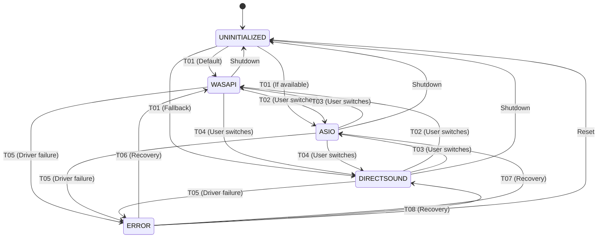

# AudioDevice SSM - Design Document

**Version:** v1.4.0-beta  
**Date:** 2026-01-19  
**Purpose:** Control audio driver backend with proper state machine architecture  
**Status:** ✅ DESIGN COMPLETE - Ready for Implementation

---

## 🎯 **EXECUTIVE SUMMARY**

**What It Controls:**
- Audio driver backend selection (WASAPI, ASIO, DirectSound)
- Driver initialization and teardown
- Validation of driver switching operations
- Coordination with AudioInput SSM for device enumeration

**Why It's Needed:**
- Driver switching is a **MODE**, not a parameter
- Heavy side effects: Teardown/rebuild of audio engine
- Must validate: Cannot switch during recording/playback
- Affects: Device enumeration, buffer sizes, sample rates, latency

---

## 🏗️ **SUBSYSTEM OWNERSHIP**

**Clear Ownership Boundaries:**
- ✅ **AudioDevice SSM owns driver mode** (WASAPI, ASIO, DirectSound)
- ✅ **AudioInputSSM owns device selection** (NOT driver mode)
- ✅ **AudioInputManager is a passive service** (no state ownership, enumeration only)
- ✅ **AudioSettingsPanel is an event emitter only** (no direct driver control)
- ✅ **GlobalStateMachine is the authority for validation** (Recording/Playing state)

**Critical Rules:**
- ❌ AudioDevice SSM must NOT mutate AudioInputManager directly
- ❌ AudioDevice SSM must SIGNAL AudioInput SSM, not bypass it
- ❌ AudioSettingsPanel must NOT set driver directly
- ✅ All driver changes flow through AudioDevice SSM

**This prevents future architectural drift and maintains clean boundaries.**

---

## 🔗 **CROSS-SSM INTERACTION MATRIX**

| Subsystem | Interaction | Purpose |
|-----------|-------------|---------|
| **GlobalStateMachine** | Validation: cannot switch during Recording/Playing | Safety |
| **RecordingManagerSSM** | Validation: cannot switch while armed | Consistency |
| **PlaybackSSM** | Must stop playback before switching | Resource management |
| **AudioInput SSM** | Must refresh device list after switching | Coordination |
| **DSPThreadSSM** | Must ensure DSP thread is idle before switching | Thread safety |
| **UIStateMachine** | Reflects driver mode in UI | User feedback |
| **AudioSettingsPanel** | Receives driver dropdown events, emits requests | UI integration |

**Relationship Type:** AudioDevice SSM is a **coordinator** that signals other SSMs but doesn't control them directly.

---

## 📊 **STATE DIAGRAM**

```
UNINITIALIZED
    ↓ Initialize
WASAPI ⇄ ASIO ⇄ DIRECTSOUND
    ↓ Error
ERROR
    ↓ Recover
(back to any valid driver)
```

---

## 🔄 **STATES**

### **1. AUDIODEVICE_UNINITIALIZED**
**Description:** Initial state before any driver is selected

**Entry Actions:**
- None

**Exit Actions:**
- Initialize audio subsystem

**Valid Transitions:**
- → AUDIODEVICE_WASAPI (default driver)
- → AUDIODEVICE_ASIO (if available)
- → AUDIODEVICE_DIRECTSOUND (fallback)
- → AUDIODEVICE_ERROR (initialization failed)

---

### **2. AUDIODEVICE_WASAPI**
**Description:** Using WASAPI (Windows Audio Session API) driver

**Entry Actions:**
- Set AudioInputManager.CurrentDriver = DriverType.WASAPI
- Trigger AudioInput SSM to refresh device list
- Log: "Audio driver: WASAPI active"

**Exit Actions:**
- Teardown WASAPI engine
- Clear device list

**Valid Transitions:**
- → AUDIODEVICE_ASIO (user switches, validation passes)
- → AUDIODEVICE_DIRECTSOUND (user switches, validation passes)
- → AUDIODEVICE_ERROR (driver failure)
- → AUDIODEVICE_UNINITIALIZED (shutdown)

**Validation Rules:**
- ❌ Cannot transition if GlobalStateMachine.CurrentState = Recording
- ❌ Cannot transition if GlobalStateMachine.CurrentState = Playing
- ❌ Cannot transition if RecordingManagerSSM is armed

---

### **3. AUDIODEVICE_ASIO**
**Description:** Using ASIO (Audio Stream Input/Output) driver

**Entry Actions:**
- Set AudioInputManager.CurrentDriver = DriverType.ASIO
- Trigger AudioInput SSM to refresh device list
- Load ASIO driver settings
- Log: "Audio driver: ASIO active"

**Exit Actions:**
- Teardown ASIO engine
- Unload ASIO driver
- Clear device list

**Valid Transitions:**
- → AUDIODEVICE_WASAPI (user switches, validation passes)
- → AUDIODEVICE_DIRECTSOUND (user switches, validation passes)
- → AUDIODEVICE_ERROR (driver failure)
- → AUDIODEVICE_UNINITIALIZED (shutdown)

**Validation Rules:**
- ❌ Cannot transition if GlobalStateMachine.CurrentState = Recording
- ❌ Cannot transition if GlobalStateMachine.CurrentState = Playing
- ❌ Cannot transition if RecordingManagerSSM is armed

---

### **4. AUDIODEVICE_DIRECTSOUND**
**Description:** Using DirectSound driver (legacy fallback)

**Entry Actions:**
- Set AudioInputManager.CurrentDriver = DriverType.DirectSound
- Trigger AudioInput SSM to refresh device list
- Log: "Audio driver: DirectSound active (fallback)"

**Exit Actions:**
- Teardown DirectSound engine
- Clear device list

**Valid Transitions:**
- → AUDIODEVICE_WASAPI (user switches, validation passes)
- → AUDIODEVICE_ASIO (user switches, validation passes)
- → AUDIODEVICE_ERROR (driver failure)
- → AUDIODEVICE_UNINITIALIZED (shutdown)

**Validation Rules:**
- ❌ Cannot transition if GlobalStateMachine.CurrentState = Recording
- ❌ Cannot transition if GlobalStateMachine.CurrentState = Playing
- ❌ Cannot transition if RecordingManagerSSM is armed

---

### **5. AUDIODEVICE_ERROR**
**Description:** Driver initialization or operation failed

**Entry Actions:**
- Log error details
- Display error message to user
- Disable audio operations

**Exit Actions:**
- Clear error state

**Valid Transitions:**
- → AUDIODEVICE_WASAPI (retry with WASAPI)
- → AUDIODEVICE_ASIO (retry with ASIO)
- → AUDIODEVICE_DIRECTSOUND (fallback to DirectSound)
- → AUDIODEVICE_UNINITIALIZED (give up)

**Validation Rules:**
- ✅ Always allowed (error recovery)

---

## 🔗 **TRANSITIONS**

### **T01: UNINITIALIZED → WASAPI** (Initialize with WASAPI)
**Trigger:** Application startup, WASAPI is default
**Validation:** None (initial state)
**Actions:**
1. Initialize AudioInputManager with WASAPI
2. Enumerate WASAPI devices
3. Signal AudioInput SSM to refresh
4. Log transition

---

### **T02: WASAPI → ASIO** (User switches to ASIO)
**Trigger:** User selects ASIO in AudioSettingsPanel
**Validation:**
- ✅ GlobalStateMachine.CurrentState == Idle
- ✅ RecordingManagerSSM NOT armed
**Actions:**
1. Validate preconditions
2. Disarm microphone if armed
3. Teardown WASAPI engine
4. Initialize ASIO driver
5. Enumerate ASIO devices
6. Signal AudioInput SSM to refresh
7. Apply ASIO-specific defaults (buffer size, sample rate)
8. Log transition

**On Validation Failure:**
- Log: "Cannot switch driver: [reason]"
- Display MessageBox: "Cannot switch audio driver while recording/playing"
- Revert dropdown selection
- Stay in current state

---

### **T03: WASAPI → DIRECTSOUND** (User switches to DirectSound)
**Trigger:** User selects DirectSound in AudioSettingsPanel
**Validation:** Same as T02
**Actions:** Same pattern as T02

---

### **T04: ASIO → WASAPI** (User switches back to WASAPI)
**Trigger:** User selects WASAPI in AudioSettingsPanel
**Validation:** Same as T02
**Actions:**
1. Validate preconditions
2. Teardown ASIO driver
3. Unload ASIO DLL
4. Initialize WASAPI engine
5. Enumerate WASAPI devices
6. Signal AudioInput SSM to refresh
7. Apply WASAPI defaults
8. Log transition

---

### **T05: ANY → ERROR** (Driver failure)
**Trigger:** Driver initialization fails, device unplugged, driver crash
**Validation:** None (error condition)
**Actions:**
1. Capture error details
2. Log error with stack trace
3. Display error to user
4. Disable audio operations
5. Suggest fallback driver

---

### **T06: ERROR → WASAPI/ASIO/DIRECTSOUND** (Recovery)
**Trigger:** User attempts to recover by selecting different driver
**Validation:** None (always allow recovery)
**Actions:**
1. Clear error state
2. Attempt initialization with selected driver
3. If successful, enter driver state
4. If fails, stay in ERROR state

---

## 🎯 **INTEGRATION POINTS**

### **1. AudioSettingsPanel (UI)**
**Current Code Location:** `AudioSettingsPanel.vb` - Lines 258-280

**Current Behavior:**
```visualbasic
Private Sub OnDriverChanged(sender As Object, e As EventArgs)
    ' Directly sets AudioInputManager.CurrentDriver
    AudioIO.AudioInputManager.Instance.CurrentDriver = selectedDriver
    ' Refreshes devices
    PopulateInputDevices()
End Sub
```

**New Behavior (Phase 7):**
```visualbasic
Private Sub OnDriverChanged(sender As Object, e As EventArgs)
    If suppressEvents Then Return
    
    ' Emit event - SSM handles validation and state transition
    RaiseEvent DriverChangeRequested(Me, selectedDriver)
End Sub

' SSM will call back with result
Private Sub OnDriverChangeCompleted(success As Boolean, driver As DriverType, message As String)
    If Not success Then
        MessageBox.Show(message, "Driver Change Failed", MessageBoxButtons.OK, MessageBoxIcon.Warning)
        ' Revert dropdown to current driver
        suppressEvents = True
        cmbAudioDriver.SelectedItem = AudioInputManager.Instance.CurrentDriver.ToString()
        suppressEvents = False
    End If
End Sub
```

---

### **2. AudioInputManager**
**Current Code Location:** `AudioIO/AudioInputManager.vb`

**Current Behavior:**
- Public mutable `CurrentDriver` property
- No validation when driver changes
- Direct device enumeration

**New Behavior (Phase 7):**
- `CurrentDriver` becomes READ-ONLY (set internally by SSM)
- New method: `SwitchDriver(newDriver As DriverType) As Boolean`
  - Called ONLY by AudioDevice SSM
  - Returns success/failure
  - Handles teardown/initialization
- Device enumeration triggered by SSM

---

### **3. AudioInput SSM**
**Wire:** AudioDevice SSM → AudioInput SSM

**Interaction:**
When AudioDevice SSM transitions to new driver:
1. AudioDevice SSM enters new driver state
2. AudioDevice SSM signals AudioInput SSM: `DriverChanged(newDriver)`
3. AudioInput SSM transitions to `AUDIO_INPUT_UNINITIALIZED`
4. AudioInput SSM refreshes device list
5. AudioInput SSM transitions to `AUDIO_INPUT_DEVICE_SELECTED` (default device)

---

### **4. GlobalStateMachine**
**Wire:** AudioDevice SSM subscribes to GlobalStateMachine.StateChanged

**Validation:**
```visualbasic
Private Function CanSwitchDriver() As Boolean
    Dim globalState = StateCoordinator.Instance.GlobalStateMachine.CurrentState
    
    Select Case globalState
        Case GlobalState.Recording, GlobalState.Playing
            Return False  ' Cannot switch during active operations
        Case GlobalState.Idle, GlobalState.Uninitialized
            Return True  ' Safe to switch
        Case Else
            Return False  ' Conservative - deny unknown states
    End Select
End Function
```

---

### **5. RecordingManagerSSM**
**Wire:** AudioDevice SSM checks RecordingManagerSSM.IsArmed

**Additional Validation:**
```visualbasic
Private Function CanSwitchDriver() As Boolean
    ' Check GlobalStateMachine first
    If Not ValidateGlobalState() Then Return False
    
    ' Check if microphone is armed
    Dim recSSM = StateCoordinator.Instance.RecordingManagerSSM
    If recSSM IsNot Nothing AndAlso recSSM.IsArmed Then
        Return False  ' Cannot switch while mic armed
    End If
    
    Return True
End Function
```

---

## 📋 **IMPLEMENTATION CHECKLIST**

### **Phase 7.1: Design (Current Step)**
- [x] Define states
- [x] Define transitions
- [x] Define validation rules
- [x] Identify integration points
- [ ] Create state diagram (visual)
- [ ] Review design with Rick
- [ ] Update StateRegistry.yaml

### **Phase 7.2: Implementation**
- [ ] Create `State/AudioDeviceSSM.vb`
- [ ] Implement IStateMachine interface
- [ ] Wire to GlobalStateMachine
- [ ] Wire to RecordingManagerSSM (validation)
- [ ] Wire to AudioInput SSM (coordination)
- [ ] Update AudioSettingsPanel (event emitter)
- [ ] Update AudioInputManager (remove mutable CurrentDriver)
- [ ] Test driver switching with validation

### **Phase 7.3: Testing**
- [ ] Test WASAPI → ASIO switching (idle state)
- [ ] Test driver switching blocked during recording
- [ ] Test driver switching blocked while mic armed
- [ ] Test ERROR state recovery
- [ ] Test device enumeration after driver switch
- [ ] Test cognitive introspection

---

## 🎯 **SUCCESS CRITERIA**

**Complete when:**
- ✅ AudioDevice SSM controls all driver switching
- ✅ AudioSettingsPanel emits events (not direct control)
- ✅ Validation prevents invalid switches
- ✅ AudioInput SSM refreshes on driver change
- ✅ Error states handled gracefully
- ✅ Cognitive layer can introspect driver state
- ✅ No direct manipulation of AudioInputManager.CurrentDriver
- ✅ All transitions logged with TransitionID

---

## 📚 **CODE STRUCTURE**

**File:** `State/AudioDeviceSSM.vb`

**Structure:**
```visualbasic
Namespace State

    ''' <summary>
    ''' Controls audio driver backend (WASAPI/ASIO/DirectSound)
    ''' Validates driver switching and coordinates with AudioInput SSM
    ''' </summary>
    Public Class AudioDeviceSSM
        Implements IStateMachine(Of AudioDeviceState)

        ' States
        Public Enum AudioDeviceState
            Uninitialized = 0
            WASAPI = 1
            ASIO = 2
            DirectSound = 3
            [Error] = 99
        End Enum

        ' Properties
        Public ReadOnly Property CurrentState As AudioDeviceState Implements IStateMachine.CurrentState
        Public ReadOnly Property CurrentDriver As DriverType  ' Expose for UI

        ' Methods
        Public Function RequestDriverChange(newDriver As DriverType) As Boolean
        Private Function ValidateDriverChange(newDriver As DriverType) As Boolean
        Private Sub OnDriverChanged(newDriver As DriverType)
        
        ' Transitions
        Private Sub TransitionTo(newState As AudioDeviceState, reason As String)
        
        ' Integration
        Private Sub SubscribeToGlobalStateMachine()
        Private Sub NotifyAudioInputSSM()
    End Class

End Namespace
```

---

## ⚠️ **FAILURE MODES & RECOVERY PATTERNS**

### **Failure Modes:**

| Failure Type | Trigger | Impact |
|--------------|---------|--------|
| **Driver Init Failure** | ASIO DLL load fails, WASAPI exclusive mode unavailable | Cannot initialize driver |
| **Device Enumeration Failure** | No devices found for selected driver | Empty device list |
| **Driver Unload Failure** | ASIO driver won't release resources | Memory leak, stuck state |
| **WASAPI Exclusive Failure** | Another app claimed exclusive mode | Shared mode fallback |
| **DirectSound Legacy Failure** | DirectSound not available (modern Windows) | No audio possible |
| **Resource Allocation Failure** | Out of memory, buffer allocation fails | Driver init fails |

### **Recovery Patterns:**

**Pattern 1: Automatic Fallback**
```
ASIO init fails → Try WASAPI → Try DirectSound → ERROR
```

**Pattern 2: User-Driven Recovery**
```
ERROR state → User selects different driver → Retry init
```

**Pattern 3: Safe Mode**
```
All drivers fail → ERROR state → Suggest system reboot
```

### **User Guidance:**

| Error | Message | Action |
|-------|---------|--------|
| ASIO DLL not found | "ASIO driver not installed. Install driver or use WASAPI." | Offer WASAPI fallback |
| WASAPI init failed | "WASAPI initialization failed. Try DirectSound or check Windows Audio service." | Offer DirectSound fallback |
| All drivers failed | "No audio drivers available. Check system audio settings and restart." | Exit gracefully |

### **Logging:**
```
[ERROR] AudioDevice SSM: ASIO initialization failed
  Reason: ASIO DLL not found at C:\Windows\System32\asio.dll
  Recovery: Attempting WASAPI fallback...
[INFO] AudioDevice SSM: WASAPI initialization successful
  Transition: ERROR → WASAPI (Fallback recovery)
```

---

## 🧵 **THREADING MODEL**

### **Threading Rules:**

1. **All transitions occur inside SSM lock**
   - Prevents race conditions during driver switching
   - Ensures atomic state changes

2. **AudioInputManager operations must be synchronous**
   - Driver initialization is blocking
   - Device enumeration is blocking
   - No async driver operations

3. **UI events must be marshaled**
   - AudioSettingsPanel dropdown events come from UI thread
   - SSM must marshal to state machine thread

4. **ASIO initialization must not block UI thread**
   - Use background thread for ASIO DLL load
   - Timeout after 5 seconds
   - Report progress to UI

5. **WASAPI teardown must be serialized**
   - Release device handles before switching
   - Wait for stream teardown completion
   - Timeout protection

6. **Driver switching is serialized**
   - Only ONE driver switch at a time
   - Queue multiple requests
   - Cancel pending requests if new one arrives

### **Thread Safety:**

```visualbasic
Private ReadOnly _stateLock As New Object()

Public Function RequestDriverChange(newDriver As DriverType) As Boolean
    SyncLock _stateLock
        ' Validate
        If Not ValidateDriverChange(newDriver) Then Return False
        
        ' Teardown current driver (blocking)
        TeardownCurrentDriver()
        
        ' Initialize new driver (blocking, with timeout)
        Dim success = InitializeDriver(newDriver)
        
        ' Transition
        If success Then
            TransitionTo(GetStateForDriver(newDriver), "User requested")
        Else
            TransitionTo(AudioDeviceState.Error, "Init failed")
        End If
        
        Return success
    End SyncLock
End Function
```

### **Deadlock Prevention:**

- ❌ **Never hold SSM lock while calling other SSMs**
- ✅ **Release lock before signaling AudioInput SSM**
- ✅ **Use timeouts for all blocking operations**
- ✅ **Driver init timeout: 5 seconds max**

---

## 🏷️ **TRANSITIONID NAMING CONVENTION**

### **Format:**
```
AUDIODEV_T{XX}_{OLDSTATE}_TO_{NEWSTATE}
```

### **Examples:**

| TransitionID | Description |
|--------------|-------------|
| `AUDIODEV_T01_UNINITIALIZED_TO_WASAPI` | Startup default |
| `AUDIODEV_T02_WASAPI_TO_ASIO` | User switches to ASIO |
| `AUDIODEV_T03_ASIO_TO_WASAPI` | User switches back to WASAPI |
| `AUDIODEV_T04_WASAPI_TO_DIRECTSOUND` | User switches to DirectSound |
| `AUDIODEV_T05_ANY_TO_ERROR` | Driver failure |
| `AUDIODEV_T06_ERROR_TO_WASAPI` | Recovery to WASAPI |
| `AUDIODEV_T07_ERROR_TO_ASIO` | Recovery to ASIO |
| `AUDIODEV_T08_ERROR_TO_DIRECTSOUND` | Recovery to DirectSound |

### **Benefits:**

- ✅ **Grep-friendly:** `git log --grep="AUDIODEV_T02"`
- ✅ **Deterministic naming:** No ambiguity
- ✅ **Consistent across SSMs:** Same pattern everywhere
- ✅ **Easy YAML export:** Maps directly to StateRegistry.yaml
- ✅ **Cognitive introspection:** CognitiveLayer can track transition frequencies

### **Logging:**
```
[INFO] AudioDevice SSM: AUDIODEV_T02_WASAPI_TO_ASIO
  User: Selected ASIO in AudioSettingsPanel
  Validation: Passed (GlobalState=Idle, RecMgr=Disarmed)
  OldDriver: WASAPI
  NewDriver: ASIO
  Timestamp: 2026-01-19T17:45:23.123Z
```

---

## 📊 **MERMAID STATE DIAGRAM**



---

## 🎨 **UI FEEDBACK CONTRACT**

### **UI Responsibilities:**

1. **Revert dropdown if transition fails**
   ```visualbasic
   Private Sub OnDriverChangeCompleted(success As Boolean, driver As DriverType, message As String)
       If Not success Then
           suppressEvents = True
           cmbAudioDriver.SelectedItem = AudioDeviceSSM.CurrentDriver.ToString()
           suppressEvents = False
       End If
   End Sub
   ```

2. **Display error message from SSM**
   ```visualbasic
   If Not success Then
       MessageBox.Show(message, "Driver Change Failed", MessageBoxButtons.OK, MessageBoxIcon.Warning)
   End If
   ```

3. **Must not directly mutate driver state**
   ```visualbasic
   ' ❌ BAD
   AudioInputManager.Instance.CurrentDriver = newDriver
   
   ' ✅ GOOD
   RaiseEvent DriverChangeRequested(Me, newDriver)
   ```

4. **Must not assume driver switch succeeded**
   ```visualbasic
   ' ❌ BAD
   lblDriverStatus.Text = "Driver: ASIO"  ' Assumes success!
   
   ' ✅ GOOD
   ' Wait for callback before updating UI
   ```

5. **Must subscribe to `DriverChangeCompleted` event**
   ```visualbasic
   AddHandler AudioDeviceSSM.DriverChangeCompleted, AddressOf OnDriverChangeCompleted
   ```

### **UI Must NOT:**

- ❌ Call `AudioInputManager.CurrentDriver = X` directly
- ❌ Initialize drivers directly
- ❌ Bypass SSM validation
- ❌ Assume synchronous success

### **UI Must:**

- ✅ Emit `DriverChangeRequested` event
- ✅ Wait for `DriverChangeCompleted` callback
- ✅ Handle failure gracefully
- ✅ Update UI based on SSM state only

---

## 🧠 **COGNITIVE LAYER HOOKS**

### **What Cognitive Layer Can Infer:**

| Metric | Inference |
|--------|-----------|
| **Frequency of driver switching** | User experimenting with low-latency (ASIO) vs stability (WASAPI) |
| **Driver switching failures** | System instability, missing drivers |
| **Correlation: Driver switch → Errors** | Specific driver causing problems |
| **User preference patterns** | Always uses ASIO → Power user, Always uses WASAPI → Stability-focused |
| **Latency patterns per driver** | ASIO = 5ms, WASAPI = 15ms (monitor via tap points) |
| **Device availability patterns** | ASIO has fewer devices than WASAPI |
| **Time in each driver state** | 90% WASAPI, 5% ASIO, 5% ERROR → WASAPI preferred |

### **Cognitive Patterns to Detect:**

**Pattern 1: "Driver Hopper"**
```
User switches WASAPI → ASIO → WASAPI → ASIO (4 times in 10 minutes)
Inference: Testing latency, unable to decide
Suggestion: Show latency comparison, recommend based on use case
```

**Pattern 2: "ASIO Struggles"**
```
User selects ASIO → ERROR → WASAPI (3 times)
Inference: ASIO driver not working properly
Suggestion: "ASIO initialization failed 3 times. Consider using WASAPI."
```

**Pattern 3: "Stable User"**
```
User stays in WASAPI for entire session (no switches)
Inference: Satisfied with default, not a power user
Action: No intervention needed
```

### **Telemetry Data:**

```yaml
AudioDevice_Telemetry:
  SessionID: 12345
  Duration: 3600s
  DriverStates:
    - State: WASAPI
      Duration: 3500s
      Transitions: 2
    - State: ASIO
      Duration: 90s
      Transitions: 1
    - State: ERROR
      Duration: 10s
      Transitions: 1
  UserActions:
    - DriverSwitchRequests: 3
    - FailedSwitches: 1
    - SuccessRate: 66%
```

---

## ✅ **TESTING MATRIX**

| Scenario | Precondition | Action | Expected Result | Notes |
|----------|--------------|--------|-----------------|-------|
| **Startup Default** | Fresh start | App init | WASAPI selected | Default safe mode |
| **Switch to ASIO (Idle)** | WASAPI, Idle | User selects ASIO | Success, device list refreshed | Happy path |
| **Switch to ASIO (Recording)** | WASAPI, Recording | User selects ASIO | **BLOCKED**, message shown | Validation works |
| **Switch to ASIO (Mic Armed)** | WASAPI, Mic armed | User selects ASIO | **BLOCKED**, message shown | Validation works |
| **Switch to ASIO (Playing)** | WASAPI, Playing | User selects ASIO | **BLOCKED**, message shown | Validation works |
| **ASIO Init Failure** | WASAPI, Idle | User selects ASIO (no driver) | ERROR state, WASAPI fallback offered | Recovery pattern |
| **WASAPI → DirectSound** | WASAPI, Idle | User selects DirectSound | Success | Legacy support |
| **ERROR → WASAPI** | ERROR state | User selects WASAPI | Success, recovery logged | Recovery works |
| **Device List Refresh** | WASAPI | Switch to ASIO | AudioInput SSM notified, devices updated | Coordination works |
| **Cognitive Introspection** | Any state | Query SSM | CurrentDriver, StateHistory visible | Telemetry works |
| **Dropdown Revert** | Idle | Switch fails | Dropdown reverts to old driver | UI contract honored |
| **Concurrent Requests** | WASAPI, Idle | 2 switch requests rapidly | Second queued or rejected | Thread safety |

### **Test Cases (Detailed):**

**TC-001: Startup Default**
```
GIVEN: Application starts fresh
WHEN: StateCoordinator initializes AudioDevice SSM
THEN: State = WASAPI
  AND CurrentDriver = DriverType.WASAPI
  AND AudioInput SSM receives driver notification
  AND Device list populated with WASAPI devices
```

**TC-002: Switch Blocked During Recording**
```
GIVEN: State = WASAPI, GlobalState = Recording
WHEN: User selects ASIO in dropdown
THEN: Validation fails
  AND MessageBox shows "Cannot switch driver while recording"
  AND State remains WASAPI
  AND Dropdown reverts to WASAPI
  AND Log shows validation failure
```

**TC-003: ASIO Init Failure → Fallback**
```
GIVEN: State = WASAPI, ASIO driver not installed
WHEN: User selects ASIO in dropdown
THEN: ASIO init fails
  AND State transitions to ERROR
  AND MessageBox shows "ASIO not available. Try WASAPI?"
  AND User clicks OK
  AND State transitions ERROR → WASAPI
  AND Log shows fallback recovery
```

---

**Status:** ✅ DESIGN COMPLETE - Ready for Implementation  
**Next Step:** Begin AudioDevice SSM implementation (Step 5)


