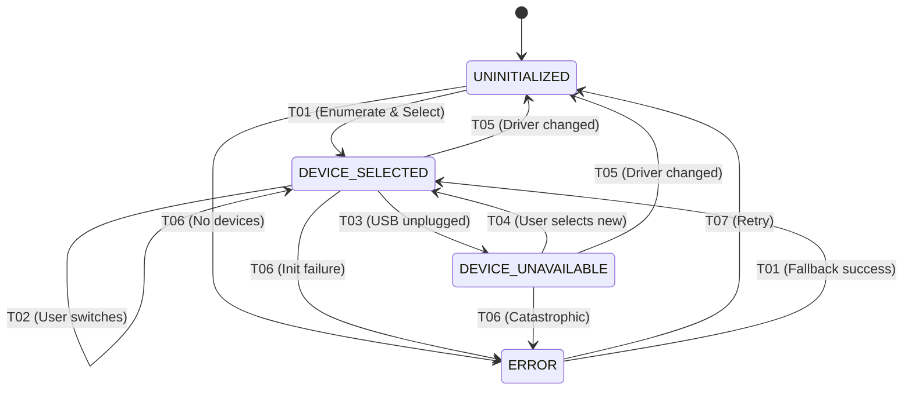

# AudioInput SSM - Design Document

**Version:** v1.4.0-beta  
**Date:** 2026-01-19  
**Purpose:** Control physical audio input device selection with proper state machine architecture  
**Status:** ? DESIGN COMPLETE - Ready for Implementation

---

## ?? **EXECUTIVE SUMMARY**

**What It Controls:**
- Physical input device selection (Scarlett, Realtek, USB mic, etc.)
- Device availability monitoring (USB plug/unplug)
- Device enumeration and validation
- Coordination with AudioDevice SSM for driver changes

**Why It's Needed:**
- Device selection is **EXCLUSIVE** (only one device active at a time)
- Device availability changes dynamically (USB devices unplugged)
- Must validate: Cannot switch during recording
- Heavy side effects: Stream teardown/rebuild

---

## ??? **SUBSYSTEM OWNERSHIP**

**Clear Ownership Boundaries:**
- ? **AudioInput SSM owns device selection state**
- ? **AudioDevice SSM owns driver mode** (NOT device selection)
- ? **AudioInputManager is a passive service** (enumeration + stream init only)
- ? **AudioSettingsPanel is an event emitter only** (no direct device control)
- ? **RecordingManagerSSM owns arming/recording state** (NOT device selection)
- ? **GlobalStateMachine is the authority for validation**

**Critical Rules:**
- ? AudioInput SSM must NOT bypass AudioDevice SSM
- ? AudioInputManager must NOT maintain device state
- ? AudioSettingsPanel must NOT set device directly
- ? All device changes flow through AudioInput SSM
- ? Driver changes trigger coordinated re-enumeration

**This prevents accidental cross-ownership and maintains clean boundaries.**

---

## ?? **CROSS-SSM INTERACTION MATRIX**

| Subsystem | Interaction | Purpose |
|-----------|-------------|---------|
| **AudioDevice SSM** | Triggers re-enumeration on driver change | Coordination |
| **RecordingManagerSSM** | Blocks device switching while armed/recording | Safety |
| **GlobalStateMachine** | Blocks switching during Recording/Playing | Validation |
| **PlaybackSSM** | No direct interaction (but switching may stop playback) | Loose coupling |
| **DSPThreadSSM** | Must be idle before switching device | Thread safety |
| **UIStateMachine** | Reflects device selection in UI | User feedback |
| **AudioSettingsPanel** | Receives device dropdown events, emits requests | UI integration |

**Relationship Type:** AudioInput SSM is a **coordinator** for device lifecycle, responds to AudioDevice SSM driver changes.

---

## ?? **STATE DIAGRAM**

```
UNINITIALIZED
    ? Enumerate Devices
DEVICE_SELECTED (Active device)
    ? User selects different device
DEVICE_UNAVAILABLE (Device unplugged/failed)
    ? User selects working device
DEVICE_SELECTED
    ? Error
ERROR
    ? Recover
(back to enumeration)
```

---

## ?? **STATES**

### **1. AUDIOINPUT_UNINITIALIZED**
**Description:** Initial state before any device is selected

**Entry Actions:**
- Clear device list
- Clear current device

**Exit Actions:**
- Enumerate devices for current driver

**Valid Transitions:**
- ? AUDIOINPUT_DEVICE_SELECTED (device enumerated and selected)
- ? AUDIOINPUT_ERROR (enumeration failed)

**When This State Occurs:**
- Application startup (before first device selection)
- After driver change (AudioDevice SSM triggers refresh)
- After system recovery from error

---

### **2. AUDIOINPUT_DEVICE_SELECTED**
**Description:** A physical device is selected and active

**Entry Actions:**
- Set AudioInputManager.CurrentDevice
- Initialize audio stream for selected device
- Apply device-specific settings (sample rate, buffer size)
- Log: "Audio input device: [Device Name] selected"
- Notify RecordingManager of device change

**Exit Actions:**
- Stop audio stream
- Release device handle
- Clear current device

**Valid Transitions:**
- ? AUDIOINPUT_DEVICE_SELECTED (user switches to different device)
- ? AUDIOINPUT_DEVICE_UNAVAILABLE (device unplugged/failed)
- ? AUDIOINPUT_UNINITIALIZED (driver changed by AudioDevice SSM)
- ? AUDIOINPUT_ERROR (device initialization failed)

**Validation Rules:**
- ? Cannot transition if GlobalStateMachine.CurrentState = Recording
- ? Cannot transition if RecordingManagerSSM is armed

**Properties:**
- CurrentDevice: DeviceInfo (device name, ID, driver type)
- IsDeviceAvailable: Boolean
- DeviceList: List(Of DeviceInfo) (for UI dropdown)

---

### **3. AUDIOINPUT_DEVICE_UNAVAILABLE**
**Description:** Previously selected device is no longer available (unplugged, driver removed, etc.)

**Entry Actions:**
- Log: "Audio input device unavailable: [Device Name]"
- Display warning to user: "Input device disconnected"
- Disable recording operations
- Show device selection UI with available alternatives

**Exit Actions:**
- Clear unavailable device state

**Valid Transitions:**
- ? AUDIOINPUT_DEVICE_SELECTED (user selects working device)
- ? AUDIOINPUT_UNINITIALIZED (driver changed)
- ? AUDIOINPUT_ERROR (catastrophic failure)

**Validation Rules:**
- ? Always allowed (recovery from device loss)

**When This State Occurs:**
- USB device unplugged during operation
- Device driver removed/disabled
- Device claimed by another application
- Hardware failure

---

### **4. AUDIOINPUT_ERROR**
**Description:** Device initialization or enumeration failed

**Entry Actions:**
- Log error details with device info
- Display error message to user
- Disable audio input operations
- Suggest recovery actions

**Exit Actions:**
- Clear error state

**Valid Transitions:**
- ? AUDIOINPUT_UNINITIALIZED (retry enumeration)
- ? AUDIOINPUT_DEVICE_SELECTED (attempt to select specific device)

**Validation Rules:**
- ? Always allowed (error recovery)

**Error Types:**
- Device enumeration failed (no devices found)
- Device initialization failed (driver error)
- Device access denied (permissions issue)
- Unknown error

---

## ?? **TRANSITIONS**

### **T01: UNINITIALIZED ? DEVICE_SELECTED** (Initial Device Selection)
**Trigger:** Application startup, enumerate devices and select default
**Validation:** None (initial state)
**Actions:**
1. Get current driver from AudioDevice SSM
2. Enumerate devices for current driver
3. Find default device (IsDefault = true)
4. If no default, select first available device
5. Initialize audio stream for selected device
6. Transition to DEVICE_SELECTED
7. Log: "Default device selected: [Device Name]"

**On Failure:**
- If no devices found ? AUDIOINPUT_ERROR
- If device init fails ? AUDIOINPUT_ERROR

---

### **T02: DEVICE_SELECTED ? DEVICE_SELECTED** (User Changes Device)
**Trigger:** User selects different device in AudioSettingsPanel
**Validation:**
- ? GlobalStateMachine.CurrentState == Idle
- ? RecordingManagerSSM NOT armed
**Actions:**
1. Validate preconditions
2. Stop audio stream for current device
3. Release current device handle
4. Initialize audio stream for new device
5. Set AudioInputManager.CurrentDevice = new device
6. Notify RecordingManager of device change
7. Log: "Device changed: [Old] ? [New]"

**On Validation Failure:**
- Log: "Cannot switch device: [reason]"
- Display MessageBox: "Cannot switch audio device while recording"
- Revert dropdown selection to current device
- Stay in current state

**On Initialization Failure:**
- Log: "Device initialization failed: [New Device]"
- Display error message
- Transition to AUDIOINPUT_ERROR

---

### **T03: DEVICE_SELECTED ? DEVICE_UNAVAILABLE** (Device Unplugged)
**Trigger:** Device removed, driver disabled, or device claimed by other app
**Validation:** None (hardware event)
**Actions:**
1. Detect device loss (stream error, driver callback)
2. Log: "Device unavailable: [Device Name]"
3. Display warning: "Input device disconnected - please select another"
4. Stop any active recording (if possible)
5. Transition to GlobalStateMachine.Error (if recording active)
6. Show device selection UI
7. Enumerate available devices

**Side Effects:**
- If recording was active: Emergency stop, partial file saved
- GlobalStateMachine transitions to Error state
- RecordingManager disarms microphone

---

### **T04: DEVICE_UNAVAILABLE ? DEVICE_SELECTED** (Recovery)
**Trigger:** User selects working device after device loss
**Validation:** None (always allow recovery)
**Actions:**
1. User selects device from dropdown
2. Verify device is available
3. Initialize audio stream for selected device
4. Set AudioInputManager.CurrentDevice
5. Re-arm microphone (if previously armed)
6. Transition to GlobalStateMachine.Idle
7. Log: "Device recovered: [New Device]"

---

### **T05: DEVICE_SELECTED ? UNINITIALIZED** (Driver Changed)
**Trigger:** AudioDevice SSM transitions to different driver
**Validation:** None (coordinated transition)
**Actions:**
1. AudioDevice SSM signals: "Driver changed to [New Driver]"
2. Stop current audio stream
3. Release current device
4. Clear device list
5. Transition to UNINITIALIZED
6. **Immediately trigger T01** to re-enumerate with new driver
7. Log: "Device reset due to driver change"

**This is a COORDINATED transition:**
```
AudioDevice SSM: WASAPI ? ASIO
        ?
AudioInput SSM: DEVICE_SELECTED ? UNINITIALIZED ? DEVICE_SELECTED
                                   (re-enumerate)
```

---

### **T06: ANY ? ERROR** (Initialization Failure)
**Trigger:** Device enumeration failed, initialization failed, access denied
**Validation:** None (error condition)
**Actions:**
1. Capture error details
2. Log error with device info and driver type
3. Display error to user with recovery options
4. Disable audio input operations
5. Suggest:
   - Check device connections
   - Try different device
   - Check Windows audio settings
   - Restart application

---

### **T07: ERROR ? UNINITIALIZED** (Retry)
**Trigger:** User clicks "Retry" or "Refresh Devices"
**Validation:** None (always allow recovery)
**Actions:**
1. Clear error state
2. Transition to UNINITIALIZED
3. **Immediately trigger T01** to re-enumerate devices
4. Log: "Device enumeration retry"

---

## ?? **INTEGRATION POINTS**

### **1. AudioSettingsPanel (UI)**
**Current Code Location:** `AudioSettingsPanel.vb` - Lines 224-246

**Current Behavior:**
```visualbasic
Private Sub PopulateInputDevices()
    cmbInputDevices.Items.Clear()
    Dim devices = AudioIO.AudioInputManager.Instance.GetDevices(currentDriver)
    ' ... populate dropdown ...
End Sub

Private Sub OnDeviceChanged(sender As Object, e As EventArgs)
    ' Directly notifies AudioInputManager
    RaiseEvent SettingsChanged(Me, GetSettings())
End Sub
```

**New Behavior (Phase 7):**
```visualbasic
Private Sub OnDeviceChanged(sender As Object, e As EventArgs)
    If suppressEvents Then Return
    
    ' Emit event - SSM handles validation and state transition
    Dim selectedDevice = GetSelectedDevice()
    RaiseEvent DeviceChangeRequested(Me, selectedDevice)
End Sub

' SSM calls back with result
Private Sub OnDeviceChangeCompleted(success As Boolean, device As DeviceInfo, message As String)
    If Not success Then
        MessageBox.Show(message, "Device Change Failed", MessageBoxButtons.OK, MessageBoxIcon.Warning)
        ' Revert dropdown to current device
        suppressEvents = True
        SelectDeviceInDropdown(AudioInputSSM.CurrentDevice)
        suppressEvents = False
    End If
End Sub

' AudioInput SSM triggers device list refresh
Public Sub RefreshDeviceList(devices As List(Of DeviceInfo), currentDevice As DeviceInfo)
    suppressEvents = True
    cmbInputDevices.Items.Clear()
    For Each device In devices
        cmbInputDevices.Items.Add(device.Name)
    Next
    SelectDeviceInDropdown(currentDevice)
    suppressEvents = False
End Sub
```

---

### **2. AudioInputManager**
**Current Code Location:** `AudioIO/AudioInputManager.vb`

**Current Behavior:**
- Public mutable `CurrentDevice` property
- Direct device enumeration
- No validation when device changes

**New Behavior (Phase 7):**
- `CurrentDevice` becomes READ-ONLY (set internally by SSM)
- New method: `SwitchDevice(device As DeviceInfo) As Boolean`
  - Called ONLY by AudioInput SSM
  - Returns success/failure
  - Handles stream teardown/initialization
- Device enumeration triggered by SSM
- Device availability monitoring (USB events)

**New Methods:**
```visualbasic
Public Class AudioInputManager
    ' READ-ONLY (set by SSM)
    Public ReadOnly Property CurrentDevice As DeviceInfo
    
    ' Called by AudioInput SSM only
    Friend Function InitializeDevice(device As DeviceInfo) As Boolean
    Friend Sub ReleaseDevice()
    Friend Function EnumerateDevices(driver As DriverType) As List(Of DeviceInfo)
    
    ' Device availability monitoring
    Public Event DeviceDisconnected(device As DeviceInfo)
    Public Event DeviceConnected(device As DeviceInfo)
End Class
```

---

### **3. AudioDevice SSM**
**Wire:** AudioDevice SSM ? AudioInput SSM

**Coordination:**
When AudioDevice SSM changes driver:
```visualbasic
' In AudioDevice SSM
Private Sub OnDriverChanged(newDriver As DriverType)
    ' Signal AudioInput SSM to refresh
    AudioInputSSM.NotifyDriverChanged(newDriver)
End Sub
```

```visualbasic
' In AudioInput SSM
Public Sub NotifyDriverChanged(newDriver As DriverType)
    ' Transition to UNINITIALIZED
    TransitionTo(AudioInputState.Uninitialized, $"Driver changed to {newDriver}")
    
    ' Immediately re-enumerate with new driver
    Dim devices = AudioInputManager.Instance.EnumerateDevices(newDriver)
    If devices.Count > 0 Then
        Dim defaultDevice = devices.FirstOrDefault(Function(d) d.IsDefault)
        SelectDevice(defaultDevice ?? devices(0))
    Else
        TransitionTo(AudioInputState.Error, "No devices found for new driver")
    End If
End Sub
```

---

### **4. GlobalStateMachine**
**Wire:** AudioInput SSM subscribes to GlobalStateMachine.StateChanged

**Validation:**
```visualbasic
Private Function CanSwitchDevice() As Boolean
    Dim globalState = StateCoordinator.Instance.GlobalStateMachine.CurrentState
    
    Select Case globalState
        Case GlobalState.Recording, GlobalState.Playing
            Return False  ' Cannot switch during active operations
        Case GlobalState.Idle, GlobalState.Uninitialized
            Return True  ' Safe to switch
        Case Else
            Return False  ' Conservative - deny unknown states
    End Select
End Function
```

---

### **5. RecordingManagerSSM**
**Wire:** AudioInput SSM checks RecordingManagerSSM.IsArmed

**Additional Validation:**
```visualbasic
Private Function CanSwitchDevice() As Boolean
    ' Check GlobalStateMachine first
    If Not ValidateGlobalState() Then Return False
    
    ' Check if microphone is armed
    Dim recSSM = StateCoordinator.Instance.RecordingManagerSSM
    If recSSM IsNot Nothing AndAlso recSSM.IsArmed Then
        Return False  ' Cannot switch while mic armed
    End If
    
    Return True
End Function
```

**Notification:**
When device changes, RecordingManagerSSM needs to know:
```visualbasic
' In AudioInput SSM
Private Sub OnDeviceChanged(newDevice As DeviceInfo)
    ' Notify RecordingManager that device changed
    ' RecordingManager may need to re-arm microphone with new device
    RecordingManagerSSM?.NotifyDeviceChanged(newDevice)
End Sub
```

---

## ?? **DEVICE AVAILABILITY MONITORING**

### **USB Device Plug/Unplug Detection**

**Windows WMI Events:**
```visualbasic
' In AudioInput SSM or AudioInputManager
Private Sub MonitorUSBDevices()
    ' Subscribe to WMI events for USB device changes
    Dim query = New WqlEventQuery("SELECT * FROM __InstanceOperationEvent WITHIN 1 WHERE TargetInstance ISA 'Win32_PnPEntity'")
    ' ... handle device added/removed events ...
End Sub
```

**NAudio Device Notification:**
```visualbasic
' If using NAudio
Private Sub OnDeviceNotification(sender As Object, e As DeviceNotificationEventArgs)
    If e.NotificationType = DeviceNotification.DeviceRemoved Then
        ' Check if our current device was removed
        If e.DeviceId = CurrentDevice.Id Then
            TransitionTo(AudioInputState.DeviceUnavailable, "Device unplugged")
        End If
    ElseIf e.NotificationType = DeviceNotification.DeviceAdded Then
        ' New device available - log it
        Utils.Logger.Instance.Info($"New audio device detected: {e.DeviceId}")
    End If
End Sub
```

---

## ?? **IMPLEMENTATION CHECKLIST**

### **Phase 7.1: Design (Current Step)**
- [x] Define states
- [x] Define transitions
- [x] Define validation rules
- [x] Identify integration points
- [x] Define coordination with AudioDevice SSM
- [ ] Create state diagram (visual)
- [ ] Review design with Rick
- [ ] Update StateRegistry.yaml

### **Phase 7.2: Implementation**
- [ ] Create `State/AudioInputSSM.vb`
- [ ] Implement IStateMachine interface
- [ ] Wire to GlobalStateMachine
- [ ] Wire to AudioDevice SSM (driver change coordination)
- [ ] Wire to RecordingManagerSSM (validation)
- [ ] Update AudioSettingsPanel (event emitter)
- [ ] Update AudioInputManager (device monitoring)
- [ ] Implement USB device monitoring
- [ ] Test device switching with validation

### **Phase 7.3: Testing**
- [ ] Test device selection on startup
- [ ] Test device switching (idle state)
- [ ] Test device switching blocked during recording
- [ ] Test USB device unplug (transition to DEVICE_UNAVAILABLE)
- [ ] Test USB device plug (device list refresh)
- [ ] Test driver change (coordination with AudioDevice SSM)
- [ ] Test ERROR state recovery
- [ ] Test cognitive introspection

---

## ?? **SUCCESS CRITERIA**

**Complete when:**
- ? AudioInput SSM controls all device selection
- ? AudioSettingsPanel emits events (not direct control)
- ? Validation prevents invalid switches
- ? Device unplugging handled gracefully (DEVICE_UNAVAILABLE state)
- ? Driver changes trigger device list refresh
- ? Error states handled with recovery options
- ? Cognitive layer can introspect device state
- ? No direct manipulation of AudioInputManager.CurrentDevice
- ? All transitions logged with TransitionID
- ? USB device monitoring works

---

## ?? **CODE STRUCTURE**

**File:** `State/AudioInputSSM.vb`

**Structure:**
```visualbasic
Namespace State

    ''' <summary>
    ''' Controls physical audio input device selection
    ''' Monitors device availability and coordinates with AudioDevice SSM
    ''' </summary>
    Public Class AudioInputSSM
        Implements IStateMachine(Of AudioInputState)

        ' States
        Public Enum AudioInputState
            Uninitialized = 0
            DeviceSelected = 1
            DeviceUnavailable = 2
            [Error] = 99
        End Enum

        ' Properties
        Public ReadOnly Property CurrentState As AudioInputState Implements IStateMachine.CurrentState
        Public ReadOnly Property CurrentDevice As DeviceInfo
        Public ReadOnly Property DeviceList As List(Of DeviceInfo)
        Public ReadOnly Property IsDeviceAvailable As Boolean

        ' Methods
        Public Function RequestDeviceChange(device As DeviceInfo) As Boolean
        Private Function ValidateDeviceChange(device As DeviceInfo) As Boolean
        Private Sub OnDeviceChanged(device As DeviceInfo)
        Public Sub NotifyDriverChanged(newDriver As DriverType)  ' Called by AudioDevice SSM
        
        ' Transitions
        Private Sub TransitionTo(newState As AudioInputState, reason As String)
        
        ' Device Monitoring
        Private Sub StartDeviceMonitoring()
        Private Sub OnDeviceDisconnected(device As DeviceInfo)
        Private Sub OnDeviceConnected(device As DeviceInfo)
        
        ' Integration
        Private Sub SubscribeToGlobalStateMachine()
        Private Sub NotifyRecordingManagerSSM()
    End Class

End Namespace
```

---

## ?? **COORDINATION EXAMPLE: Driver Change**

**Scenario:** User switches from WASAPI to ASIO

**State Flow:**
```
AudioDevice SSM: WASAPI ? ASIO
    ?
    ?? Entry action: Set AudioInputManager.CurrentDriver = ASIO
    ?
    ?? Call: AudioInputSSM.NotifyDriverChanged(ASIO)
              ?
              ?
AudioInput SSM: DEVICE_SELECTED ? UNINITIALIZED
    ?
    ?? Exit action: Release current device (Scarlett on WASAPI)
    ?
    ?? Transition to UNINITIALIZED
              ?
              ?
AudioInput SSM: UNINITIALIZED ? DEVICE_SELECTED
    ?
    ?? Action: Enumerate devices for ASIO driver
    ?? Action: Find default ASIO device (Scarlett ASIO driver)
    ?? Action: Initialize ASIO stream
    ?
    ?? Entry action: Set CurrentDevice = Scarlett (ASIO)
```

**Logs:**
```
[AudioDevice SSM] Transition: WASAPI ? ASIO (User requested driver change)
[AudioInputManager] Driver changed: WASAPI ? ASIO
[AudioInput SSM] Transition: DEVICE_SELECTED ? UNINITIALIZED (Driver changed)
[AudioInput SSM] Releasing device: Focusrite Scarlett 2i2 (WASAPI)
[AudioInput SSM] Enumerating devices for ASIO driver...
[AudioInput SSM] Found 2 ASIO devices
[AudioInput SSM] Transition: UNINITIALIZED ? DEVICE_SELECTED (Device: Focusrite Scarlett 2i2 ASIO)
[AudioInputManager] Device initialized: Focusrite Scarlett 2i2 ASIO
```

---

## ?? **FAILURE MODES & RECOVERY PATTERNS**

### **Failure Modes:**

| Failure Type | Trigger | Impact |
|--------------|---------|--------|
| **Device Enumeration Failure** | No devices found for driver | Empty device list, cannot record |
| **Device Init Failure** | Device is busy, permissions denied | Cannot use selected device |
| **Device Unavailable** | USB unplugged, driver removed | Loss of audio input mid-session |
| **Device Claimed** | Another app using device exclusively | Cannot initialize stream |
| **Driver Change Invalidation** | Current device not available in new driver | Need to re-select device |
| **Stream Failure** | Device stream crashes mid-operation | Recording interrupted |

### **Recovery Patterns:**

**Pattern 1: Automatic Device Fallback**
```
Selected device init fails ? Try default device ? Try first available ? ERROR
```

**Pattern 2: USB Disconnect Recovery**
```
DEVICE_SELECTED ? DEVICE_UNAVAILABLE (USB unplugged)
                ? User notification
                ? User selects new device
                ? DEVICE_SELECTED
```

**Pattern 3: Driver Change Coordination**
```
AudioDevice SSM changes driver
    ? AudioInput SSM: DEVICE_SELECTED ? UNINITIALIZED
    ? Re-enumerate devices for new driver
    ? Auto-select default or first available
    ? DEVICE_SELECTED
```

### **User Guidance:**

| Error | Message | Action |
|-------|---------|--------|
| No devices found | "No input devices available for current driver. Check connections." | Offer driver switch |
| Device init failed | "Cannot initialize device. Check if device is in use by another application." | Show device list |
| USB unplugged | "Input device disconnected. Please select another device." | Show device selection dialog |
| All devices failed | "No working input devices. Check system audio settings." | Suggest system reboot |

### **Logging:**
```
[ERROR] AudioInput SSM: Device initialization failed
  Device: Scarlett 2i2 (WASAPI)
  Reason: Device is busy (claimed by another app)
  Recovery: Attempting first available device...
[INFO] AudioInput SSM: Fallback successful
  Device: Realtek HD Audio (WASAPI)
  Transition: ERROR ? DEVICE_SELECTED
```

---

## ?? **THREADING MODEL**

### **Threading Rules:**

1. **All transitions occur inside SSM lock**
   - Prevents race conditions during device switching
   - Ensures atomic state changes

2. **AudioInputManager operations must be synchronous**
   - Device enumeration is blocking
   - Device initialization is blocking
   - Stream teardown is blocking

3. **UI events must be marshaled**
   - Device dropdown events come from UI thread
   - SSM must marshal to state machine thread

4. **USB notifications may arrive on arbitrary threads**
   - WMI events fire on background threads
   - NAudio device notifications use callback threads
   - Must marshal to SSM thread before processing

5. **Device teardown must not block UI thread**
   - Stream stop may take time
   - Use background task with timeout
   - Update UI only after completion

6. **Device initialization must be serialized**
   - Only ONE device initialization at a time
   - Queue multiple requests
   - Cancel pending if new request arrives

### **Thread Safety:**

```visualbasic
Private ReadOnly _stateLock As New Object()

Public Function RequestDeviceChange(device As DeviceInfo) As Boolean
    SyncLock _stateLock
        ' Validate
        If Not ValidateDeviceChange(device) Then Return False
        
        ' Teardown current device (blocking)
        TeardownCurrentDevice()
        
        ' Initialize new device (blocking, with timeout)
        Dim success = InitializeDevice(device)
        
        ' Transition
        If success Then
            TransitionTo(AudioInputState.DeviceSelected, "User requested")
        Else
            TransitionTo(AudioInputState.Error, "Init failed")
        End If
        
        Return success
    End SyncLock
End Function
```

### **USB Device Monitoring:**

```visualbasic
' WMI event arrives on background thread
Private Sub OnUSBDeviceRemoved(deviceId As String)
    ' Marshal to SSM thread
    SyncLock _stateLock
        If deviceId = CurrentDevice.Id Then
            TransitionTo(AudioInputState.DeviceUnavailable, "USB unplugged")
        End If
    End SyncLock
End Sub
```

### **Deadlock Prevention:**

- ? **Never hold SSM lock while calling other SSMs**
- ? **Release lock before signaling RecordingManagerSSM**
- ? **Use timeouts for all blocking operations**
- ? **Device init timeout: 5 seconds max**

---

## ??? **TRANSITIONID NAMING CONVENTION**

### **Format:**
```
AUDIOIN_T{XX}_{OLDSTATE}_TO_{NEWSTATE}
```

### **Examples:**

| TransitionID | Description |
|--------------|-------------|
| `AUDIOIN_T01_UNINITIALIZED_TO_DEVICE_SELECTED` | Initial device selection |
| `AUDIOIN_T02_DEVICE_SELECTED_TO_DEVICE_SELECTED` | User switches device |
| `AUDIOIN_T03_DEVICE_SELECTED_TO_DEVICE_UNAVAILABLE` | USB unplugged |
| `AUDIOIN_T04_DEVICE_UNAVAILABLE_TO_DEVICE_SELECTED` | Recovery |
| `AUDIOIN_T05_DEVICE_SELECTED_TO_UNINITIALIZED` | Driver changed |
| `AUDIOIN_T06_ANY_TO_ERROR` | Device failure |
| `AUDIOIN_T07_ERROR_TO_UNINITIALIZED` | Retry enumeration |

### **Benefits:**

- ? **Grep-friendly:** `git log --grep="AUDIOIN_T03"`
- ? **Deterministic naming:** No ambiguity
- ? **Consistent across SSMs:** Same pattern everywhere
- ? **Easy YAML export:** Maps directly to StateRegistry.yaml
- ? **Cognitive introspection:** Track USB disconnect frequencies

### **Logging:**
```
[INFO] AudioInput SSM: AUDIOIN_T02_DEVICE_SELECTED_TO_DEVICE_SELECTED
  User: Selected "Scarlett 2i2" in AudioSettingsPanel
  Validation: Passed (GlobalState=Idle, RecMgr=Disarmed)
  OldDevice: Realtek HD Audio
  NewDevice: Scarlett 2i2
  Timestamp: 2026-01-19T17:50:15.456Z
```

---

## ?? **MERMAID STATE DIAGRAM**



---

## ?? **UI FEEDBACK CONTRACT**

### **UI Responsibilities:**

1. **Revert dropdown if transition fails**
   ```visualbasic
   Private Sub OnDeviceChangeCompleted(success As Boolean, device As DeviceInfo, message As String)
       If Not success Then
           suppressEvents = True
           SelectDeviceInDropdown(AudioInputSSM.CurrentDevice)
           suppressEvents = False
       End If
   End Sub
   ```

2. **Display error message from SSM**
   ```visualbasic
   If Not success Then
       MessageBox.Show(message, "Device Change Failed", MessageBoxButtons.OK, MessageBoxIcon.Warning)
   End If
   ```

3. **Must not directly mutate device state**
   ```visualbasic
   ' ? BAD
   AudioInputManager.Instance.CurrentDevice = newDevice
   
   ' ? GOOD
   RaiseEvent DeviceChangeRequested(Me, selectedDevice)
   ```

4. **Must not assume device switch succeeded**
   ```visualbasic
   ' ? BAD
   lblDeviceStatus.Text = "Device: Scarlett 2i2"  ' Assumes success!
   
   ' ? GOOD
   ' Wait for callback before updating UI
   ```

5. **Must subscribe to `DeviceChangeCompleted` event**
   ```visualbasic
   AddHandler AudioInputSSM.DeviceChangeCompleted, AddressOf OnDeviceChangeCompleted
   ```

### **UI Must NOT:**

- ? Call `AudioInputManager.CurrentDevice = X` directly
- ? Initialize devices directly
- ? Bypass SSM validation
- ? Assume synchronous success

### **UI Must:**

- ? Emit `DeviceChangeRequested` event
- ? Wait for `DeviceChangeCompleted` callback
- ? Handle failure gracefully
- ? Update UI based on SSM state only

---

## ?? **DEVICE AVAILABILITY MONITORING STRATEGY**

### **Monitoring Sources:**

**1. WMI (Windows Management Instrumentation)**
```visualbasic
' Monitor PnP device changes
Private Sub InitializeWMIMonitoring()
    Dim query = New WqlEventQuery("SELECT * FROM __InstanceOperationEvent WITHIN 1 WHERE TargetInstance ISA 'Win32_PnPEntity'")
    Dim watcher = New ManagementEventWatcher(query)
    AddHandler watcher.EventArrived, AddressOf OnWMIDeviceEvent
    watcher.Start()
End Sub
```

**2. NAudio Device Notifications**
```visualbasic
' NAudio provides high-level device change events
AddHandler NAudio.Wave.WaveIn.DeviceChanged, AddressOf OnNAudioDeviceChanged
```

**3. Stream Failure Callbacks**
```visualbasic
' Audio stream can detect device removal
AddHandler audioStream.StreamError, AddressOf OnStreamError
```

**4. Driver-Level Disconnect Events**
```visualbasic
' WASAPI/ASIO provide device disconnect callbacks
AddHandler wasapiCapture.RecordingStopped, AddressOf OnCaptureStoppedUnexpectedly
```

### **Debounce Logic:**

**Problem:** USB devices fire multiple connect/disconnect events rapidly

**Solution:** Debounce device events

```visualbasic
Private lastDeviceEvent As DateTime = DateTime.MinValue
Private Const DebounceMs As Integer = 500

Private Sub OnUSBDeviceEvent(e As DeviceEventArgs)
    ' Debounce: Ignore events within 500ms of last event
    If (DateTime.Now - lastDeviceEvent).TotalMilliseconds < DebounceMs Then
        Utils.Logger.Instance.Debug("USB event debounced", "AudioInput SSM")
        Return
    End If
    
    lastDeviceEvent = DateTime.Now
    ProcessDeviceEvent(e)
End Sub
```

### **Event Types:**

| Event | Source | Action |
|-------|--------|--------|
| **USB Device Added** | WMI | Refresh device list |
| **USB Device Removed** | WMI | Check if current device, transition to DEVICE_UNAVAILABLE if so |
| **Driver Changed** | AudioDevice SSM | Re-enumerate devices, select default |
| **Stream Error** | WASAPI/ASIO | Transition to ERROR, offer recovery |

---

## ?? **COGNITIVE LAYER HOOKS**

### **What Cognitive Layer Can Infer:**

| Metric | Inference |
|--------|-----------|
| **Frequency of device switching** | User testing multiple mics/interfaces |
| **Device switching failures** | Hardware/driver issues |
| **Correlation: Device switch ? Recording errors** | Specific device problematic |
| **USB disconnect patterns** | Unstable USB connections, cable issues |
| **User preference patterns** | Always uses Scarlett ? Preferred device |
| **Device stability metrics** | Scarlett: 99.9% uptime, Realtek: 95% uptime |

### **Cognitive Patterns to Detect:**

**Pattern 1: "Device Hunter"**
```
User switches Realtek ? Scarlett ? USB Mic ? Realtek (4 times in 5 minutes)
Inference: Testing devices, unsure which to use
Suggestion: "Stick with Scarlett for best quality"
```

**Pattern 2: "Unstable USB"**
```
USB disconnect ? reconnect ? disconnect (3 times in 10 minutes)
Inference: Bad USB cable or loose connection
Suggestion: "USB device unstable. Try different USB port or cable."
```

**Pattern 3: "Forgotten Device"**
```
User always uses Scarlett, but it's unplugged ? Fallback to Realtek
Inference: User forgot to plug in preferred device
Action: Show notification: "Scarlett not found. Using Realtek instead."
```

### **Telemetry Data:**

```yaml
AudioInput_Telemetry:
  SessionID: 12345
  Duration: 3600s
  Devices:
    - Name: "Scarlett 2i2"
      Duration: 3400s
      Transitions: 2
      Disconnects: 0
    - Name: "Realtek HD Audio"
      Duration: 200s
      Transitions: 1
      Disconnects: 0
  UserActions:
    - DeviceSwitchRequests: 3
    - FailedSwitches: 0
    - USBDisconnects: 0
    - SuccessRate: 100%
```

---

## ? **TESTING MATRIX**

| Scenario | Precondition | Action | Expected Result | Notes |
|----------|--------------|--------|-----------------|-------|
| **Startup Enumeration** | Fresh start | App init | Default device selected | Happy path |
| **Switch Device (Idle)** | Realtek, Idle | User selects Scarlett | Success, stream initialized | Happy path |
| **Switch Device (Recording)** | Realtek, Recording | User selects Scarlett | **BLOCKED**, message shown | Validation works |
| **Switch Device (Mic Armed)** | Realtek, Mic armed | User selects Scarlett | **BLOCKED**, message shown | Validation works |
| **USB Unplug** | Scarlett selected | Unplug USB | DEVICE_UNAVAILABLE, dialog shown | Recovery works |
| **USB Replug** | DEVICE_UNAVAILABLE | Plug USB back in | Device list refreshed | Detection works |
| **Driver Change** | Scarlett (WASAPI) | Switch to ASIO | Re-enumerate, select Scarlett ASIO | Coordination works |
| **Device Init Failure** | Realtek selected | Device busy | ERROR state, fallback offered | Recovery works |
| **No Devices Found** | UNINITIALIZED | Enumerate with no devices | ERROR state, guidance shown | Error handling works |
| **Cognitive Introspection** | Any state | Query SSM | CurrentDevice, DeviceList visible | Telemetry works |
| **Dropdown Revert** | Idle | Switch fails | Dropdown reverts to old device | UI contract honored |
| **Concurrent Requests** | Idle | 2 switch requests rapidly | Second queued or rejected | Thread safety |

### **Test Cases (Detailed):**

**TC-001: USB Disconnect During Monitoring**
```
GIVEN: State = DEVICE_SELECTED (Scarlett), Mic armed, monitoring active
WHEN: USB cable unplugged
THEN: WMI event fires
  AND State transitions to DEVICE_UNAVAILABLE
  AND MessageBox shows "Input device disconnected"
  AND Monitoring stops
  AND Device selection dialog shown
  AND User selects Realtek
  AND State transitions to DEVICE_SELECTED
  AND Monitoring resumes with Realtek
```

**TC-002: Driver Change Coordination**
```
GIVEN: State = DEVICE_SELECTED (Scarlett WASAPI)
WHEN: AudioDevice SSM changes to ASIO
THEN: AudioInput SSM receives DriverChanged(ASIO) signal
  AND State transitions DEVICE_SELECTED ? UNINITIALIZED
  AND Current device released
  AND Devices re-enumerated for ASIO driver
  AND Default device selected (Scarlett ASIO if available)
  AND State transitions UNINITIALIZED ? DEVICE_SELECTED
  AND Log shows coordinated transition
```

**TC-003: Device Init Failure ? Fallback**
```
GIVEN: State = DEVICE_SELECTED (Realtek), Idle
WHEN: User selects Scarlett (but device is busy)
THEN: Init fails
  AND State transitions to ERROR
  AND Log shows: "Device busy: Scarlett 2i2"
  AND MessageBox shows "Device in use. Try closing other apps."
  AND SSM attempts fallback to first available device
  AND State transitions ERROR ? DEVICE_SELECTED (Realtek)
  AND User notified of fallback
```

---

**Status:** ? DESIGN COMPLETE - Ready for Implementation  
**Next Step:** Begin AudioInput SSM implementation (Step 6)


