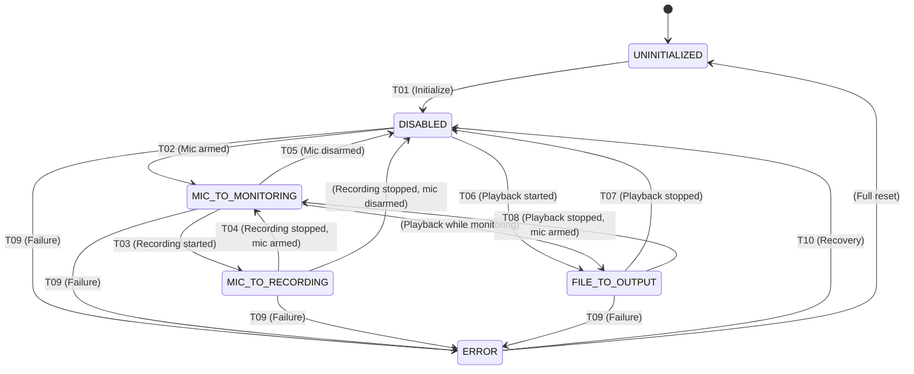

# AudioRouting SSM - Design Document

**Version:** v1.4.0-beta  
**Date:** 2026-01-19  
**Purpose:** Control entire audio routing topology with proper state machine architecture  
**Status:** ? DESIGN COMPLETE - Ready for Implementation (MOST COMPLEX SSM)

---

## ?? **EXECUTIVE SUMMARY**

**What It Controls:**
- **Entire routing topology** of the audio system
- **Tap point management** - This is where tap points belong!
- Mic vs File playback routing
- Output device selection
- Monitoring enable/disable
- Recording enable/disable paths
- Playback enable/disable paths
- DSP enable/disable routing (coordinates with DSP Mode SSM)

**Why It's Critical:**
- Routing is the **CENTRAL COORDINATOR** of the entire audio pipeline
- All audio flows through routing decisions
- Tap points are part of routing architecture
- Modeful subsystem with complex dependencies
- Cross-subsystem coordinator
- Cognitive significance: Routing mode is a major system mode

**Complexity:**
- Interacts with: AudioDevice SSM, AudioInput SSM, DSP Mode SSM, RecordingManagerSSM, PlaybackSSM
- Controls: AudioRouter, TapPointManager, DSPThread tap points
- Affects: Meters, FFT, monitoring, recording, playback

---

## ??? **SUBSYSTEM OWNERSHIP**

**Clear Ownership Boundaries:**
- ? **AudioRouting SSM owns routing topology**
- ? **AudioRouter is the executor** (not the decision-maker)
- ? **TapPointManager instances are owned by routing states**
- ? **DSP Mode SSM owns DSP enable/disable** (NOT routing)
- ? **RecordingManagerSSM owns recording lifecycle** (NOT routing)
- ? **PlaybackSSM owns playback lifecycle** (NOT routing)
- ? **AudioInput SSM owns device selection** (NOT routing)
- ? **AudioDevice SSM owns driver mode** (NOT routing)
- ? **MainForm is a passive consumer of tap point data**

**Critical Rules:**
- ? AudioRouting SSM must NOT control subsystem lifecycles directly
- ? AudioRouting SSM must RESPOND to SSM events, not command them
- ? AudioRouting SSM is the CONDUCTOR, not the orchestra
- ? Tap point lifecycle tied to routing state
- ? All routing changes flow through AudioRouting SSM

**This clarifies that AudioRouting SSM is the CONDUCTOR, coordinating audio flow without controlling individual subsystems.**

---

## ?? **CROSS-SSM INTERACTION MATRIX**

| Subsystem | Interaction | Purpose |
|-----------|-------------|---------|
| **RecordingManagerSSM** | Arms/disarms mic, starts/stops recording | Triggers routing transitions |
| **PlaybackSSM** | Starts/stops playback | Triggers routing transitions |
| **DSP Mode SSM** | Determines whether routing uses DSP path | Routing configuration |
| **AudioInput SSM** | Provides active input device | Device availability |
| **AudioDevice SSM** | Provides active driver mode | Driver configuration |
| **DSPThreadSSM** | Provides tap point buffers | Tap point source |
| **UIStateMachine** | Reflects routing mode in UI | User feedback |
| **MainForm** | Consumes tap point data via events | Monitoring/FFT |
| **RoutingPanel** | Emits routing change requests | UI integration |
| **AudioPipelinePanel** | Reflects routing status | Visual feedback |

**Relationship Type:** AudioRouting SSM is the **central coordinator** that responds to events from all subsystems and manages the audio flow topology.

---

## ?? **STATE DIAGRAM**

```
UNINITIALIZED
    ? Initialize
DISABLED (No routing active)
    ? Arm microphone
MIC_TO_MONITORING (Mic ? Monitoring only)
    ? Enable recording
MIC_TO_RECORDING (Mic ? Recording + Monitoring)
    ? Start playback
FILE_TO_OUTPUT (File ? Playback + Monitoring)
    ? Stop playback
(back to MIC states)
    ? Error
ERROR
    ? Recover
(back to DISABLED)
```

**5 operational states + 2 special states (Uninitialized, Error)**

---

## ?? **STATES**

### **1. ROUTING_UNINITIALIZED**
**Description:** Initial state before routing subsystem is initialized

**Entry Actions:**
- None

**Exit Actions:**
- Initialize AudioRouter
- Initialize TapPointManager infrastructure
- Subscribe to dependent SSMs

**Valid Transitions:**
- ? ROUTING_DISABLED (default safe state)
- ? ROUTING_ERROR (initialization failed)

**When This State Occurs:**
- Application startup
- After catastrophic routing failure requiring reset

---

### **2. ROUTING_DISABLED**
**Description:** No audio routing active - system idle

**Entry Actions:**
- Disable all audio routing
- Stop monitoring
- Clear tap point readers
- Log: "Audio Routing: DISABLED"
- Update UI: Show "No routing active"

**Exit Actions:**
- None (next state handles routing setup)

**Valid Transitions:**
- ? ROUTING_MIC_TO_MONITORING (microphone armed)
- ? ROUTING_FILE_TO_OUTPUT (file playback started)
- ? ROUTING_ERROR (system error)

**What This Means:**
- No audio flows through system
- Tap points inactive
- Meters show zero
- FFT shows nothing
- Recording disabled
- Playback disabled

**When This State Occurs:**
- Application idle
- After stopping all audio operations
- After disarming microphone with no playback

---

### **3. ROUTING_MIC_TO_MONITORING**
**Description:** Microphone armed, monitoring active, NOT recording

**Entry Actions:**
- Configure routing: Mic ? (DSP if enabled) ? Monitoring
- Initialize tap points for mic monitoring
- Create tap point readers:
  - "MicInputMonitor" (PreDSP tap)
  - "MicOutputMonitor" (PostDSP tap)
- Wire tap points to meters and FFT
- Start monitoring (speakers/headphones output)
- Log: "Audio Routing: MIC_TO_MONITORING"
- Update UI: Show "Monitoring active"

**Exit Actions:**
- Maintain routing (next state extends it)

**Valid Transitions:**
- ? ROUTING_MIC_TO_RECORDING (recording started)
- ? ROUTING_DISABLED (microphone disarmed, no recording)
- ? ROUTING_ERROR (routing failure)

**What This Means:**
- Audio flows: Mic ? DSP (if enabled) ? Speakers/Headphones
- Tap points active: Input and Output monitoring
- Meters show mic levels
- FFT shows mic spectrum
- Recording NOT capturing (just monitoring)
- User can hear themselves

**When This State Occurs:**
- Microphone armed (idle state)
- After recording stops (mic still armed)
- Between loop recording takes

**Tap Point Wiring:**
```
Mic Input ? TapPoint.PreDSP ? "MicInputMonitor" reader ? Meters + FFT
         ?
    DSP (if enabled)
         ?
   TapPoint.PostOutputGain ? "MicOutputMonitor" reader ? Meters + FFT
         ?
   Speakers/Headphones
```

---

### **4. ROUTING_MIC_TO_RECORDING**
**Description:** Recording active, capturing audio to file

**Entry Actions:**
- Extend routing: Mic ? (DSP if enabled) ? Recording + Monitoring
- Maintain existing tap points from MIC_TO_MONITORING
- Add tap point reader for recording: "RecordingCapture"
- Wire recording engine to tap points
- Enable recording path in AudioRouter
- Log: "Audio Routing: MIC_TO_RECORDING"
- Update UI: Show "Recording active"

**Exit Actions:**
- Remove recording tap point reader
- Keep monitoring tap points active

**Valid Transitions:**
- ? ROUTING_MIC_TO_MONITORING (recording stopped, mic still armed)
- ? ROUTING_DISABLED (recording stopped, mic disarmed)
- ? ROUTING_ERROR (routing failure during recording)

**What This Means:**
- Audio flows: Mic ? DSP (if enabled) ? Recording Engine + Monitoring
- Tap points active: Input, Output, Recording
- Meters show mic levels
- FFT shows mic spectrum
- Recording capturing to file
- User can still hear themselves (monitoring continues)

**When This State Occurs:**
- Recording in progress
- Loop recording (each take)

**Tap Point Wiring:**
```
Mic Input ? TapPoint.PreDSP ? "MicInputMonitor" reader ? Meters + FFT
         ?
    DSP (if enabled)
         ?
   TapPoint.PostOutputGain ? "MicOutputMonitor" reader ? Meters + FFT
         ?
         ??? "RecordingCapture" reader ? Recording Engine ? File
         ?
         ??? Speakers/Headphones (Monitoring)
```

---

### **5. ROUTING_FILE_TO_OUTPUT**
**Description:** File playback active

**Entry Actions:**
- Configure routing: File ? (DSP if enabled) ? Output
- Create tap points for playback:
  - "PlaybackInputMonitor" (PreDSP tap - raw file audio)
  - "PlaybackOutputMonitor" (PostDSP tap - processed audio)
- Wire tap points to meters and FFT
- Enable playback path in AudioRouter
- Log: "Audio Routing: FILE_TO_OUTPUT"
- Update UI: Show "Playback active"

**Exit Actions:**
- Destroy playback tap point readers
- Clear playback routing

**Valid Transitions:**
- ? ROUTING_MIC_TO_MONITORING (playback stopped, mic armed)
- ? ROUTING_DISABLED (playback stopped, mic not armed)
- ? ROUTING_ERROR (playback routing failure)

**What This Means:**
- Audio flows: File ? DSP (if enabled) ? Speakers/Headphones
- Tap points active: Playback input and output
- Meters show playback levels
- FFT shows playback spectrum
- No recording (playback only)
- **THIS FIXES THE TAP POINT ISSUE!** ? Our original problem!

**When This State Occurs:**
- Playing recorded file
- During DSP playback

**Tap Point Wiring:**
```
File (AudioRouter) ? TapPoint.PreDSP ? "PlaybackInputMonitor" reader ? Meters + FFT
                   ?
              DSP (if enabled)
                   ?
        TapPoint.PostOutputGain ? "PlaybackOutputMonitor" reader ? Meters + FFT
                   ?
           Speakers/Headphones
```

**NO MORE FALLBACK!** ? This is the proper architecture!

---

### **6. ROUTING_ERROR**
**Description:** Routing initialization or operation failed

**Entry Actions:**
- Log error details
- Display error message to user
- Disable all routing operations
- Stop all audio flows
- Clear tap points

**Exit Actions:**
- Clear error state

**Valid Transitions:**
- ? ROUTING_DISABLED (safe fallback)
- ? ROUTING_UNINITIALIZED (reset system)

**Validation Rules:**
- ? Always allowed (error recovery)

**Error Types:**
- Tap point creation failed
- AudioRouter initialization failed
- Device routing configuration failed
- Resource allocation failed

---

## ?? **TRANSITIONS**

### **T01: UNINITIALIZED ? DISABLED** (Startup)
**Trigger:** Application startup, routing subsystem initialized
**Validation:** None (initial state)
**Actions:**
1. Initialize AudioRouter
2. Initialize TapPointManager infrastructure
3. Subscribe to dependent SSMs (DSP Mode, Recording, Playback)
4. Transition to DISABLED
5. Log: "Audio Routing: Initialized ? DISABLED"

---

### **T02: DISABLED ? MIC_TO_MONITORING** (Microphone Armed)
**Trigger:** RecordingManagerSSM arms microphone
**Validation:**
- ? AudioInput SSM has device selected
- ? AudioDevice SSM in valid driver state
**Actions:**
1. Validate device availability
2. Get DSP mode from DSP Mode SSM
3. Configure routing: Mic ? (DSP if enabled) ? Monitoring
4. Create mic tap points:
   - "MicInputMonitor" at TapPoint.PreDSP
   - "MicOutputMonitor" at TapPoint.PostOutputGain
5. Wire tap points to MainForm handlers
6. Start monitoring output
7. Transition to MIC_TO_MONITORING
8. Log: "Audio Routing: DISABLED ? MIC_TO_MONITORING"

**Tap Point Creation:**
```visualbasic
' Create tap point manager for recording path
micTapManager = New TapPointManager(RecordingManager.DSPThread)
micTapManager.CreateReader(TapPoint.PreDSP, "MicInputMonitor")
micTapManager.CreateReader(TapPoint.PostOutputGain, "MicOutputMonitor")

' Wire to MainForm
AddHandler micTapManager.DataAvailable, AddressOf MainForm.OnMicMonitorData
```

---

### **T03: MIC_TO_MONITORING ? MIC_TO_RECORDING** (Recording Started)
**Trigger:** RecordingManagerSSM starts recording
**Validation:**
- ? Currently in MIC_TO_MONITORING state
- ? Tap points already active
**Actions:**
1. Maintain existing tap points (already monitoring)
2. Add recording tap point reader:
   - "RecordingCapture" at TapPoint.PostOutputGain
3. Wire RecordingEngine to tap point
4. Enable recording path in routing
5. Transition to MIC_TO_RECORDING
6. Log: "Audio Routing: MIC_TO_MONITORING ? MIC_TO_RECORDING"

**Tap Point Addition:**
```visualbasic
' Add recording reader to existing tap point
micTapManager.CreateReader(TapPoint.PostOutputGain, "RecordingCapture")

' Wire to Recording Engine
RecordingEngine.SetTapPointSource(micTapManager, "RecordingCapture")
```

---

### **T04: MIC_TO_RECORDING ? MIC_TO_MONITORING** (Recording Stopped)
**Trigger:** RecordingManagerSSM stops recording, mic still armed
**Validation:** None (always safe)
**Actions:**
1. Remove recording tap point reader: "RecordingCapture"
2. Maintain monitoring tap points
3. Disable recording path in routing
4. Keep monitoring active
5. Transition to MIC_TO_MONITORING
6. Log: "Audio Routing: MIC_TO_RECORDING ? MIC_TO_MONITORING"

**Tap Point Cleanup:**
```visualbasic
' Remove recording reader (monitoring continues)
micTapManager.DestroyReader("RecordingCapture")
RecordingEngine.ClearTapPointSource()
```

---

### **T05: MIC_TO_MONITORING ? DISABLED** (Microphone Disarmed)
**Trigger:** RecordingManagerSSM disarms microphone, no playback
**Validation:** None (always safe)
**Actions:**
1. Destroy all mic tap points
2. Stop monitoring
3. Dispose micTapManager
4. Clear routing configuration
5. Transition to DISABLED
6. Log: "Audio Routing: MIC_TO_MONITORING ? DISABLED"

**Tap Point Cleanup:**
```visualbasic
' Destroy all mic tap point readers
micTapManager.DestroyReader("MicInputMonitor")
micTapManager.DestroyReader("MicOutputMonitor")
micTapManager.Dispose()
micTapManager = Nothing
```

---

### **T06: DISABLED ? FILE_TO_OUTPUT** (Playback Started)
**Trigger:** PlaybackSSM starts file playback
**Validation:**
- ? AudioRouter available
- ? File loaded successfully
**Actions:**
1. Get DSP mode from DSP Mode SSM
2. Configure routing: File ? (DSP if enabled) ? Output
3. Create playback tap points in AudioRouter:
   - "PlaybackInputMonitor" at TapPoint.PreDSP
   - "PlaybackOutputMonitor" at TapPoint.PostOutputGain
4. Wire tap points to MainForm handlers
5. Enable playback routing
6. Transition to FILE_TO_OUTPUT
7. Log: "Audio Routing: DISABLED ? FILE_TO_OUTPUT"

**Tap Point Creation (FIXES TAP POINT ISSUE!):**
```visualbasic
' Create tap point manager for playback path
AudioRouter.CreateTapPointManager()  ' NEW METHOD!
AudioRouter.TapManager.CreateReader(TapPoint.PreDSP, "PlaybackInputMonitor")
AudioRouter.TapManager.CreateReader(TapPoint.PostOutputGain, "PlaybackOutputMonitor")

' Wire to MainForm
AddHandler AudioRouter.TapManager.DataAvailable, AddressOf MainForm.OnPlaybackMonitorData
```

**NO MORE "TapManager not available" WARNING!** ? This is the fix!

---

### **T07: FILE_TO_OUTPUT ? DISABLED** (Playback Stopped)
**Trigger:** PlaybackSSM stops playback, mic not armed
**Validation:** None (always safe)
**Actions:**
1. Destroy all playback tap points
2. Stop playback routing
3. Dispose AudioRouter.TapManager
4. Clear routing configuration
5. Transition to DISABLED
6. Log: "Audio Routing: FILE_TO_OUTPUT ? DISABLED"

**Tap Point Cleanup:**
```visualbasic
' Destroy all playback tap point readers
AudioRouter.TapManager.DestroyReader("PlaybackInputMonitor")
AudioRouter.TapManager.DestroyReader("PlaybackOutputMonitor")
AudioRouter.DisposeTapPointManager()  ' NEW METHOD!
```

---

### **T08: FILE_TO_OUTPUT ? MIC_TO_MONITORING** (Playback Stopped, Mic Armed)
**Trigger:** PlaybackSSM stops, mic is still armed
**Validation:**
- ? RecordingManagerSSM is armed
**Actions:**
1. Destroy playback tap points
2. Create mic tap points
3. Switch routing: File ? Mic
4. Transition to MIC_TO_MONITORING
5. Log: "Audio Routing: FILE_TO_OUTPUT ? MIC_TO_MONITORING"

**Routing Switch:**
```visualbasic
' Cleanup playback
AudioRouter.DisposeTapPointManager()

' Setup mic monitoring
micTapManager = New TapPointManager(RecordingManager.DSPThread)
micTapManager.CreateReader(TapPoint.PreDSP, "MicInputMonitor")
micTapManager.CreateReader(TapPoint.PostOutputGain, "MicOutputMonitor")
```

---

### **T09: ANY ? ERROR** (Routing Failure)
**Trigger:** Tap point creation failed, routing configuration failed, resource error
**Validation:** None (error condition)
**Actions:**
1. Capture error details
2. Log error with context
3. Stop all audio routing
4. Dispose all tap points
5. Display error to user
6. Transition to ERROR

---

## ?? **TAP POINT MANAGEMENT - THE CORE FEATURE**

### **Why Tap Points Belong in AudioRouting SSM**

**Tap points are part of ROUTING, not device management!**

**Reasoning:**
- Tap points depend on routing topology
- Different routes need different tap points:
  - Recording route: Mic tap points
  - Playback route: Playback tap points
- Tap point lifecycle tied to routing lifecycle
- Tap point readers depend on audio source (Mic vs File)

**This is why playback had no tap points!**
- Playback routing was never properly managed by routing SSM
- Tap points were only created for recording
- Fallback mechanism masked the architectural gap

**AudioRouting SSM fixes this:**
- ? Playback route creates playback tap points
- ? Recording route creates recording tap points
- ? No fallbacks needed
- ? Complete pipeline visibility

---

### **Tap Point Ownership by State**

| Routing State | Tap Points Created | Purpose |
|---------------|-------------------|---------|
| **DISABLED** | None | No routing active |
| **MIC_TO_MONITORING** | MicInputMonitor, MicOutputMonitor | Monitor microphone |
| **MIC_TO_RECORDING** | MicInputMonitor, MicOutputMonitor, RecordingCapture | Monitor + record mic |
| **FILE_TO_OUTPUT** | PlaybackInputMonitor, PlaybackOutputMonitor | Monitor playback |
| **ERROR** | None | Error recovery |

---

### **Tap Point Reader Naming Convention**

**Format:** `[Source][Location][Purpose]`

**Examples:**
- `MicInputMonitor` - Microphone, PreDSP tap, Monitoring
- `MicOutputMonitor` - Microphone, PostDSP tap, Monitoring
- `RecordingCapture` - Microphone, PostDSP tap, Recording
- `PlaybackInputMonitor` - File, PreDSP tap, Monitoring
- `PlaybackOutputMonitor` - File, PostDSP tap, Monitoring

**Benefits:**
- Clear source identification
- Clear purpose
- Debuggable logs
- Cognitive introspection

---

## ?? **INTEGRATION POINTS**

### **1. RecordingManagerSSM**
**Wire:** RecordingManagerSSM ? AudioRouting SSM

**Signals:**
```visualbasic
' In RecordingManagerSSM
Public Event MicrophoneArmed()
Public Event MicrophoneDisarmed()
Public Event RecordingStarted()
Public Event RecordingStopped()
```

**AudioRouting SSM subscribes:**
```visualbasic
' In AudioRouting SSM
Private Sub OnMicrophoneArmed()
    TransitionTo(RoutingState.MicToMonitoring, "Microphone armed")
End Sub

Private Sub OnRecordingStarted()
    TransitionTo(RoutingState.MicToRecording, "Recording started")
End Sub

Private Sub OnRecordingStopped()
    If RecordingManagerSSM.IsArmed Then
        TransitionTo(RoutingState.MicToMonitoring, "Recording stopped, mic still armed")
    Else
        TransitionTo(RoutingState.Disabled, "Recording stopped, mic disarmed")
    End If
End Sub
```

---

### **2. PlaybackSSM**
**Wire:** PlaybackSSM ? AudioRouting SSM

**Signals:**
```visualbasic
' In PlaybackSSM
Public Event PlaybackStarted()
Public Event PlaybackStopped()
```

**AudioRouting SSM subscribes:**
```visualbasic
' In AudioRouting SSM
Private Sub OnPlaybackStarted()
    TransitionTo(RoutingState.FileToOutput, "Playback started")
End Sub

Private Sub OnPlaybackStopped()
    If RecordingManagerSSM.IsArmed Then
        TransitionTo(RoutingState.MicToMonitoring, "Playback stopped, mic armed")
    Else
        TransitionTo(RoutingState.Disabled, "Playback stopped")
    End If
End Sub
```

---

### **3. DSP Mode SSM**
**Wire:** DSP Mode SSM ? AudioRouting SSM

**Notification:**
```visualbasic
' In DSP Mode SSM
Public Event DSPModeChanged(enabled As Boolean)
```

**AudioRouting SSM subscribes:**
```visualbasic
' In AudioRouting SSM
Private Sub OnDSPModeChanged(enabled As Boolean)
    ' Reconfigure routing with new DSP mode
    Select Case CurrentState
        Case RoutingState.MicToMonitoring, RoutingState.MicToRecording
            ReconfigureMicRouting(enabled)
        Case RoutingState.FileToOutput
            ReconfigurePlaybackRouting(enabled)
    End Select
    
    Log($"Routing updated for DSP mode: {enabled}")
End Sub

Private Sub ReconfigureMicRouting(dspEnabled As Boolean)
    ' Update routing: Mic ? (DSP if enabled) ? Output
    ' Tap points already exist, just update routing path
End Sub
```

---

### **4. AudioRouter (Routing Engine)**
**Wire:** AudioRouting SSM ? AudioRouter

**New Methods Required:**
```visualbasic
' In AudioRouter
Public Sub CreateTapPointManager()
    _tapManager = New TapPointManager(dspThread)
End Sub

Public Sub DisposeTapPointManager()
    If _tapManager IsNot Nothing Then
        _tapManager.Dispose()
        _tapManager = Nothing
    End If
End Sub

Public ReadOnly Property TapManager As TapPointManager
    Get
        Return _tapManager
    End Get
End Property

' Configuration
Public Sub ConfigureRouting(source As AudioSource, destination As AudioDestination, dspEnabled As Boolean)
    ' Configure routing path
End Sub
```

---

### **5. TapPointManager**
**Wire:** AudioRouting SSM creates and manages TapPointManager instances

**Lifecycle:**
- Created when entering routing state (MIC_TO_MONITORING or FILE_TO_OUTPUT)
- Readers added based on routing needs
- Destroyed when exiting routing state

**Multiple Instances:**
- `micTapManager` - For microphone routing (owned by RecordingManager)
- `AudioRouter.TapManager` - For playback routing (owned by AudioRouter)

**This is OK!** Each routing path has its own tap point manager. No shared state.

---

### **6. MainForm (UI)**
**Wire:** AudioRouting SSM ? MainForm (tap point data events)

**Current Problem:**
```visualbasic
' MainForm.TimerPlayback_Tick
If audioRouter.TapManager IsNot Nothing Then
    ' Read from tap points
Else
    ' WARNING: TapManager not available - using fallback ? BAD!
End If
```

**After Phase 7:**
```visualbasic
' MainForm registers with AudioRouting SSM
AudioRoutingSSM.TapPointDataAvailable += OnTapPointData

Private Sub OnTapPointData(source As AudioSource, location As TapPoint, data As Byte())
    Select Case source
        Case AudioSource.Microphone
            ' Update mic meters and FFT
            UpdateMicMeters(data)
            UpdateMicFFT(data)
            
        Case AudioSource.FilePlayback
            ' Update playback meters and FFT
            UpdatePlaybackMeters(data)
            UpdatePlaybackFFT(data)
    End Select
End Sub
```

**NO MORE FALLBACK CHECKS!** ? Clean architecture!

---

## ?? **IMPLEMENTATION CHECKLIST**

### **Phase 7.1: Design (Current Step)**
- [x] Define states
- [x] Define transitions
- [x] Define tap point management strategy
- [x] Identify integration points
- [x] Define coordination with all dependent SSMs
- [ ] Create state diagram (visual)
- [ ] Review design with Rick
- [ ] Update StateRegistry.yaml

### **Phase 7.2: Implementation**
- [ ] Create `State/AudioRoutingSSM.vb`
- [ ] Implement IStateMachine interface
- [ ] Implement tap point lifecycle management
- [ ] Wire to GlobalStateMachine
- [ ] Wire to RecordingManagerSSM (mic arm/disarm events)
- [ ] Wire to PlaybackSSM (playback start/stop events)
- [ ] Wire to DSP Mode SSM (DSP mode changes)
- [ ] Update AudioRouter (add TapPointManager support)
- [ ] Remove fallback code from MainForm
- [ ] Test all routing transitions

### **Phase 7.3: Testing**
- [ ] Test MIC_TO_MONITORING (microphone armed)
- [ ] Test MIC_TO_RECORDING (recording active)
- [ ] Test FILE_TO_OUTPUT (playback active)
- [ ] Test routing switches (mic ? playback)
- [ ] Test DSP mode changes during routing
- [ ] Test tap point creation/destruction
- [ ] **Verify NO "TapManager not available" warnings!**
- [ ] Test cognitive introspection

---

## ?? **SUCCESS CRITERIA**

**Complete when:**
- ? AudioRouting SSM controls all audio routing
- ? Tap points created/destroyed based on routing state
- ? Playback has proper tap points (NO FALLBACK!)
- ? Recording has proper tap points
- ? MainForm receives tap point data via events (no direct access)
- ? All routing transitions logged and introspectable
- ? DSP mode changes trigger routing reconfiguration
- ? No "TapManager not available" warnings
- ? Complete pipeline visibility for all audio paths

---

## ?? **CODE STRUCTURE**

**File:** `State/AudioRoutingSSM.vb`

**Structure:**
```visualbasic
Namespace State

    ''' <summary>
    ''' Controls entire audio routing topology and tap point management
    ''' Central coordinator for audio pipeline
    ''' </summary>
    Public Class AudioRoutingSSM
        Implements IStateMachine(Of RoutingState)

        ' States
        Public Enum RoutingState
            Uninitialized = 0
            Disabled = 1
            MicToMonitoring = 2
            MicToRecording = 3
            FileToOutput = 4
            [Error] = 99
        End Enum

        ' Properties
        Public ReadOnly Property CurrentState As RoutingState Implements IStateMachine.CurrentState
        Public ReadOnly Property CurrentSource As AudioSource
        Public ReadOnly Property IsDSPEnabled As Boolean  ' From DSP Mode SSM

        ' Tap Point Management
        Private micTapManager As TapPointManager
        Private Sub CreateMicTapPoints()
        Private Sub DestroyMicTapPoints()
        Private Sub CreatePlaybackTapPoints()
        Private Sub DestroyPlaybackTapPoints()
        
        ' Methods
        Private Sub ConfigureRouting(source As AudioSource, dspEnabled As Boolean)
        
        ' Transitions
        Private Sub TransitionTo(newState As RoutingState, reason As String)
        
        ' Integration - Subscribe to dependent SSMs
        Private Sub SubscribeToRecordingManagerSSM()
        Private Sub SubscribeToPlaybackSSM()
        Private Sub SubscribeToDSPModeSSM()
        
        ' Event Handlers
        Private Sub OnMicrophoneArmed()
        Private Sub OnMicrophoneDisarmed()
        Private Sub OnRecordingStarted()
        Private Sub OnRecordingStopped()
        Private Sub OnPlaybackStarted()
        Private Sub OnPlaybackStopped()
        Private Sub OnDSPModeChanged(enabled As Boolean)
        
        ' Tap Point Events (for MainForm)
        Public Event TapPointDataAvailable(source As AudioSource, location As TapPoint, data As Byte())
    End Class

    Public Enum AudioSource
        None = 0
        Microphone = 1
        FilePlayback = 2
    End Enum

End Namespace
```

---

## ?? **COMPLETE ROUTING EXAMPLE**

### **Scenario: Record, then Play Back**

**Phase 1: Idle (DISABLED)**
```
User: Opens application
AudioRouting SSM: UNINITIALIZED ? DISABLED
State: No routing active
Tap Points: None
```

**Phase 2: Arm Microphone (MIC_TO_MONITORING)**
```
User: Application arms microphone
RecordingManagerSSM: Raises MicrophoneArmed event
AudioRouting SSM: DISABLED ? MIC_TO_MONITORING
Actions:
  - Create micTapManager
  - Create "MicInputMonitor" tap point (PreDSP)
  - Create "MicOutputMonitor" tap point (PostDSP)
  - Wire to MainForm
  - Start monitoring
State: Mic ? DSP (if enabled) ? Monitoring
Tap Points: MicInputMonitor, MicOutputMonitor
Log: "Audio Routing: DISABLED ? MIC_TO_MONITORING"
```

**Phase 3: Start Recording (MIC_TO_RECORDING)**
```
User: Clicks Record button
RecordingManagerSSM: Raises RecordingStarted event
AudioRouting SSM: MIC_TO_MONITORING ? MIC_TO_RECORDING
Actions:
  - Maintain existing mic tap points
  - Add "RecordingCapture" tap point (PostDSP)
  - Wire to RecordingEngine
State: Mic ? DSP ? Recording + Monitoring
Tap Points: MicInputMonitor, MicOutputMonitor, RecordingCapture
Log: "Audio Routing: MIC_TO_MONITORING ? MIC_TO_RECORDING"
```

**Phase 4: Stop Recording (MIC_TO_MONITORING)**
```
User: Clicks Stop button
RecordingManagerSSM: Raises RecordingStopped event
AudioRouting SSM: MIC_TO_RECORDING ? MIC_TO_MONITORING
Actions:
  - Remove "RecordingCapture" tap point
  - Keep mic monitoring tap points
State: Mic ? DSP ? Monitoring only
Tap Points: MicInputMonitor, MicOutputMonitor
Log: "Audio Routing: MIC_TO_RECORDING ? MIC_TO_MONITORING"
```

**Phase 5: Play Back Recording (FILE_TO_OUTPUT)**
```
User: Double-clicks recorded file
PlaybackSSM: Raises PlaybackStarted event
AudioRouting SSM: MIC_TO_MONITORING ? FILE_TO_OUTPUT
Actions:
  - Destroy mic tap points
  - Create AudioRouter.TapManager
  - Create "PlaybackInputMonitor" tap point (PreDSP)
  - Create "PlaybackOutputMonitor" tap point (PostDSP)
  - Wire to MainForm
State: File ? DSP ? Output
Tap Points: PlaybackInputMonitor, PlaybackOutputMonitor
Log: "Audio Routing: MIC_TO_MONITORING ? FILE_TO_OUTPUT"

RESULT: Playback now has PROPER TAP POINTS! ? FIX COMPLETE!
```

**Phase 6: Stop Playback (MIC_TO_MONITORING)**
```
User: Playback completes (EOF)
PlaybackSSM: Raises PlaybackStopped event
AudioRouting SSM: FILE_TO_OUTPUT ? MIC_TO_MONITORING
Actions:
  - Destroy playback tap points
  - Dispose AudioRouter.TapManager
  - Recreate mic tap points (mic still armed)
State: Mic ? DSP ? Monitoring
Tap Points: MicInputMonitor, MicOutputMonitor
Log: "Audio Routing: FILE_TO_OUTPUT ? MIC_TO_MONITORING"
```

---

## ?? **THIS SOLVES THE TAP POINT PROBLEM!**

**Before (Broken):**
```
Playback: File ? AudioRouter ? ??? ? Fallback ? Meters
                              ?
                    NO TAP POINTS!
                    [WARNING] TapManager not available
```

**After (Fixed):**
```
Playback: File ? AudioRouter ? TapPointManager ? Tap Points ? Meters
                              ?
                    PROPER ARCHITECTURE!
                    AudioRouting SSM manages lifecycle
```

**The Architecture Is Now Complete!** ?

---

## ?? **FAILURE MODES & RECOVERY PATTERNS**

### **Failure Modes:**

| Failure Type | Trigger | Impact |
|--------------|---------|--------|
| **Tap Point Creation Failure** | TapPointManager init fails, ring buffer allocation fails | No monitoring/FFT |
| **AudioRouter Init Failure** | Routing engine fails to initialize | No audio routing possible |
| **Device Routing Config Failure** | Output device unavailable, driver error | Cannot route audio to output |
| **Resource Allocation Failure** | Out of memory, buffer allocation fails | Routing cannot be established |
| **DSP Mode Conflict** | DSP Mode SSM in error state | Routing cannot use DSP path |
| **Microphone Stream Failure** | Input device error, stream crash | Mic routing fails |
| **Playback Stream Failure** | File read error, decoder failure | Playback routing fails |

### **Recovery Patterns:**

**Pattern 1: Graceful Fallback to Disabled**
```
Routing error ? ROUTING_ERROR state ? Automatic transition to ROUTING_DISABLED
```

**Pattern 2: Tap Point Recreation**
```
Tap point creation fails ? Log error ? Routing continues without monitoring
```

**Pattern 3: Device Fallback**
```
Output device fails ? Try default device ? If fails, transition to ERROR
```

### **User Guidance:**

| Error | Message | Action |
|-------|---------|--------|
| Tap point failure | "Monitoring unavailable. Routing continues." | Continue operation |
| AudioRouter init failure | "Audio routing failed to initialize. Check system resources." | Restart app |
| Device unavailable | "Output device not available. Select different device." | Show device list |
| All routing failed | "Audio routing system failure. Restart application." | Exit gracefully |

### **Logging:**
```
[ERROR] AudioRouting SSM: Tap point creation failed
  Reason: Ring buffer allocation failed - Out of memory
  State: MIC_TO_MONITORING
  Recovery: Routing continues without monitoring
[WARN] AudioRouting SSM: Monitoring disabled (tap point failure)
```

---

## ?? **THREADING MODEL**

### **Threading Rules:**

1. **All transitions occur inside SSM lock**
   - Prevents race conditions during routing changes
   - Ensures atomic state changes

2. **Tap point operations must be thread-safe**
   - TapPointManager uses locks internally
   - Ring buffer writes are thread-safe
   - Multiple readers supported

3. **SSM event handlers may arrive on arbitrary threads**
   - RecordingManagerSSM events from audio thread
   - PlaybackSSM events from playback thread
   - DSP Mode SSM events from UI thread
   - Must marshal to SSM thread

4. **AudioRouter operations must be serialized**
   - Only ONE routing reconfiguration at a time
   - Queue multiple requests
   - Wait for completion before next change

5. **Tap point creation/destruction must not block audio thread**
   - Use background task for allocation
   - Audio continues during tap point setup
   - Timeout protection

### **Thread Safety:**

```visualbasic
Private ReadOnly _stateLock As New Object()

Private Sub OnRecordingStarted()
    ' Event arrives from audio thread - marshal to SSM thread
    SyncLock _stateLock
        If CurrentState = RoutingState.MicToMonitoring Then
            ' Add recording tap point reader
            CreateRecordingTapPoint()
            TransitionTo(RoutingState.MicToRecording, "Recording started")
        End If
    End SyncLock
End Sub

Private Sub OnPlaybackStarted()
    ' Event arrives from playback thread - marshal to SSM thread
    SyncLock _stateLock
        ' Destroy mic tap points if active
        If CurrentState = RoutingState.MicToMonitoring Then
            DestroyMicTapPoints()
        End If
        
        ' Create playback tap points
        CreatePlaybackTapPoints()
        TransitionTo(RoutingState.FileToOutput, "Playback started")
    End SyncLock
End Sub
```

### **Deadlock Prevention:**

- ? **Never hold SSM lock while calling other SSMs**
- ? **Release lock before emitting events**
- ? **Use timeouts for all blocking operations**
- ? **Tap point creation timeout: 5 seconds max**

---

## ??? **TRANSITIONID NAMING CONVENTION**

### **Format:**
```
ROUTING_T{XX}_{OLDSTATE}_TO_{NEWSTATE}
```

### **Examples:**

| TransitionID | Description |
|--------------|-------------|
| `ROUTING_T01_UNINITIALIZED_TO_DISABLED` | Startup initialization |
| `ROUTING_T02_DISABLED_TO_MIC_TO_MONITORING` | Microphone armed |
| `ROUTING_T03_MIC_TO_MONITORING_TO_MIC_TO_RECORDING` | Recording started |
| `ROUTING_T04_MIC_TO_RECORDING_TO_MIC_TO_MONITORING` | Recording stopped, mic still armed |
| `ROUTING_T05_MIC_TO_MONITORING_TO_DISABLED` | Microphone disarmed |
| `ROUTING_T06_DISABLED_TO_FILE_TO_OUTPUT` | Playback started |
| `ROUTING_T07_FILE_TO_OUTPUT_TO_DISABLED` | Playback stopped, mic not armed |
| `ROUTING_T08_FILE_TO_OUTPUT_TO_MIC_TO_MONITORING` | Playback stopped, mic armed |
| `ROUTING_T09_ANY_TO_ERROR` | Routing failure |
| `ROUTING_T10_ERROR_TO_DISABLED` | Recovery |

### **Benefits:**

- ? **Grep-friendly:** `git log --grep="ROUTING_T03"`
- ? **Deterministic naming:** No ambiguity
- ? **Consistent across SSMs:** Same pattern everywhere
- ? **Easy YAML export:** Maps directly to StateRegistry.yaml
- ? **Cognitive introspection:** Track routing patterns over time

### **Logging:**
```
[INFO] AudioRouting SSM: ROUTING_T03_MIC_TO_MONITORING_TO_MIC_TO_RECORDING
  Trigger: RecordingManagerSSM.RecordingStarted event
  DSP Mode: ENABLED (from DSP Mode SSM)
  Tap Points: Maintained (MicInputMonitor, MicOutputMonitor)
  New Tap Point: RecordingCapture (PostOutputGain)
  Timestamp: 2026-01-19T18:15:45.123Z
```

---

## ?? **MERMAID STATE DIAGRAM**



---

## ?? **UI FEEDBACK CONTRACT**

### **UI Responsibilities:**

**RoutingPanel:**
```visualbasic
' Routing panel emits routing change requests
Private Sub btnEnableMonitoring_Click(sender As Object, e As EventArgs)
    RaiseEvent RoutingChangeRequested(Me, RoutingMode.MicToMonitoring)
End Sub

' SSM calls back with result
Private Sub OnRoutingChangeCompleted(success As Boolean, mode As RoutingMode, message As String)
    If Not success Then
        MessageBox.Show(message, "Routing Change Failed", MessageBoxButtons.OK, MessageBoxIcon.Warning)
    Else
        UpdateRoutingStatus(mode)
    End If
End Sub
```

**AudioPipelinePanel:**
```visualbasic
' AudioPipelinePanel reflects routing status (read-only)
Public Sub UpdateRoutingMode(mode As RoutingMode)
    lblRoutingMode.Text = $"Routing: {mode}"
    UpdateSignalFlowVisualization(mode)
End Sub
```

**MainForm:**
```visualbasic
' MainForm consumes tap point data via events (NO direct tap point access!)
Private Sub OnTapPointDataAvailable(source As AudioSource, location As TapPoint, data As Byte())
    Select Case source
        Case AudioSource.Microphone
            UpdateMicMeters(data)
            UpdateMicFFT(data)
        Case AudioSource.FilePlayback
            UpdatePlaybackMeters(data)
            UpdatePlaybackFFT(data)
    End Select
End Sub

' NO MORE FALLBACK CODE! ? Clean architecture
```

### **UI Must NOT:**

- ? Access AudioRouter.TapManager directly
- ? Create/destroy tap points
- ? Configure routing directly
- ? Check "TapManager not available" (that code is deleted!)

### **UI Must:**

- ? Subscribe to AudioRouting SSM events
- ? Emit routing change requests
- ? Wait for callbacks before updating UI
- ? Handle routing state changes gracefully

---

## ?? **COGNITIVE LAYER HOOKS**

### **What Cognitive Layer Can Infer:**

| Metric | Inference |
|--------|-----------|
| **Time in each routing state** | User workflow patterns (mostly recording vs mostly playback) |
| **Routing state transitions** | Workflow complexity, user behavior |
| **Correlation: Routing ? Recording** | User records after arming mic (professional vs casual) |
| **Correlation: Routing ? Playback** | User reviews recordings frequently |
| **Tap point usage patterns** | Heavy monitoring = mixing/mastering, Light monitoring = quick captures |
| **Routing failures over time** | System instability, resource issues |
| **DSP mode during routing** | User uses DSP for recording vs playback |

### **Cognitive Patterns to Detect:**

**Pattern 1: "Professional Workflow"**
```
Mic armed ? Monitor (30s) ? Record (3min) ? Monitor (10s) ? Record (3min) (loop)
Inference: User reviews levels before each take
Suggestion: "Quick arm/record shortcut available"
```

**Pattern 2: "Casual User"**
```
Mic armed ? Record immediately (no monitoring)
Inference: User doesn't check levels beforehand
Suggestion: "Enable monitoring to check levels before recording"
```

**Pattern 3: "Playback Heavy"**
```
90% time in FILE_TO_OUTPUT, 10% in MIC_TO_RECORDING
Inference: User listens to recordings more than creating them
Action: Optimize for playback performance
```

**Pattern 4: "Routing Thrash"**
```
DISABLED ? MIC_TO_MONITORING (10 times in 1 minute)
Inference: User confused about arming/disarming
Suggestion: "Tip: Keep mic armed while recording multiple takes"
```

### **Telemetry Data:**

```yaml
AudioRouting_Telemetry:
  SessionID: 12345
  Duration: 3600s
  States:
    - State: DISABLED
      Duration: 500s
      Transitions: 5
    - State: MIC_TO_MONITORING
      Duration: 400s
      Transitions: 8
    - State: MIC_TO_RECORDING
      Duration: 2100s
      Transitions: 7
    - State: FILE_TO_OUTPUT
      Duration: 600s
      Transitions: 3
  UserActions:
    - MicArmed: 8 times
    - RecordingStarts: 7 times
    - PlaybackStarts: 3 times
  Correlation:
    - DSP_Enabled_During_Recording: 100%
    - DSP_Enabled_During_Playback: 66%
    - Avg_Monitor_Before_Record: 50s
```

---

## ?? **TAP POINT LIFECYCLE TABLE**

| Routing State | TapPointManager | Tap Point Readers | Wired To | Notes |
|---------------|-----------------|-------------------|----------|-------|
| **UNINITIALIZED** | None | None | - | Clean slate |
| **DISABLED** | None | None | - | No routing active |
| **MIC_TO_MONITORING** | micTapManager | MicInputMonitor (PreDSP), MicOutputMonitor (PostOutputGain) | MainForm (meters, FFT) | Monitoring only |
| **MIC_TO_RECORDING** | micTapManager | + RecordingCapture (PostOutputGain) | MainForm + RecordingEngine | Monitoring + recording |
| **FILE_TO_OUTPUT** | AudioRouter.TapManager | PlaybackInputMonitor (PreDSP), PlaybackOutputMonitor (PostOutputGain) | MainForm (meters, FFT) | Playback monitoring |
| **ERROR** | None (all destroyed) | None | - | Error recovery |

**Key Insight:** Each routing state creates EXACTLY the tap points it needs. No more, no less.

---

## ?? **ROUTING GRAPH**

### **Conceptual Routing Graph:**

```
Input Sources:
  ?? Microphone (via AudioInput SSM)
  ?? File (via PlaybackSSM)
                ?
         [TapPoint.PreDSP]
                ?
          DSP? (conditional)
          ?? Yes: DSP pipeline
          ?   ?? InputGainProcessor
          ?   ?? [TapPoint.PostInputGain]
          ?   ?? OutputGainProcessor
          ?   ?? [TapPoint.PostOutputGain]
          ?? No: Direct pass-through
                ?
         [TapPoint.PreOutput]
                ?
           Output Destinations:
             ?? Speakers/Headphones
             ?? Recording File
             ?? Monitoring Display (Meters, FFT)
```

**This clarifies that routing is a GRAPH, not a linear pipeline.**

---

## ?? **ROUTING ENGINE CONTRACT**

### **What AudioRouter Must Guarantee:**

**1. TapPointManager Support:**
```visualbasic
Public Sub CreateTapPointManager()
    ' Create TapPointManager for playback routing
    ' Called by AudioRouting SSM when entering FILE_TO_OUTPUT state
End Sub

Public Sub DisposeTapPointManager()
    ' Destroy TapPointManager and all readers
    ' Called by AudioRouting SSM when exiting FILE_TO_OUTPUT state
End Sub

Public ReadOnly Property TapManager As TapPointManager
    ' Expose TapPointManager for reader creation
    ' Returns Nothing if not created yet
End Property
```

**2. Routing Configuration:**
```visualbasic
Public Sub ConfigureRouting(source As AudioSource, destination As AudioDestination, dspEnabled As Boolean)
    ' Configure routing path
    ' Called by AudioRouting SSM during state transitions
    ' Must be idempotent (can be called multiple times)
End Sub
```

**3. AudioRouter Must NOT:**
- ? Perform routing decisions internally
- ? Create tap points internally without SSM coordination
- ? Bypass SSM decisions
- ? Maintain routing state (that's AudioRouting SSM's job!)

**4. AudioRouter Must:**
- ? Execute routing decisions from SSM
- ? Support tap point lifecycle management
- ? Report routing errors to SSM
- ? Remain a pure executor (no business logic)

---

## ? **TESTING MATRIX**

| Scenario | Precondition | Action | Expected Result | Notes |
|----------|--------------|--------|-----------------|-------|
| **Startup** | Fresh start | App init | DISABLED state | Clean slate |
| **Arm Mic** | DISABLED | RecordingMgr arms mic | MIC_TO_MONITORING, tap points created | Happy path |
| **Start Recording** | MIC_TO_MONITORING | RecordingMgr starts | MIC_TO_RECORDING, recording tap added | Happy path |
| **Stop Recording (Armed)** | MIC_TO_RECORDING | RecordingMgr stops, mic still armed | MIC_TO_MONITORING, recording tap removed | Mic stays armed |
| **Stop Recording (Disarmed)** | MIC_TO_RECORDING | RecordingMgr stops, mic disarmed | DISABLED, all taps destroyed | Complete teardown |
| **Start Playback (Idle)** | DISABLED | PlaybackSSM starts | FILE_TO_OUTPUT, playback taps created | **TAP POINT FIX!** |
| **Start Playback (Mic Armed)** | MIC_TO_MONITORING | PlaybackSSM starts | FILE_TO_OUTPUT, mic taps ? playback taps | Routing switch |
| **Stop Playback (Mic Armed)** | FILE_TO_OUTPUT | PlaybackSSM stops, mic armed | MIC_TO_MONITORING, playback taps ? mic taps | Back to monitoring |
| **Stop Playback (Idle)** | FILE_TO_OUTPUT | PlaybackSSM stops, mic not armed | DISABLED, all taps destroyed | Clean teardown |
| **DSP Mode Change** | MIC_TO_MONITORING | DSP Mode SSM enables DSP | Routing reconfigured for DSP | Coordination works |
| **Tap Point Failure** | MIC_TO_MONITORING | Tap point creation fails | Warning logged, routing continues | Graceful degradation |
| **Routing Failure** | Any state | AudioRouter init fails | ERROR state, user notified | Error handling |
| **Cognitive Introspection** | Any state | Query SSM | Routing history, tap point usage visible | Telemetry works |

### **Test Cases (Detailed):**

**TC-001: Record ? Stop ? Play Back (Complete Workflow)**
```
GIVEN: Application starts (DISABLED)
WHEN: User arms microphone
THEN: State = MIC_TO_MONITORING
  AND micTapManager created
  AND Tap points: MicInputMonitor, MicOutputMonitor
  AND Meters show mic levels
  
WHEN: User clicks Record
THEN: State = MIC_TO_RECORDING
  AND Tap point added: RecordingCapture
  AND Recording engine wired to tap point
  AND File captures audio
  
WHEN: User clicks Stop (mic still armed)
THEN: State = MIC_TO_MONITORING
  AND Tap point removed: RecordingCapture
  AND Mic tap points maintained
  AND Monitoring continues
  
WHEN: User double-clicks recorded file
THEN: State = FILE_TO_OUTPUT
  AND micTapManager destroyed
  AND AudioRouter.TapManager created
  AND Tap points: PlaybackInputMonitor, PlaybackOutputMonitor
  AND Meters show playback levels ? NO FALLBACK WARNING! ?
  AND FFT shows playback spectrum ? PROPER ARCHITECTURE! ?
  
WHEN: Playback completes (mic still armed)
THEN: State = MIC_TO_MONITORING
  AND AudioRouter.TapManager destroyed
  AND micTapManager recreated
  AND Mic monitoring resumes
```

**TC-002: Tap Point Lifecycle Verification**
```
GIVEN: State = DISABLED (no tap points)
WHEN: Arm mic
THEN: micTapManager created
  AND Readers: MicInputMonitor, MicOutputMonitor
  AND Memory allocated: ~8KB ring buffers
  
WHEN: Start recording
THEN: micTapManager maintained
  AND Reader added: RecordingCapture
  AND Memory allocated: +8KB ring buffer
  
WHEN: Stop recording (disarm mic)
THEN: micTapManager destroyed
  AND All readers destroyed
  AND Memory released: ~24KB
  AND No memory leaks
```

---

**Status:** ? DESIGN COMPLETE - Ready for Implementation  
**Next Step:** Begin AudioRouting SSM implementation (Step 8) - This is the final and most important SSM!


