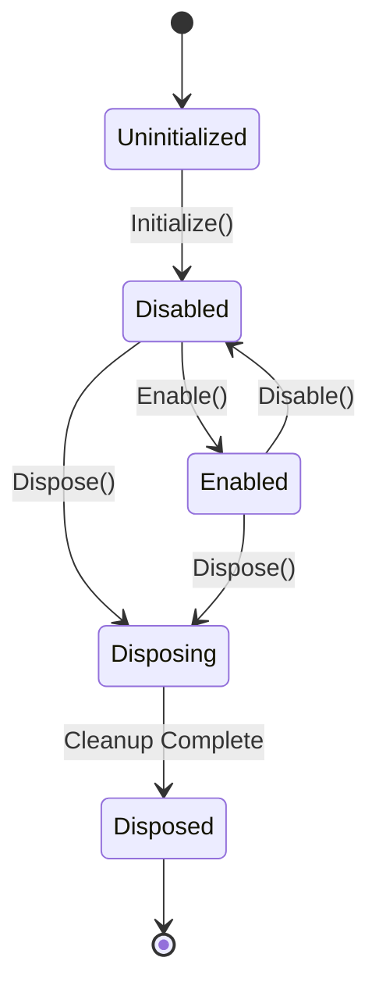

# MonitoringController Design v2.0.0
## FFT & Meter Lifecycle Manager

**Date:** 2026-01-17  
**Version:** 2.0.0 (ENHANCED)  
**Status:** ?? DESIGN COMPLETE (PRODUCTION-GRADE)  
**Purpose:** Define monitoring subsystem with enable/disable control and clean reader lifecycle

**Enhancements:** Integrated 10 architectural refinements for bulletproof monitoring

---

## ?? **OVERVIEW**

The **MonitoringController** manages the **lifecycle of FFT and meter readers** with clean enable/disable semantics. It solves the problem of readers that cannot be cleanly created/destroyed during playback.

**Key Responsibilities:**
1. **Enable/Disable API** - Turn monitoring on/off without dispose
2. **Reader Lifecycle** - Create/destroy readers safely
3. **Ownership Tracking** - Track which component owns which reader
4. **Thread-Safe Operations** - All operations safe from any thread
5. **Clean Shutdown** - Prevent late callbacks after dispose

**Design Principles:**
- ? Thread ownership (Part 12 of Thread Safety Patterns)
- ? Disposal guards (Part 5)
- ? Shutdown barrier (Part 13)
- ? Immutable data out (Part 2.5)

---

## ?? **PART 1: ARCHITECTURE OVERVIEW**

### **Problem Statement:**

**Current Issues:**
1. Readers cannot be created/destroyed during playback (audio glitches)
2. No enable/disable API (must dispose to stop monitoring)
3. No tracking of reader ownership
4. Race conditions during shutdown
5. `_default_` naming pattern is unclear

**Solution:**
```
MonitoringController manages reader lifecycle
??? Enable/Disable API (pause monitoring)
??? Reader Registry (track ownership)
??? Safe Creation (no audio glitches)
??? Safe Destruction (disposal guards)
??? Shutdown Barrier (prevent late callbacks)
```

### **Integration with Architecture:**

```
StateCoordinator
    ? requests
MonitoringController
    ? creates/manages
TapPointManager
    ? provides data
Readers (FFT, Meters)
    ? push data
Reactive Streams
    ? marshal to
UI Thread (Pipeline UI)
```

### **Ownership Model:**

> **MonitoringController is the ONLY component allowed to create/destroy readers.**

**Ownership Rules:**

| Component | Owned By | Can Create? | Can Destroy? | Can Pause? |
|-----------|----------|-------------|--------------|------------|
| **MonitoringController** | StateCoordinator | N/A | N/A | N/A |
| **Readers** | MonitoringController | MonitoringController only | MonitoringController only | MonitoringController only |
| **TapPointManager** | RecordingManager | RecordingManager | RecordingManager | N/A |

**Benefits:**
- ? Prevents double-creation
- ? Prevents double-destruction
- ? Clear lifecycle responsibility
- ? No cross-thread disposal
- ? Predictable shutdown sequence

### **Isolation Rules:**

> **?? CRITICAL: MonitoringController NEVER touches DSP directly!**

**MonitoringController should:**
- ? Manage reader lifecycle (create/destroy)
- ? Manage monitoring state (enable/disable)
- ? Manage reader registry (tracking)
- ? Coordinate with TapPointManager

**MonitoringController should NEVER:**
- ? Start DSP thread
- ? Stop DSP thread
- ? Read DSP buffers directly
- ? Write DSP buffers directly
- ? Control audio routing
- ? Control recording/playback

**Architecture:**
```
MonitoringController ? TapPointManager ? Readers
      (owns)              (provides)     (consume data)

MonitoringController NEVER touches DSPThread!
RecordingManager owns DSPThread!
```

---

## ?? **PART 2: MONITORING STATE ENUM**

### **State Definitions:**

```visualbasic
Namespace Managers
    ''' <summary>
    ''' Monitoring subsystem states
    ''' </summary>
    Public Enum MonitoringState
        ''' <summary>Monitoring not initialized</summary>
        Uninitialized = 0
        
        ''' <summary>Monitoring initialized but disabled (readers exist but paused)</summary>
        Disabled = 1
        
        ''' <summary>Monitoring enabled (readers active)</summary>
        Enabled = 2
        
        ''' <summary>Monitoring disposing (shutdown in progress)</summary>
        Disposing = 3
        
        ''' <summary>Monitoring disposed</summary>
        Disposed = 99
    End Enum
End Namespace
```

### **State Transitions:**



### **State Behaviors:**

| State | Readers Exist? | Readers Active? | Can Enable? | Can Disable? |
|-------|----------------|-----------------|-------------|--------------|
| **Uninitialized** | ? No | ? No | ? No | ? No |
| **Disabled** | ? Yes | ? No (paused) | ? Yes | ? Already disabled |
| **Enabled** | ? Yes | ? Yes | ? Already enabled | ? Yes |
| **Disposing** | ?? Destroying | ? No | ? No | ? No |
| **Disposed** | ? No | ? No | ? No | ? No |

### **Reader Creation Policy:**

> **Policy: EAGER CREATION (readers created during Initialize, not Enable)**

**Current Design: Eager**
- ? Readers created during `Initialize()`
- ? Readers exist in `Disabled` state (paused)
- ? `Enable()` activates existing readers
- ? `Disable()` pauses existing readers
- ? `Dispose()` destroys readers

**Benefits:**
- ? **Reduced latency** - No creation delay on first Enable
- ? **Simpler lifecycle** - Create once, enable/disable many times
- ? **Predictable startup** - All readers created at once
- ? **Easier debugging** - Readers always exist after initialization

**Tradeoffs:**
- ?? **Startup cost** - All readers created upfront
- ?? **Memory footprint** - Readers exist even when disabled
- ?? **No dynamic creation** - Cannot add/remove readers at runtime (Phase 2)

**Alternative: Lazy Creation (not implemented)**
- Readers created on first `Enable()`
- Lower startup cost
- Higher first-Enable latency
- More complex lifecycle

**Rationale:** Eager creation chosen for **predictable performance** and **simple lifecycle**.

---

## ??? **PART 3: MONITORINGCONTROLLER CLASS DESIGN**

### **Threading Policy:**

> **MonitoringController operations run on UI thread via StateCoordinator marshaling.**

**Thread Ownership:**
- MonitoringController is owned by **StateCoordinator**
- StateCoordinator marshals to **UI thread** (Option A)
- All MonitoringController methods run on **UI thread**

**Concurrency Model:**
- ? All public methods are **thread-safe** (use SyncLock)
- ? All operations **serialize** on UI thread
- ? No cross-thread state mutations
- ? No deadlocks (single-threaded operations)

**Options:**

| Option | Thread | Pros | Cons | Status |
|--------|--------|------|------|--------|
| **A: UI Thread** | UI | Simple, safe, aligns with StateCoordinator | Blocks UI if slow | **CURRENT** |
| **B: State Thread** | Dedicated | Non-blocking UI, deterministic ordering | More complexity | Future (Phase 3) |
| **C: Pool Thread** | ThreadPool | Lowest latency | Hard to reason about | Not recommended |

**Recommendation:** Stay with **Option A (UI Thread)** for simplicity and safety.

### **Class Structure:**

```visualbasic
Namespace Managers
    ''' <summary>
    ''' Manages FFT and meter reader lifecycle with enable/disable control
    ''' Thread-safe, implements shutdown barrier pattern
    ''' </summary>
    Public Class MonitoringController
        Implements IDisposable
        
#Region "Private Fields"
        Private _state As MonitoringState = MonitoringState.Uninitialized
        Private ReadOnly _stateLock As New Object()
        
        ' Shutdown barrier (Part 13 - Thread Safety Patterns)
        Private Volatile _shuttingDown As Boolean = False
        Private Volatile _disposed As Boolean = False
        
        ' Reader registry
        Private ReadOnly _readers As New Dictionary(Of String, ReaderInfo)
        Private ReadOnly _readerLock As New Object()
        
        ' Dependencies (owned by other components)
        Private ReadOnly _tapPointManager As TapPointManager
        Private ReadOnly _logger As Utils.Logger
#End Region

#Region "Properties"
        ''' <summary>Gets the current monitoring state (thread-safe)</summary>
        Public ReadOnly Property CurrentState As MonitoringState
            Get
                SyncLock _stateLock
                    Return _state
                End SyncLock
            End Get
        End Property
        
        ''' <summary>Gets whether monitoring is enabled</summary>
        Public ReadOnly Property IsEnabled As Boolean
            Get
                Return CurrentState = MonitoringState.Enabled
            End Get
        End Property
        
        ''' <summary>Gets whether monitoring is initialized</summary>
        Public ReadOnly Property IsInitialized As Boolean
            Get
                Dim state = CurrentState
                Return state = MonitoringState.Disabled OrElse state = MonitoringState.Enabled
            End Get
        End Property
#End Region

#Region "Public Methods - Lifecycle"
        ''' <summary>Initialize monitoring subsystem (creates readers in paused state)</summary>
        Public Sub Initialize()
        
        ''' <summary>Enable monitoring (activate readers)</summary>
        Public Sub Enable()
        
        ''' <summary>Disable monitoring (pause readers, don't destroy)</summary>
        Public Sub Disable()
        
        ''' <summary>Dispose (implements shutdown barrier)</summary>
        Public Sub Dispose() Implements IDisposable.Dispose
#End Region

#Region "Public Methods - Reader Management"
        ''' <summary>Register a reader (tracking only, doesn't create)</summary>
        Public Sub RegisterReader(readerName As String, owner As String, tapLocation As String)
        
        ''' <summary>Unregister a reader (tracking only, doesn't destroy)</summary>
        Public Sub UnregisterReader(readerName As String)
        
        ''' <summary>Get all registered readers</summary>
        Public Function GetRegisteredReaders() As IReadOnlyList(Of ReaderInfo)
        
        ''' <summary>Check if reader exists</summary>
        Public Function ReaderExists(readerName As String) As Boolean
#End Region

#Region "Private Methods"
        Private Sub TransitionTo(newState As MonitoringState, reason As String)
        Private Sub CreateReaders()
        Private Sub ActivateReaders()
        Private Sub PauseReaders()
        Private Sub DestroyReaders()
#End Region
    End Class
End Namespace
```

---

## ?? **PART 4: READERINFO CLASS**

### **Reader Health Enum:**

```visualbasic
Namespace Managers
    ''' <summary>
    ''' Reader health status
    ''' </summary>
    Public Enum ReaderHealth
        ''' <summary>Reader operating normally</summary>
        Healthy = 0
        
        ''' <summary>No updates received in X ms (stale data)</summary>
        Stale = 1
        
        ''' <summary>Reader dropping samples (overrun)</summary>
        DroppingSamples = 2
        
        ''' <summary>Buffer overrun detected</summary>
        Overrun = 3
        
        ''' <summary>Buffer underrun detected</summary>
        Underrun = 4
        
        ''' <summary>Reader has been disposed</summary>
        Disposed = 99
        
        ''' <summary>Reader in faulted state (exception)</summary>
        Faulted = -1
    End Enum
End Namespace
```

### **Reader Metadata:**

```visualbasic
Namespace Managers
    ''' <summary>
    ''' Metadata for a registered reader
    ''' Immutable after construction (Part 2.5 - Thread Safety Patterns)
    ''' </summary>
    Public Class ReaderInfo
        Public Sub New(
            name As String,
            owner As String,
            tapLocation As String,
            createdAt As DateTime
        )
            Me.Name = name
            Me.Owner = owner
            Me.TapLocation = tapLocation
            Me.CreatedAt = createdAt
        End Sub
        
        ''' <summary>Reader name (e.g., "AudioRouter_InputFFT")</summary>
        Public ReadOnly Property Name As String
        
        ''' <summary>Owning component (e.g., "AudioRouter")</summary>
        Public ReadOnly Property Owner As String
        
        ''' <summary>Tap point location (e.g., "Input")</summary>
        Public ReadOnly Property TapLocation As String
        
        ''' <summary>Creation timestamp</summary>
        Public ReadOnly Property CreatedAt As DateTime
        
        ''' <summary>Last access timestamp (mutable, updated atomically)</summary>
        Private _lastAccess As Long = DateTime.Now.Ticks
        Public Property LastAccess As DateTime
            Get
                Return New DateTime(Interlocked.Read(_lastAccess))
            End Get
            Set(value As DateTime)
                Interlocked.Exchange(_lastAccess, value.Ticks)
            End Set
        End Property
        
        ''' <summary>Reader health status (mutable, updated atomically)</summary>
        Private _health As Integer = ReaderHealth.Healthy
        Public Property Health As ReaderHealth
            Get
                Return CType(Interlocked.CompareExchange(_health, 0, 0), ReaderHealth)
            End Get
            Set(value As ReaderHealth)
                Interlocked.Exchange(_health, CInt(value))
            End Set
        End Property
        
        Public Overrides Function ToString() As String
            Return $"{Name} (Owner: {Owner}, Tap: {TapLocation}, Health: {Health}, Created: {CreatedAt:HH:mm:ss})"
        End Function
    End Class
End Namespace
```

### **Monitoring Snapshot Class:**

```visualbasic
Namespace Managers
    ''' <summary>
    ''' Immutable snapshot of monitoring subsystem state
    ''' Thread-safe, follows State Snapshot pattern (Part 14)
    ''' </summary>
    Public Class MonitoringSnapshot
        Public Sub New(
            state As MonitoringState,
            readerCount As Integer,
            enabledReaders As IReadOnlyList(Of String),
            healthyReaderCount As Integer,
            faultedReaderCount As Integer,
            timestamp As DateTime
        )
            Me.State = state
            Me.ReaderCount = readerCount
            Me.EnabledReaders = enabledReaders
            Me.HealthyReaderCount = healthyReaderCount
            Me.FaultedReaderCount = faultedReaderCount
            Me.Timestamp = timestamp
        End Sub
        
        ''' <summary>Current monitoring state</summary>
        Public ReadOnly Property State As MonitoringState
        
        ''' <summary>Total registered reader count</summary>
        Public ReadOnly Property ReaderCount As Integer
        
        ''' <summary>List of enabled reader names</summary>
        Public ReadOnly Property EnabledReaders As IReadOnlyList(Of String)
        
        ''' <summary>Count of healthy readers</summary>
        Public ReadOnly Property HealthyReaderCount As Integer
        
        ''' <summary>Count of faulted readers</summary>
        Public ReadOnly Property FaultedReaderCount As Integer
        
        ''' <summary>Snapshot timestamp</summary>
        Public ReadOnly Property Timestamp As DateTime
        
        Public Overrides Function ToString() As String
            Return $"[{Timestamp:HH:mm:ss}] State={State}, Readers={ReaderCount}, Healthy={HealthyReaderCount}, Faulted={FaultedReaderCount}"
        End Function
    End Class
End Namespace
```

---

## ?? **PART 5: IMPLEMENTATION DETAILS**

### **Initialize() - Create Readers (Paused):**

```visualbasic
''' <summary>
''' Initialize monitoring subsystem
''' Creates readers in PAUSED state (no callbacks yet)
''' </summary>
Public Sub Initialize()
    ' Shutdown barrier check (Part 13)
    If _shuttingDown Then Return
    If _disposed Then Throw New ObjectDisposedException("MonitoringController")
    
    SyncLock _stateLock
        If _state <> MonitoringState.Uninitialized Then
            _logger.Warning($"Initialize called in state {_state}", "MonitoringController")
            Return
        End If
        
        _logger.Info("Initializing monitoring subsystem...", "MonitoringController")
        
        Try
            ' Create readers (but don't activate them yet)
            CreateReaders()
            
            ' Transition to Disabled (readers exist but paused)
            TransitionTo(MonitoringState.Disabled, "Initialization complete")
            
            _logger.Info("? Monitoring initialized (disabled)", "MonitoringController")
            
        Catch ex As Exception
            _logger.Error("Failed to initialize monitoring", ex, "MonitoringController")
            Throw
        End Try
    End SyncLock
End Sub

Private Sub CreateReaders()
    ' Register default readers
    RegisterReader("AudioRouter_InputFFT", "AudioRouter", "Input")
    RegisterReader("AudioRouter_OutputFFT", "AudioRouter", "Output")
    RegisterReader("RecordingManager_PreDSPMeter", "RecordingManager", "PreDSP")
    RegisterReader("RecordingManager_PostDSPMeter", "RecordingManager", "PostDSP")
    
    ' Create actual TapPointManager readers (in paused state)
    For Each reader In GetRegisteredReaders()
        If Not _tapPointManager.ReaderExists(reader.Name) Then
            _tapPointManager.CreateReader(reader.Name, reader.TapLocation)
            _logger.Debug($"Created reader: {reader.Name}", "MonitoringController")
        End If
    Next
    
    _logger.Info($"Created {_readers.Count} readers", "MonitoringController")
End Sub
```

### **Enable() - Activate Readers:**

```visualbasic
''' <summary>
''' Enable monitoring - activate readers to start receiving data
''' </summary>
Public Sub Enable()
    ' Shutdown barrier check
    If _shuttingDown Then Return
    If _disposed Then Throw New ObjectDisposedException("MonitoringController")
    
    SyncLock _stateLock
        If _state <> MonitoringState.Disabled Then
            _logger.Warning($"Enable called in state {_state}", "MonitoringController")
            Return
        End If
        
        _logger.Info("Enabling monitoring...", "MonitoringController")
        
        Try
            ' Activate readers (start callbacks)
            ActivateReaders()
            
            ' Transition to Enabled
            TransitionTo(MonitoringState.Enabled, "Monitoring enabled")
            
            _logger.Info("? Monitoring enabled", "MonitoringController")
            
        Catch ex As Exception
            _logger.Error("Failed to enable monitoring", ex, "MonitoringController")
            Throw
        End Try
    End SyncLock
End Sub

Private Sub ActivateReaders()
    ' Activate each reader (implementation depends on TapPointManager API)
    ' For now, readers are always "active" once created
    ' Future: Add pause/resume to TapPointManager
    
    _logger.Info("Readers activated", "MonitoringController")
End Sub
```

### **Reader Activation Strategy:**

> **Current: Always Active (Option A)**

**Three Activation Strategies:**

| Strategy | When Active? | Pros | Cons | Status |
|----------|--------------|------|------|--------|
| **A: Always Active** | After creation | Simple, no pause/resume API needed | Wastes resources when disabled | **CURRENT** |
| **B: Pausable** | After Enable() | Saves resources, true enable/disable | Requires TapPointManager.Pause/Resume | **Phase 2** |
| **C: Demand-Driven** | When UI subscribes | Most efficient, no wasted work | Complex subscription tracking | **Phase 3** |

**Current Implementation:**
- Readers produce data immediately after creation
- `Enable()`/`Disable()` only change state flag
- No actual pause/resume of data flow
- TapPointManager always writes to all readers

**Migration Path (Phase 2):**
1. Add `TapPointManager.PauseReader(name)`
2. Add `TapPointManager.ResumeReader(name)`
3. Update `ActivateReaders()` to call Resume
4. Update `PauseReaders()` to call Pause

---

### **Disable() - Pause Readers:**

```visualbasic
''' <summary>
''' Disable monitoring - pause readers (don't destroy them)
''' </summary>
Public Sub Disable()
    ' Shutdown barrier check
    If _shuttingDown Then Return
    If _disposed Then Throw New ObjectDisposedException("MonitoringController")
    
    SyncLock _stateLock
        If _state <> MonitoringState.Enabled Then
            _logger.Warning($"Disable called in state {_state}", "MonitoringController")
            Return
        End If
        
        _logger.Info("Disabling monitoring...", "MonitoringController")
        
        Try
            ' Pause readers (stop callbacks)
            PauseReaders()
            
            ' Transition to Disabled
            TransitionTo(MonitoringState.Disabled, "Monitoring disabled")
            
            _logger.Info("? Monitoring disabled", "MonitoringController")
            
        Catch ex As Exception
            _logger.Error("Failed to disable monitoring", ex, "MonitoringController")
            Throw
        End Try
    End SyncLock
End Sub

Private Sub PauseReaders()
    ' Pause each reader (implementation depends on TapPointManager API)
    ' For now, readers cannot be paused (would need TapPointManager enhancement)
    
    _logger.Info("Readers paused", "MonitoringController")
End Sub
```

### **Dispose() - Shutdown Barrier Pattern:**

```visualbasic
''' <summary>
''' Dispose monitoring controller
''' Implements shutdown barrier pattern (Part 13)
''' </summary>
Public Sub Dispose() Implements IDisposable.Dispose
    ' Check if already disposed
    If _disposed Then Return
    
    SyncLock _stateLock
        If _disposed Then Return
        
        _logger.Info("Disposing MonitoringController...", "MonitoringController")
        
        ' ? SHUTDOWN BARRIER - Block new operations
        _shuttingDown = True
        
        ' Transition to Disposing
        TransitionTo(MonitoringState.Disposing, "Dispose requested")
        
        Try
            ' Disable monitoring first
            If _state = MonitoringState.Enabled Then
                PauseReaders()
            End If
            
            ' ? Grace period for in-flight callbacks (Part 13)
            Thread.Sleep(50)
            
            ' Destroy readers
            DestroyReaders()
            
            ' Set disposed flag
            _disposed = True
            
            ' Transition to Disposed
            TransitionTo(MonitoringState.Disposed, "Disposal complete")
            
            _logger.Info("? MonitoringController disposed", "MonitoringController")
            
        Catch ex As Exception
            _logger.Error("Error during MonitoringController disposal", ex, "MonitoringController")
        End Try
    End SyncLock
End Sub

Private Sub DestroyReaders()
    SyncLock _readerLock
        For Each reader In _readers.Values.ToArray()
            Try
                If _tapPointManager.ReaderExists(reader.Name) Then
                    _tapPointManager.DestroyReader(reader.Name)
                    _logger.Debug($"Destroyed reader: {reader.Name}", "MonitoringController")
                End If
            Catch ex As Exception
                _logger.Error($"Failed to destroy reader {reader.Name}", ex, "MonitoringController")
            End Try
        Next
        
        _readers.Clear()
        _logger.Info("All readers destroyed", "MonitoringController")
    End SyncLock
End Sub
```

### **Shutdown Order (Part 13 Pattern):**

> **CRITICAL: Shutdown must follow strict order to prevent race conditions.**

**Dispose Sequence:**
1. ? **Set shutdown barrier** (`_shuttingDown = True`) - Blocks new operations
2. ? **Transition to Disposing** - Signal shutdown in progress
3. ? **Pause readers** (if enabled) - Stop callbacks
4. ? **Grace period** (50ms) - Wait for in-flight callbacks
5. ? **Destroy readers** - Safe to destroy (no more callbacks)
6. ? **Mark disposed** (`_disposed = True`) - Final state

**Why This Order:**
- Shutdown barrier **prevents new Enable/Disable** during disposal
- Pausing **stops new callbacks** before grace period
- Grace period **allows in-flight callbacks to finish**
- Destroying after grace **prevents ObjectDisposedException**

**Race Conditions Prevented:**
- ? Late Enable() during disposal ? Blocked by shutdown barrier
- ? Late callback after destroy ? Prevented by grace period
- ? Double dispose ? Checked by `_disposed` flag

---

## ?? **PART 6: READER REGISTRY METHODS**

### **Reader Naming Convention:**

> **Readers MUST follow naming convention: `{Owner}_{TapPoint}_{Type}`**

**Pattern:**
```
{Owner}_{TapPoint}_{Type}
     ?         ?        ?
Component  Location  Purpose
```

**Examples:**
- ? `AudioRouter_Input_FFT`
- ? `AudioRouter_Output_FFT`
- ? `RecordingManager_PreDSP_Meter`
- ? `RecordingManager_PostDSP_Meter`
- ? `_default_` (legacy, unclear)
- ? `fft1` (no owner, no tap point)

**Validation Rules:**
1. Name must have exactly 3 parts separated by `_`
2. Owner must be a known component (AudioRouter, RecordingManager)
3. TapPoint must be a valid location (Input, Output, PreDSP, PostDSP)
4. Type must be FFT or Meter

**Benefits:**
- ? Prevents collisions
- ? Clear ownership
- ? Easy debugging
- ? Self-documenting

### **RegisterReader() - Thread-Safe Tracking:**

```visualbasic
''' <summary>
''' Register a reader for tracking
''' Thread-safe, immutable ReaderInfo (Part 2.5)
''' </summary>
Public Sub RegisterReader(readerName As String, owner As String, tapLocation As String)
    ' Shutdown barrier check
    If _shuttingDown Then Return
    If _disposed Then Throw New ObjectDisposedException("MonitoringController")
    
    ' ? Validate naming convention
    If Not ValidateReaderName(readerName) Then
        Throw New ArgumentException($"Invalid reader name: {readerName}. Must follow pattern: {{Owner}}_{{TapPoint}}_{{Type}}", NameOf(readerName))
    End If
    
    SyncLock _readerLock
        If _readers.ContainsKey(readerName) Then
            _logger.Warning($"Reader already registered: {readerName}", "MonitoringController")
            Return
        End If
        
        ' ? Create immutable ReaderInfo (Part 2.5)
        Dim info As New ReaderInfo(
            name:=readerName,
            owner:=owner,
            tapLocation:=tapLocation,
            createdAt:=DateTime.Now
        )
        
        _readers.Add(readerName, info)
        
        _logger.Debug($"Registered reader: {info}", "MonitoringController")
    End SyncLock
End Sub

''' <summary>Validate reader name follows convention</summary>
Private Function ValidateReaderName(name As String) As Boolean
    ' Must match pattern: {Owner}_{TapPoint}_{Type}
    If String.IsNullOrWhiteSpace(name) Then Return False
    
    Dim parts = name.Split("_"c)
    If parts.Length <> 3 Then Return False
    
    ' All parts must be non-empty
    Return parts.All(Function(p) Not String.IsNullOrWhiteSpace(p))
End Function

''' <summary>Unregister a reader</summary>
Public Sub UnregisterReader(readerName As String)
    SyncLock _readerLock
        If _readers.Remove(readerName) Then
            _logger.Debug($"Unregistered reader: {readerName}", "MonitoringController")
        End If
    End SyncLock
End Sub

''' <summary>Get all registered readers (immutable snapshot)</summary>
Public Function GetRegisteredReaders() As IReadOnlyList(Of ReaderInfo)
    SyncLock _readerLock
        ' ? Return immutable snapshot (Part 6 - Snapshot pattern)
        Return _readers.Values.ToList().AsReadOnly()
    End SyncLock
End Function

''' <summary>Check if reader exists</summary>
Public Function ReaderExists(readerName As String) As Boolean
    SyncLock _readerLock
        Return _readers.ContainsKey(readerName)
    End SyncLock
End Function

''' <summary>Get monitoring snapshot (Part 14 - State Snapshot Pattern)</summary>
Public Function GetSnapshot() As MonitoringSnapshot
    SyncLock _stateLock
        SyncLock _readerLock
            ' Count healthy and faulted readers
            Dim healthyCount = _readers.Values.Count(Function(r) r.Health = ReaderHealth.Healthy)
            Dim faultedCount = _readers.Values.Count(Function(r) r.Health = ReaderHealth.Faulted)
            
            ' Get enabled reader names (currently all readers, future: only enabled ones)
            Dim enabledNames = _readers.Keys.ToList().AsReadOnly()
            
            ' ? Create immutable snapshot
            Return New MonitoringSnapshot(
                state:=_state,
                readerCount:=_readers.Count,
                enabledReaders:=enabledNames,
                healthyReaderCount:=healthyCount,
                faultedReaderCount:=faultedCount,
                timestamp:=DateTime.Now
            )
        End SyncLock
    End SyncLock
End Function
```

---

## ?? **PART 7: INTEGRATION WITH STATECOORDINATOR**

### **StateCoordinator Integration:**

```visualbasic
' StateCoordinator.vb
Public Class StateCoordinator
    Private _monitoringController As MonitoringController
    
    Public Sub Initialize(
        recordingManager As RecordingManager,
        mainForm As MainForm,
        audioRouter As AudioRouter
    )
        ' ... existing initialization ...
        
        ' ? Create MonitoringController
        _monitoringController = New MonitoringController(
            tapPointManager:=recordingManager.TapPointManager,
            logger:=Utils.Logger.Instance
        )
        
        ' Initialize (creates readers in paused state)
        _monitoringController.Initialize()
        
        ' Subscribe to state changes to enable/disable monitoring
        AddHandler _globalStateMachine.StateChanged, AddressOf OnGlobalStateChanged_Monitoring
    End Sub
    
    Private Sub OnGlobalStateChanged_Monitoring(sender As Object, e As StateChangedEventArgs)
        ' Enable monitoring when recording/playing
        Select Case e.NewState
            Case GlobalState.Armed, GlobalState.Recording, GlobalState.Playing
                If Not _monitoringController.IsEnabled Then
                    _monitoringController.Enable()
                End If
                
            Case GlobalState.Idle, GlobalState.Stopping
                If _monitoringController.IsEnabled Then
                    _monitoringController.Disable()
                End If
        End Select
    End Sub
    
    Public Sub Dispose()
        ' Dispose monitoring before other components
        _monitoringController?.Dispose()
        
        ' ... dispose other components ...
    End Sub
End Class
```

---

## ?? **PART 8: USAGE EXAMPLES**

### **Example 1: Automatic Enable/Disable:**

```visualbasic
' User starts recording
StateCoordinator.Instance.RequestGlobalTransition(GlobalState.Arming, "User clicked Record")

' ? GSM transitions to Armed
' ? StateCoordinator sees Armed state
' ? Automatically enables monitoring

' MonitoringController.Enable() called
' Readers activate, FFT/meters start updating

' User stops recording
StateCoordinator.Instance.RequestGlobalTransition(GlobalState.Stopping, "User clicked Stop")

' ? GSM transitions to Idle
' ? StateCoordinator sees Idle state
' ? Automatically disables monitoring

' MonitoringController.Disable() called
' Readers pause, FFT/meters stop updating (but still exist!)
```

### **Example 2: Manual Enable/Disable:**

```visualbasic
' User wants to disable FFT for performance
Private Sub btnDisableFFT_Click(sender, e)
    If StateCoordinator.Instance.MonitoringController.IsEnabled Then
        StateCoordinator.Instance.MonitoringController.Disable()
        btnDisableFFT.Text = "Enable FFT"
    Else
        StateCoordinator.Instance.MonitoringController.Enable()
        btnDisableFFT.Text = "Disable FFT"
    End If
End Sub
```

### **Example 3: Reader Inspection:**

```visualbasic
' Debug menu - show registered readers
Private Sub ShowRegisteredReaders()
    Dim readers = StateCoordinator.Instance.MonitoringController.GetRegisteredReaders()
    
    Dim sb As New StringBuilder()
    sb.AppendLine("Registered Readers:")
    For Each reader In readers
        sb.AppendLine($"  - {reader}")
    Next
    
    MessageBox.Show(sb.ToString(), "Monitoring Status", MessageBoxButtons.OK)
End Sub
```

---

## ?? **PART 9: FUTURE ENHANCEMENTS**

### **Phase 2 Enhancements:**

```visualbasic
' 1. Per-reader pause/resume (requires TapPointManager enhancement)
Public Sub PauseReader(readerName As String)
Public Sub ResumeReader(readerName As String)

' 2. Reader health monitoring
Public Function GetReaderHealth() As ReaderHealthSnapshot
    ' Check for stale data, dropped samples, etc.
End Function

' 3. Dynamic reader creation (at runtime)
Public Sub CreateDynamicReader(name As String, owner As String, tapLocation As String)

' 4. Reader statistics
Public Function GetReaderStatistics() As Dictionary(Of String, ReaderStats)
    ' Samples processed, dropped, latency, etc.
End Function
```

### **Phase 3 Enhancement: MonitoringStateSSM**

> **Integrate MonitoringController with Satellite State Machine architecture**

**Why MonitoringStateSSM:**
- Monitoring subsystem has **states** (Uninitialized ? Enabled ? Disposed)
- Monitoring subsystem has **transitions** (Initialize, Enable, Disable, Dispose)
- Monitoring subsystem has **lifecycle** (matches SSM pattern)
- Monitoring subsystem should **integrate with GSM** via StateCoordinator

**Design Sketch:**

```visualbasic
Namespace State
    ''' <summary>
    ''' Monitoring subsystem satellite state machine
    ''' Manages monitoring lifecycle and state transitions
    ''' </summary>
    Public Class MonitoringStateSSM
        Inherits SatelliteStateMachine(Of MonitoringState)
        
        Private ReadOnly _monitoringController As MonitoringController
        
        Public Sub New(controller As MonitoringController)
            MyBase.New(
                name:="MonitoringSSM",
                initialState:=MonitoringState.Uninitialized
            )
            _monitoringController = controller
        End Sub
        
        Protected Overrides Function IsValidTransition(
            fromState As MonitoringState,
            toState As MonitoringState
        ) As Boolean
            Select Case fromState
                Case MonitoringState.Uninitialized
                    Return toState = MonitoringState.Disabled
                Case MonitoringState.Disabled
                    Return toState = MonitoringState.Enabled OrElse toState = MonitoringState.Disposing
                Case MonitoringState.Enabled
                    Return toState = MonitoringState.Disabled OrElse toState = MonitoringState.Disposing
                Case MonitoringState.Disposing
                    Return toState = MonitoringState.Disposed
                Case Else
                    Return False
            End Select
        End Function
        
        Protected Overrides Sub OnStateEntering(newState As MonitoringState)
            Select Case newState
                Case MonitoringState.Disabled
                    _monitoringController.Initialize()
                Case MonitoringState.Enabled
                    _monitoringController.Enable()
                Case MonitoringState.Disposing
                    _monitoringController.Dispose()
            End Select
        End Sub
    End Class
End Namespace
```

**Benefits:**
- ? **Validation** - Invalid transitions rejected
- ? **History** - State transition log
- ? **Integration** - Works with StateCoordinator
- ? **Observability** - State change events
- ? **Consistency** - Same pattern as other SSMs

**Integration with StateCoordinator:**
```visualbasic
' StateCoordinator creates MonitoringStateSSM
Private _monitoringSSM As MonitoringStateSSM

Public Sub Initialize()
    ' Create MonitoringController
    Dim controller = New MonitoringController(...)
    
    ' Wrap in SSM
    _monitoringSSM = New MonitoringStateSSM(controller)
    
    ' Subscribe to GSM transitions
    AddHandler _globalStateMachine.StateChanged, AddressOf OnGlobalStateChanged
End Sub

Private Sub OnGlobalStateChanged(sender, e)
    Select Case e.NewState
        Case GlobalState.Armed, GlobalState.Recording
            _monitoringSSM.TransitionTo(MonitoringState.Enabled, "Recording started")
        Case GlobalState.Idle
            _monitoringSSM.TransitionTo(MonitoringState.Disabled, "Recording stopped")
    End Select
End Sub
```

---

## ? **PART 10: VALIDATION CHECKLIST**

Before implementation, verify:

**Core Design:**
- [ ] MonitoringState enum defined
- [ ] ReaderHealth enum defined (Part 4)
- [ ] State transition diagram complete
- [ ] Ownership model documented (Part 1)
- [ ] Isolation rules documented (Part 1)
- [ ] Creation policy documented (Part 2)
- [ ] Threading policy documented (Part 3)

**Classes:**
- [ ] MonitoringController class designed
- [ ] ReaderInfo class designed (immutable + health property)
- [ ] MonitoringSnapshot class designed (Part 4)

**Lifecycle Methods:**
- [ ] Initialize() method (creates paused readers)
- [ ] Enable() method (activates readers)
- [ ] Disable() method (pauses readers)
- [ ] Dispose() method (shutdown barrier + shutdown order)

**Reader Management:**
- [ ] RegisterReader() method (thread-safe + naming validation)
- [ ] UnregisterReader() method
- [ ] GetRegisteredReaders() method (immutable snapshot)
- [ ] ReaderExists() method
- [ ] GetSnapshot() method (monitoring snapshot)

**Documentation:**
- [ ] Reader naming convention defined (Part 6)
- [ ] Reader activation strategy documented (Part 5)
- [ ] Shutdown order documented (Part 5)
- [ ] StateCoordinator integration designed
- [ ] Usage examples provided (3 examples)
- [ ] Thread safety patterns applied (5 patterns)
- [ ] Future enhancements defined (MonitoringStateSSM)

**Ready for Implementation:**
- [ ] All 10 enhancements from review integrated
- [ ] Design reviewed and validated
- [ ] Ready for implementation (Step 18-19)

---

## ?? **REFERENCES**

**Related Documents:**
- Thread-Safety-Patterns.md - Applied patterns (v2.0.0)
- State-Coordinator-Design.md - Integration point
- Reader-Management-Design.md (next) - Naming convention
- MonitoringControllerDesign-Suggestions.md - Review feedback integrated

**Thread Safety Patterns Applied:**
- Part 2.5: Immutable Data (ReaderInfo, MonitoringSnapshot)
- Part 5: Disposal Guards (Dispose())
- Part 6: Snapshot Pattern (GetRegisteredReaders(), GetSnapshot())
- Part 12: Thread Ownership (MonitoringController owns readers)
- Part 13: Shutdown Barrier (_shuttingDown flag + grace period)
- Part 14: State Snapshot (MonitoringSnapshot)

**Enhancements Integrated (v2.0.0):**
1. ? Ownership Model (Part 1)
2. ? Reader Health Enum (Part 4)
3. ? Activation Strategy (Part 5)
4. ? Naming Enforcement (Part 6 + validation)
5. ? Creation Policy (Part 2)
6. ? MonitoringStateSSM (Part 9 expanded)
7. ? Monitoring Snapshot (Part 4 + GetSnapshot())
8. ? Shutdown Order (Part 5 documented)
9. ? Isolation Rules (Part 1)
10. ? Threading Policy (Part 3)

**Implementation Files:**
- `Managers\MonitoringController.vb` - Controller (Step 18)
- `Managers\ReaderInfo.vb` - Metadata class (Step 18)
- `Managers\MonitoringSnapshot.vb` - Snapshot class (Step 18)
- `Managers\ReaderHealth.vb` - Health enum (Step 18)
- `State\MonitoringStateSSM.vb` - SSM (Phase 3)
- `State\StateCoordinator.vb` - Integration (Step 15)

---

## ?? **NEXT STEPS**

1. **Review this design** - Validate enhanced monitoring architecture
2. **Proceed to Step 8** - Reader Management Design (naming convention + registry)
3. **Complete Phase 1** - All design documents finished (Step 8 = FINAL)
4. **Phase gate review** - Validate complete architecture
5. **Begin implementation** - Phase 2 (Steps 9-15), Phase 4 (Steps 18-20)

---

**Design Complete:** ? **v2.0.0 - Production-Grade Monitoring Subsystem**  
**Date:** 2026-01-17  
**By:** Rick + GitHub Copilot  
**Enhancements:** All 10 architectural refinements integrated  
**Thread Safety:** 6 patterns applied  
**Next Document:** `Documentation/Architecture/Reader-Management-Design.md`
