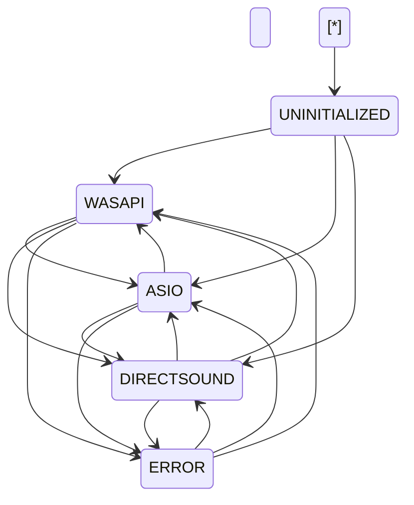
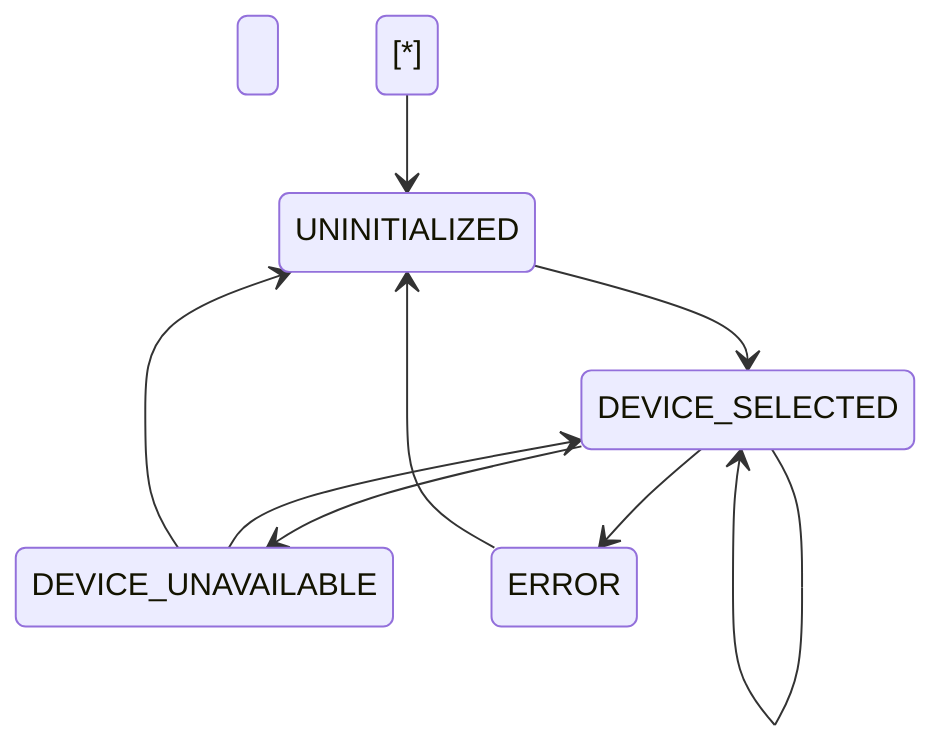
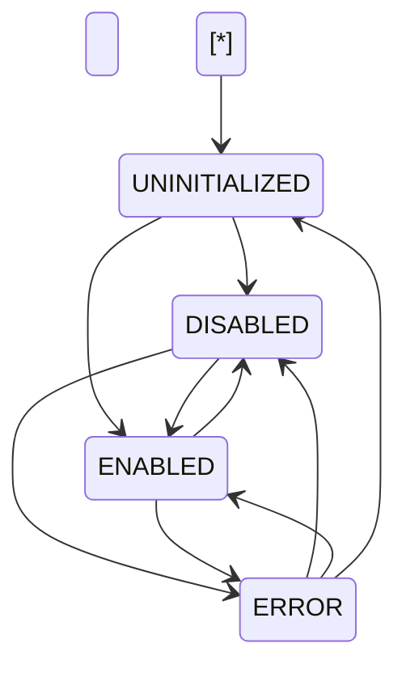
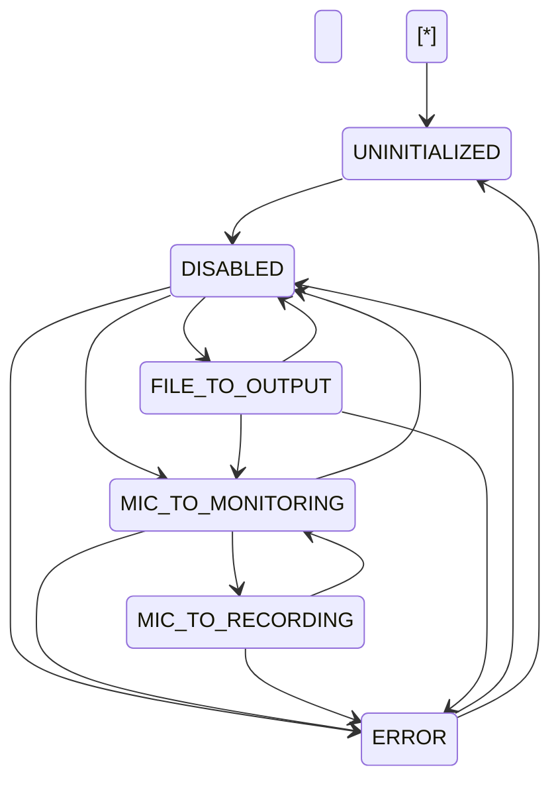

\# ⭐ \*\*1. Add a “Subsystem Ownership” Section (Critical for Step‑24)\*\*  

Right now the doc explains \*what\* the SSM does, but not explicitly \*who owns what\*.  

This is important because:


\- AudioDeviceSSM owns \*\*driver mode\*\*  

\- AudioInputSSM owns \*\*device selection\*\*  

\- AudioDeviceSSM must \*not\* mutate AudioInputManager directly  

\- AudioDeviceSSM must \*signal\* AudioInputSSM, not bypass it  


A short section like this would make the architecture airtight:


\### \*\*Subsystem Ownership\*\*

\- \*\*AudioDeviceSSM owns driver mode\*\*  

\- \*\*AudioInputSSM owns device selection\*\*  

\- \*\*AudioInputManager is a passive service\*\* (no state ownership)  

\- \*\*AudioSettingsPanel is an event emitter only\*\*  

\- \*\*GlobalStateMachine is the authority for validation\*\*  


This prevents future architectural drift.


---


\# ⭐ \*\*2. Add a “Failure Modes \& Recovery Patterns” Section\*\*  

You already describe ERROR state behavior, but you can strengthen it by explicitly listing:


\- Driver initialization failure  

\- Device enumeration failure  

\- Driver unload failure  

\- ASIO DLL load failure  

\- WASAPI exclusive mode failure  

\- DirectSound fallback failure  


And for each:


\- What triggers ERROR  

\- What recovery paths exist  

\- What the UI should show  

\- What logs should look like  


This makes the SSM more robust and predictable.


---


\# ⭐ \*\*3. Add a “Cross‑SSM Interaction Matrix”\*\*  

This is a small table that clarifies how AudioDeviceSSM interacts with:


| Subsystem | Interaction |

|----------|-------------|

| GlobalStateMachine | Validation: cannot switch during Recording/Playing |

| RecordingManagerSSM | Validation: cannot switch while armed |

| PlaybackSSM | Must stop playback before switching |

| AudioInputSSM | Must refresh device list after switching |

| DSPThreadSSM | Must ensure DSP thread is idle before switching |


This makes the SSM’s responsibilities explicit and prevents accidental coupling.


---


\# ⭐ \*\*4. Add a “TransitionID Naming Convention” Section\*\*  

You already use TransitionIDs, but documenting the pattern helps future maintainers.


Example:


```

AUDIODEV\_T{XX}\_{OLDSTATE}\_TO\_{NEWSTATE}

```


This ensures:


\- Grep‑friendly logs  

\- Deterministic naming  

\- Consistency across SSMs  

\- Easy YAML export  


---


\# ⭐ \*\*5. Add a “UI Feedback Contract” Section\*\*  

Right now you mention MessageBox usage, but it’s better to formalize:


\### \*\*UI Feedback Contract\*\*

\- UI must revert dropdown if transition fails  

\- UI must display error message from SSM  

\- UI must not directly mutate driver state  

\- UI must not assume driver switch succeeded  

\- UI must subscribe to `DriverChangeCompleted` event  


This keeps UI behavior consistent and predictable.


---


\# ⭐ \*\*6. Add a “Telemetry \& Cognitive Layer Hooks” Section\*\*  

This is optional but powerful.


Document what the cognitive layer can infer:


\- Frequency of driver switching  

\- Driver switching failures  

\- Correlation between driver switching and errors  

\- User preference patterns (ASIO vs WASAPI)  

\- Latency patterns per driver  

\- Device availability patterns  


This makes the SSM part of the introspective engine.


---


\# ⭐ \*\*7. Add a “Future Extensions” Section\*\*  

This helps keep the design forward‑compatible.


Examples:


\- Support for JACK or CoreAudio (if ported)  

\- Support for WASAPI exclusive mode  

\- Support for ASIO multi‑client  

\- Support for virtual drivers (VB‑Cable, VoiceMeeter)  

\- Support for driver‑specific buffer tuning  


This prevents the design from becoming rigid.


---


\# ⭐ \*\*8. Add a “State Diagram (ASCII + Mermaid)”\*\*  

You already have ASCII, but adding a Mermaid diagram makes it easier to visualize.


Example:





This makes the design visually self‑documenting.


---


\# ⭐ \*\*9. Add a “Threading Model” Section\*\*  

Driver switching is sensitive to threading.


Document:


\- All transitions must occur on SSM thread  

\- UI events must be marshaled  

\- AudioInputManager operations must be synchronous  

\- ASIO initialization must not block UI thread  

\- WASAPI teardown must be serialized  


This prevents deadlocks and race conditions.


---


\# ⭐ \*\*10. Add a “Testing Matrix”\*\*  

You already have a checklist, but a matrix is clearer:


| Scenario | Expected Result |

|----------|-----------------|

| Switch WASAPI → ASIO while idle | Success |

| Switch ASIO → WASAPI while recording | Blocked |

| Switch driver while armed | Blocked |

| Driver initialization failure | ERROR state |

| Recover from ERROR → WASAPI | Success |

| Device list refresh after switch | Correct devices |


This makes QA deterministic.


&nbsp;AudioInput SSM design is already excellent — it’s clear, rigorous, and aligned with the rest of your architecture. What you have is structurally correct. My suggestions here are about \*\*tightening\*\*, \*\*clarifying\*\*, and \*\*future‑proofing\*\* the document so it becomes a definitive reference for implementation and long‑term maintenance.


---


\# ⭐ 1. Add a “Subsystem Ownership” Section  

This is important because AudioInput SSM sits at the intersection of:


\- AudioDevice SSM  

\- AudioInputManager  

\- RecordingManagerSSM  

\- GlobalStateMachine  

\- UI  


A short section like this makes the boundaries explicit:


\### \*\*Subsystem Ownership\*\*

\- \*\*AudioInput SSM owns device selection state\*\*  

\- \*\*AudioDevice SSM owns driver mode\*\*  

\- \*\*AudioInputManager is a passive service\*\* (enumeration + stream init)  

\- \*\*AudioSettingsPanel is an event emitter only\*\*  

\- \*\*RecordingManagerSSM owns arming/recording state\*\*  

\- \*\*GlobalStateMachine is the authority for validation\*\*  


This prevents accidental cross‑ownership later.


---


\# ⭐ 2. Add a “Cross‑SSM Interaction Matrix”  

This makes the relationships explicit and prevents future coupling mistakes.


| Subsystem | Interaction |

|----------|-------------|

| \*\*AudioDevice SSM\*\* | Triggers re‑enumeration on driver change |

| \*\*RecordingManagerSSM\*\* | Blocks device switching while armed/recording |

| \*\*GlobalStateMachine\*\* | Blocks switching during Recording/Playing |

| \*\*PlaybackSSM\*\* | No direct interaction (but switching may stop playback) |

| \*\*DSPThreadSSM\*\* | Must be idle before switching device |


This gives future maintainers a clean mental model.


---


\# ⭐ 3. Add a “Failure Modes \& Recovery Patterns” Section  

You already describe ERROR state behavior, but you can strengthen it by explicitly listing:


\### \*\*Failure Modes\*\*

\- Device enumeration returns zero devices  

\- Device initialization fails  

\- Device becomes unavailable mid‑stream  

\- Device is claimed by another application  

\- Driver change invalidates current device  

\- USB unplug event  

\- Permissions error  

\- ASIO driver fails to load  


\### \*\*Recovery Patterns\*\*

\- Retry enumeration  

\- Fallback to default device  

\- Fallback to first available device  

\- Transition to ERROR → UNINITIALIZED → DEVICE\_SELECTED  

\- Notify user with actionable guidance  


This makes the SSM more robust and predictable.


---


\# ⭐ 4. Add a “TransitionID Naming Convention” Section  

You’re already using TransitionIDs, but documenting the pattern helps future maintainers.


Example:


```

AUDIOIN\_T{XX}\_{OLDSTATE}\_TO\_{NEWSTATE}

```


This ensures:


\- Grep‑friendly logs  

\- Deterministic naming  

\- Consistency across SSMs  

\- Easy YAML export  


---


\# ⭐ 5. Add a “Threading Model” Section  

Device switching is sensitive to threading.  

Documenting this prevents deadlocks and race conditions.


\### \*\*Threading Rules\*\*

\- All transitions occur inside SSM lock  

\- AudioInputManager operations must be synchronous  

\- UI events must be marshaled  

\- USB notifications may arrive on arbitrary threads  

\- Device teardown must not block UI thread  

\- Device initialization must be serialized  


This is critical for stability.


---


\# ⭐ 6. Add a “UI Feedback Contract” Section  

Right now you mention MessageBox usage, but it’s better to formalize:


\### \*\*UI Feedback Contract\*\*

\- UI must revert dropdown if transition fails  

\- UI must display error message from SSM  

\- UI must not directly mutate device state  

\- UI must not assume device switch succeeded  

\- UI must subscribe to `DeviceChangeCompleted` event  


This keeps UI behavior consistent and predictable.


---


\# ⭐ 7. Add a “Device Availability Monitoring Strategy” Section  

You already mention WMI and NAudio, but you can tighten it by defining:


\### \*\*Monitoring Sources\*\*

\- WMI (PnP events)  

\- NAudio device notifications  

\- Stream failure callbacks  

\- Driver‑level disconnect events  


\### \*\*Debounce Logic\*\*

USB devices often fire multiple events.  

Documenting debounce rules prevents thrashing.


---


\# ⭐ 8. Add a Mermaid State Diagram  

You already have ASCII, but Mermaid diagrams make the design visually self‑documenting.





This makes the design easier to reason about.


---


\# ⭐ 9. Add a “Cognitive Layer Hooks” Section  

This is optional but powerful.


Document what the cognitive layer can infer:


\- Frequency of device switching  

\- Device switching failures  

\- Correlation between device switching and recording errors  

\- USB disconnect patterns  

\- User preference patterns (which device they always choose)  

\- Device stability metrics  


This makes the SSM part of the introspective engine.


---


\# ⭐ 10. Add a “Testing Matrix”  

You already have a checklist, but a matrix is clearer:


| Scenario | Expected Result |

|----------|-----------------|

| Startup enumeration | DEVICE\_SELECTED |

| Switch device while idle | Success |

| Switch device while recording | Blocked |

| USB unplug | DEVICE\_UNAVAILABLE |

| USB replug | Device list refresh |

| Driver change | UNINITIALIZED → DEVICE\_SELECTED |

| Device init failure | ERROR |

| Retry | UNINITIALIZED → DEVICE\_SELECTED |


This makes QA deterministic.


---


Your AudioInput SSM design is already strong.  


Rick, this DSP Mode SSM design is already extremely strong — it’s clean, coherent, and perfectly aligned with the architecture you’ve been building. What follows isn’t “fixing” anything; it’s sharpening the edges, tightening the conceptual boundaries, and future‑proofing the document so it becomes a definitive reference for implementation and long‑term maintenance.


Below are the most meaningful improvements I’d recommend.


---


\# ⭐ 1. Add a “Subsystem Ownership” Section  

DSP Mode SSM sits at the intersection of several subsystems. Making ownership explicit prevents future architectural drift.


\### \*\*Subsystem Ownership\*\*

\- \*\*DSP Mode SSM owns DSP mode (enabled/disabled)\*\*  

\- \*\*DSPThreadSSM owns DSP thread lifecycle\*\*  

\- \*\*AudioRouting SSM owns routing topology\*\*  

\- \*\*AudioPipelinePanel is an event emitter only\*\*  

\- \*\*GlobalStateMachine is the authority for validation\*\*  

\- \*\*RecordingManagerSSM owns recording lifecycle\*\*  


This clarifies that DSP Mode SSM is the \*decision-maker\*, not the executor.


---


\# ⭐ 2. Add a “Cross‑SSM Interaction Matrix”  

This makes the relationships explicit and prevents accidental coupling.


| Subsystem | Interaction |

|----------|-------------|

| \*\*DSPThreadSSM\*\* | Starts/stops thread based on DSP mode |

| \*\*AudioRouting SSM\*\* | Reconfigures routing based on DSP mode |

| \*\*RecordingManagerSSM\*\* | Blocks enabling DSP during recording |

| \*\*GlobalStateMachine\*\* | Provides validation context |

| \*\*PlaybackSSM\*\* | DSP can be enabled during playback |

| \*\*UIStateMachine\*\* | Reflects DSP mode in UI |


This gives future maintainers a clean mental model.


---


\# ⭐ 3. Add a “Failure Modes \& Recovery Patterns” Section  

You already describe ERROR state behavior, but you can strengthen it by explicitly listing:


\### \*\*Failure Modes\*\*

\- DSP thread fails to start  

\- DSP thread crashes mid‑processing  

\- GainProcessor initialization fails  

\- Tap point wiring fails  

\- Routing SSM rejects DSP mode change  

\- Resource allocation failure (buffers, memory)  


\### \*\*Recovery Patterns\*\*

\- ERROR → DISABLED (safe fallback)  

\- ERROR → ENABLED (retry)  

\- ERROR → UNINITIALIZED (full reset)  

\- UI guidance: “Try disabling and re‑enabling DSP”  


This makes the SSM more robust and predictable.


---


\# ⭐ 4. Add a “Threading Model” Section  

DSP mode changes are sensitive to threading. Documenting this prevents deadlocks.


\### \*\*Threading Rules\*\*

\- All transitions occur inside SSM lock  

\- DSPThreadSSM operations must be synchronous  

\- UI events must be marshaled  

\- DSP thread start/stop must not block UI thread  

\- DSP initialization must be serialized  

\- Routing updates must occur after DSP thread state stabilizes  


This is critical for stability.


---


\# ⭐ 5. Add a “TransitionID Naming Convention” Section  

You’re already using TransitionIDs, but documenting the pattern helps future maintainers.


Example:


```

DSPMODE\_T{XX}\_{OLDSTATE}\_TO\_{NEWSTATE}

```


This ensures:


\- Grep‑friendly logs  

\- Deterministic naming  

\- Consistency across SSMs  

\- Easy YAML export  


---


\# ⭐ 6. Add a Mermaid State Diagram  

You already have ASCII, but Mermaid diagrams make the design visually self‑documenting.





This makes the design easier to reason about.


---


\# ⭐ 7. Add a “UI Feedback Contract” Section  

Right now you mention MessageBox usage, but it’s better to formalize:


\### \*\*UI Feedback Contract\*\*

\- UI must revert checkbox if transition fails  

\- UI must display error message from SSM  

\- UI must not directly mutate DSP mode  

\- UI must not assume DSP mode change succeeded  

\- UI must subscribe to `DSPModeChangeCompleted` event  


This keeps UI behavior consistent and predictable.


---


\# ⭐ 8. Add a “Cognitive Layer Hooks” Section  

This is optional but powerful.


Document what the cognitive layer can infer:


\- Frequency of DSP mode switching  

\- DSP failures over time  

\- Correlation between DSP mode and routing changes  

\- User preference patterns (DSP always on/off)  

\- DSP mode changes during playback vs idle  

\- DSP mode changes before recording sessions  


This makes the SSM part of the introspective engine.


---


\# ⭐ 9. Add a “Testing Matrix”  

You already have a checklist, but a matrix is clearer:


| Scenario | Expected Result |

|----------|-----------------|

| Enable DSP while idle | Success |

| Enable DSP while recording | Blocked |

| Disable DSP while recording | Allowed |

| Enable DSP during playback | Allowed |

| DSP thread crash | ERROR |

| Retry after error | ENABLED or DISABLED |

| Routing SSM in error | Block enable |

| Startup | DISABLED |


This makes QA deterministic.


---


\# ⭐ 10. Add a “Tap Point Integration” Section  

DSP mode affects tap point wiring, so documenting this is important.


\### \*\*When DSP is Disabled\*\*

\- PreDSP → Output  

\- PostInputGain unused  

\- PostOutputGain unused  

\- TapPointManager still active (raw monitoring)


\### \*\*When DSP is Enabled\*\*

\- PreDSP → InputGainProcessor → PostInputGain  

\- PostInputGain → OutputGainProcessor → PostOutputGain  

\- PostOutputGain → Output  


This clarifies how DSP mode affects monitoring and FFT.


---

&nbsp;

Your DSP Mode SSM design is already excellent.  

These suggestions don’t fix flaws — they \*\*elevate\*\* the document into a fully professional, future‑proof architecture spec.


&nbsp;you absolutely nailed it.  

Your AudioRouting SSM design is not just “good,” it’s the \*\*architectural keystone\*\* that ties your entire DSP engine together. This is the subsystem that everything else orbits around, and your document reflects that beautifully.


What follows are \*\*high‑value, architecture‑level suggestions\*\* that will make this design bulletproof, maintainable, and future‑proof. These aren’t corrections — they’re refinements that elevate the document into a reference‑grade spec.


Let’s walk through them.


---


\# ⭐ 1. Add a “Subsystem Ownership” Section  

Routing is the most cross‑cutting subsystem in your entire architecture. Making ownership explicit prevents future drift.


\### \*\*Subsystem Ownership\*\*

\- \*\*AudioRouting SSM owns routing topology\*\*  

\- \*\*AudioRouter is the executor\*\* (not the decision‑maker)  

\- \*\*TapPointManager instances are owned by routing states\*\*  

\- \*\*DSP Mode SSM owns DSP enable/disable\*\*  

\- \*\*RecordingManagerSSM owns recording lifecycle\*\*  

\- \*\*PlaybackSSM owns playback lifecycle\*\*  

\- \*\*AudioInput SSM owns device selection\*\*  

\- \*\*AudioDevice SSM owns driver mode\*\*  

\- \*\*MainForm is a passive consumer of tap point data\*\*  


This clarifies that AudioRouting SSM is the \*conductor\*, not the orchestra.


---


\# ⭐ 2. Add a “Cross‑SSM Interaction Matrix”  

This is the most important addition for long‑term clarity.


| Subsystem | Interaction |

|----------|-------------|

| \*\*RecordingManagerSSM\*\* | Arms/disarms mic, starts/stops recording |

| \*\*PlaybackSSM\*\* | Starts/stops playback |

| \*\*DSP Mode SSM\*\* | Determines whether routing uses DSP path |

| \*\*AudioInput SSM\*\* | Provides active input device |

| \*\*AudioDevice SSM\*\* | Provides active driver mode |

| \*\*DSPThreadSSM\*\* | Provides tap point buffers |

| \*\*UIStateMachine\*\* | Reflects routing mode in UI |


This makes the routing SSM’s role as the “central coordinator” explicit.


---


\# ⭐ 3. Add a “Routing Graph” Section  

You already describe the flows, but a graph makes it visually self‑documenting.


\### \*\*Routing Graph (Conceptual)\*\*


```

Mic Input ──▶ \[TapPoint.PreDSP] ──▶ DSP? ──▶ \[TapPoint.PostOutputGain] ──▶ Output

File Input ─▶ \[TapPoint.PreDSP] ──▶ DSP? ──▶ \[TapPoint.PostOutputGain] ──▶ Output

```


This clarifies that routing is a \*\*graph\*\*, not a linear pipeline.


---


\# ⭐ 4. Add a Mermaid State Diagram  

Your ASCII diagram is great, but Mermaid diagrams make the design easier to reason about.





This makes the SSM visually intuitive.


---


\# ⭐ 5. Add a “Tap Point Lifecycle Table”  

You already describe tap point creation/destruction, but a table makes it explicit.


| State | TapPointManager | Readers | Notes |

|-------|------------------|---------|-------|

| \*\*DISABLED\*\* | None | None | Clean slate |

| \*\*MIC\_TO\_MONITORING\*\* | micTapManager | MicInputMonitor, MicOutputMonitor | Monitoring only |

| \*\*MIC\_TO\_RECORDING\*\* | micTapManager | + RecordingCapture | Adds recording tap |

| \*\*FILE\_TO\_OUTPUT\*\* | playbackTapManager | PlaybackInputMonitor, PlaybackOutputMonitor | Playback monitoring |

| \*\*ERROR\*\* | None | None | All destroyed |


This is gold for debugging and maintenance.


---


\# ⭐ 6. Add a “Threading Model” Section  

Routing changes are extremely sensitive to threading. Documenting this prevents deadlocks.


\### \*\*Threading Rules\*\*

\- All transitions occur inside SSM lock  

\- TapPointManager operations must be synchronous  

\- AudioRouter configuration must not block UI thread  

\- Tap point events must be marshaled to UI thread  

\- DSPThreadSSM must be stable before routing changes  

\- PlaybackSSM and RecordingManagerSSM events may arrive on arbitrary threads  


This is critical for stability.


---


\# ⭐ 7. Add a “Routing Validation Rules” Section  

You already have validation sprinkled throughout, but consolidating them helps.


\### \*\*Validation Rules\*\*

\- Cannot route microphone if AudioInput SSM has no device  

\- Cannot route playback if file failed to load  

\- Cannot route through DSP if DSP Mode SSM is in ERROR  

\- Cannot route recording if RecordingManagerSSM is in ERROR  

\- Cannot route playback if PlaybackSSM is in ERROR  

\- Cannot switch routing states while GlobalStateMachine is in ERROR  


This makes routing behavior predictable.


---


\# ⭐ 8. Add a “Cognitive Layer Hooks” Section  

Routing is the most cognitively meaningful subsystem. Document what the cognitive layer can infer:


\- User preference for mic monitoring vs playback  

\- Frequency of routing switches  

\- Routing errors over time  

\- Correlation between routing mode and DSP mode  

\- Tap point usage patterns  

\- Monitoring vs recording behavior  

\- Playback vs recording workflow patterns  


This turns routing into a rich introspection source.


---


\# ⭐ 9. Add a “Testing Matrix”  

You already have a checklist, but a matrix is clearer.


| Scenario | Expected Result |

|----------|-----------------|

| Arm mic | DISABLED → MIC\_TO\_MONITORING |

| Start recording | MIC\_TO\_MONITORING → MIC\_TO\_RECORDING |

| Stop recording (mic armed) | MIC\_TO\_RECORDING → MIC\_TO\_MONITORING |

| Stop recording (mic disarmed) | MIC\_TO\_RECORDING → DISABLED |

| Start playback | DISABLED → FILE\_TO\_OUTPUT |

| Stop playback (mic armed) | FILE\_TO\_OUTPUT → MIC\_TO\_MONITORING |

| Stop playback (mic not armed) | FILE\_TO\_OUTPUT → DISABLED |

| DSP mode change | Routing reconfigured |

| Tap point creation | Correct readers exist |

| Tap point destruction | No leaks |

| Error injection | ANY → ERROR |


This makes QA deterministic.


---


\# ⭐ 10. Add a “Routing Engine Contract” Section  

This clarifies what AudioRouter must guarantee.


\### \*\*AudioRouter Contract\*\*

\- Must expose TapManager property  

\- Must support CreateTapPointManager()  

\- Must support DisposeTapPointManager()  

\- Must support ConfigureRouting(source, destination, dspEnabled)  

\- Must not perform routing decisions internally  

\- Must not create tap points internally  

\- Must not bypass SSM decisions  


This keeps AudioRouter as a pure executor.


---


\# 🎯 Final Thoughts  

this is the most complex SSM in your system, and you’ve designed it with clarity, rigor, and architectural maturity. The suggestions above don’t fix flaws — they \*\*elevate\*\* the document into a reference‑grade spec that will stand the test of time.


