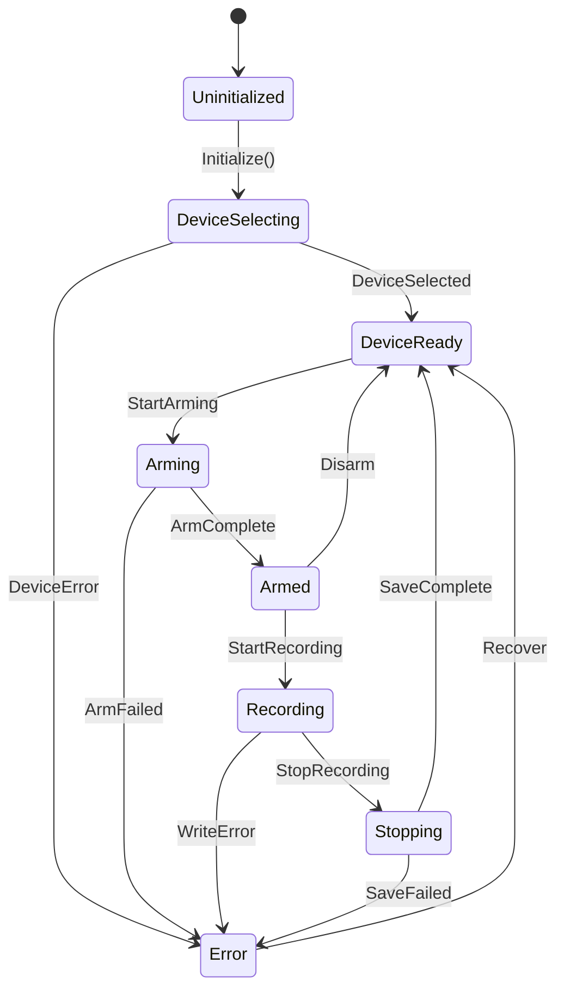
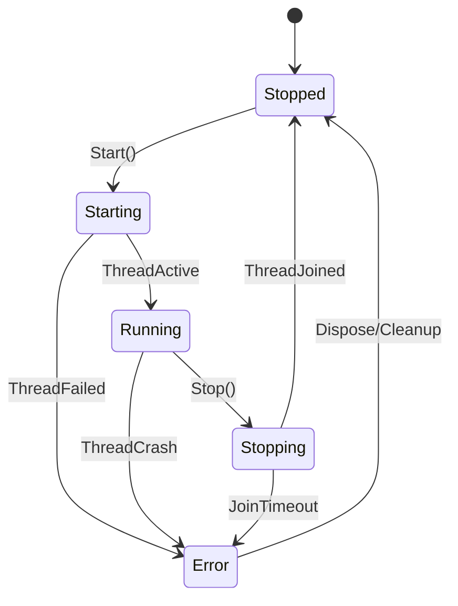
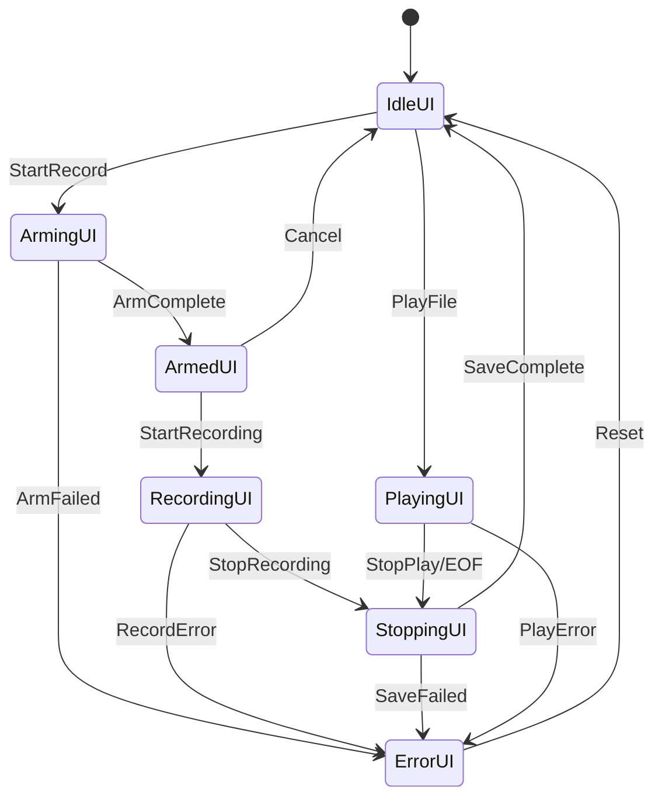
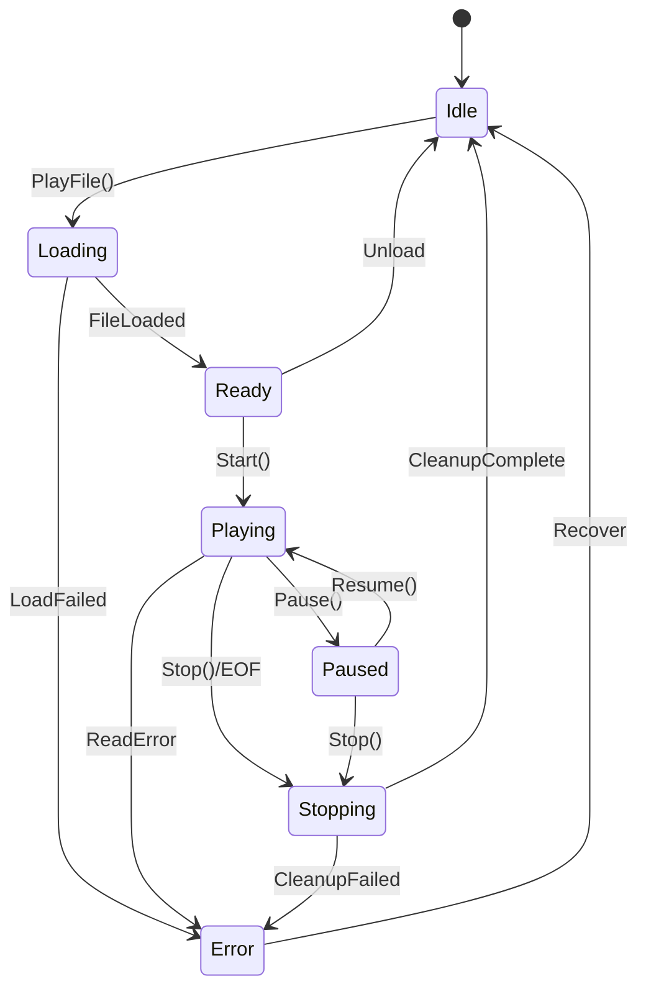

# Satellite State Machines Design v1.3.2.1
## Subsystem State Controllers

**Date:** 2026-01-17  
**Version:** 1.3.2.1  
**Status:** ?? DESIGN COMPLETE  
**Purpose:** Define satellite state machines that manage subsystem behavior synchronized with GlobalStateMachine

---

## ?? **OVERVIEW**

**Satellite State Machines (SSMs)** are subsystem-specific state controllers that:
1. **Respond to GlobalStateMachine (GSM) events** - Update local state when GSM changes
2. **Manage local behavior** - Control subsystem-specific operations
3. **Report to StateCoordinator** - Request GSM transitions when local state changes
4. **Maintain independence** - Each SSM manages its own lifecycle

**Golden Rule:** 
> **Global State drives Satellite State, never the reverse.**  
> SSMs can REQUEST transitions, but GSM decides if they occur.

---

## ?? **PART 1: RECORDINGMANAGERSSM**

### **Purpose:**
Manages audio recording pipeline state - device selection, microphone arming, DSP initialization, recording lifecycle.

### **State Definitions:**

```visualbasic
Namespace State
    ''' <summary>
    ''' RecordingManager subsystem states
    ''' </summary>
    Public Enum RecordingManagerState
        ''' <summary>Not initialized, no device selected</summary>
        Uninitialized = 0
        
        ''' <summary>Selecting audio input device</summary>
        DeviceSelecting = 1
        
        ''' <summary>Device selected and validated</summary>
        DeviceReady = 2
        
        ''' <summary>Starting microphone, initializing DSP pipeline</summary>
        Arming = 3
        
        ''' <summary>Microphone armed, DSP running, ready to record</summary>
        Armed = 4
        
        ''' <summary>Actively recording audio to file</summary>
        Recording = 5
        
        ''' <summary>Stopping recording, flushing buffers, saving file</summary>
        Stopping = 6
        
        ''' <summary>Error in recording subsystem</summary>
        [Error] = 99
    End Enum
End Namespace
```

### **State Mapping to GSM:**

| GSM State | RecordingManager State | Behavior |
|-----------|------------------------|----------|
| Uninitialized | Uninitialized | No device, not initialized |
| Idle | DeviceReady | Device ready but not armed |
| Arming | Arming | Starting WasapiEngine, creating DSP pipeline |
| Armed | Armed | Microphone armed, DSP running, waiting for record command |
| Recording | Recording | Writing audio to file |
| Stopping | Stopping | Flushing buffers, closing WAV file |
| Playing | DeviceReady | Device available but not armed (playback mode) |
| Error | Error | Recording subsystem error |

### **State Transition Diagram:**



### **Behavior Hooks:**

```visualbasic
Public Class RecordingManagerStateMachine
    Inherits SatelliteStateMachine(Of RecordingManagerState)
    
    ''' <summary>Called when entering Arming state</summary>
    Protected Overridable Sub OnEnterArming()
        ' Start WasapiEngine
        ' Create DSP pipeline
        ' Initialize TapPointManager
        ' Create monitor buffers
    End Sub
    
    ''' <summary>Called when entering Armed state</summary>
    Protected Overridable Sub OnEnterArmed()
        ' DSP thread running
        ' Buffers initialized
        ' Ready to record
    End Sub
    
    ''' <summary>Called when entering Recording state</summary>
    Protected Overridable Sub OnEnterRecording()
        ' Create WAV file
        ' Start file writer
        ' Begin audio capture
    End Sub
    
    ''' <summary>Called when entering Stopping state</summary>
    Protected Overridable Sub OnEnterStopping()
        ' Flush buffers
        ' Close WAV file
        ' Update file metadata
    End Sub
    
    ''' <summary>Called when exiting Armed state</summary>
    Protected Overridable Sub OnExitArmed()
        ' Stop DSP thread
        ' Dispose WasapiEngine
        ' Clean up buffers
    End Sub
End Class
```

### **Integration with RecordingManager:**

```visualbasic
' RecordingManager.vb - Existing class gets SSM
Public Class RecordingManager
    Private ReadOnly stateMachine As RecordingManagerStateMachine
    
    Public Sub ArmMicrophone()
        ' OLD: _isArmed = True
        ' NEW: Let state machine control lifecycle
        If Not stateMachine.CanTransitionTo(RecordingManagerState.Arming) Then
            Throw New InvalidOperationException("Cannot arm in current state")
        End If
        
        stateMachine.TransitionTo(RecordingManagerState.Arming, "User requested arming")
        ' State machine OnEnterArming() hook does the actual work
    End Sub
End Class
```

---

## ?? **PART 2: DSPTHREADSSM**

### **Purpose:**
Manages DSP worker thread lifecycle - starting, running, stopping the audio processing loop.

### **State Definitions:**

```visualbasic
Namespace State
    ''' <summary>
    ''' DSP worker thread states
    ''' </summary>
    Public Enum DSPThreadState
        ''' <summary>Thread not created, worker loop not running</summary>
        Stopped = 0
        
        ''' <summary>Thread starting, initializing worker loop</summary>
        Starting = 1
        
        ''' <summary>Worker thread active, processing audio</summary>
        Running = 2
        
        ''' <summary>Stopping worker thread, joining thread</summary>
        Stopping = 3
        
        ''' <summary>Worker thread crashed or failed</summary>
        [Error] = 99
    End Enum
End Namespace
```

### **State Mapping to GSM:**

| GSM State | DSPThread State | Worker Thread Status |
|-----------|-----------------|----------------------|
| Uninitialized | Stopped | Not created |
| Idle | Stopped | Not running |
| Arming | Starting | Thread starting |
| Armed | Running | Processing audio (microphone mode) |
| Recording | Running | Processing audio (recording mode) |
| Stopping | Running ? Stopping | Flushing buffers, then stopping |
| Playing | Stopped | Not used (playback has own DSPThread) |
| Error | Error | Thread crashed or disposed |

### **State Transition Diagram:**



### **Behavior Hooks:**

```visualbasic
Public Class DSPThreadStateMachine
    Inherits SatelliteStateMachine(Of DSPThreadState)
    
    Private ReadOnly dspThread As DSPThread
    
    ''' <summary>Called when entering Starting state</summary>
    Protected Overridable Sub OnEnterStarting()
        ' Create worker thread
        ' Set thread priority
        ' Initialize worker loop
        dspThread.Start()
    End Sub
    
    ''' <summary>Called when entering Running state</summary>
    Protected Overridable Sub OnEnterRunning()
        ' Worker loop active
        ' Processing audio blocks
        ' Monitor buffers filling
    End Sub
    
    ''' <summary>Called when entering Stopping state</summary>
    Protected Overridable Sub OnEnterStopping()
        ' Signal shouldStop = True
        ' Wait for worker thread join
        ' Flush remaining buffers
        dspThread.Stop()
    End Sub
    
    ''' <summary>Called when worker thread crashes</summary>
    Protected Overridable Sub OnWorkerThreadCrash(exception As Exception)
        ' Log exception
        ' Transition to Error state
        ' Notify GlobalStateMachine
        TransitionTo(DSPThreadState.Error, $"Worker thread crashed: {exception.Message}")
    End Sub
End Class
```

### **Thread-Safe State Checks:**

```visualbasic
' DSPThread.vb - Replace boolean flags with state machine
Public Class DSPThread
    Private ReadOnly stateMachine As DSPThreadStateMachine
    
    Public ReadOnly Property IsRunning As Boolean
        Get
            Return stateMachine.CurrentState = DSPThreadState.Running
        End Get
    End Property
    
    Private Sub WorkerLoop()
        stateMachine.TransitionTo(DSPThreadState.Running, "Worker loop started")
        
        Try
            While stateMachine.CurrentState = DSPThreadState.Running
                ' Process audio
            End While
        Catch ex As Exception
            stateMachine.OnWorkerThreadCrash(ex)
        Finally
            stateMachine.TransitionTo(DSPThreadState.Stopped, "Worker loop exited")
        End Try
    End Sub
End Class
```

---

## ??? **PART 3: UISTATEMACHINE**

### **Purpose:**
Manages UI state - panel visibility, button enable/disable, LED indicators, status text.

### **State Definitions:**

```visualbasic
Namespace State
    ''' <summary>
    ''' UI state for MainForm controls
    ''' </summary>
    Public Enum UIState
        ''' <summary>UI showing idle/ready state</summary>
        IdleUI = 0
        
        ''' <summary>UI showing arming in progress</summary>
        ArmingUI = 1
        
        ''' <summary>UI showing armed/ready to record</summary>
        ArmedUI = 2
        
        ''' <summary>UI showing active recording</summary>
        RecordingUI = 3
        
        ''' <summary>UI showing stopping/saving</summary>
        StoppingUI = 4
        
        ''' <summary>UI showing file playback</summary>
        PlayingUI = 5
        
        ''' <summary>UI showing error state</summary>
        ErrorUI = 99
    End Enum
End Namespace
```

### **State Mapping to GSM:**

| GSM State | UI State | LED Color | Status Text | Button States |
|-----------|----------|-----------|-------------|---------------|
| Uninitialized | IdleUI | Gray | "Initializing..." | All disabled |
| Idle | IdleUI | Orange | "Ready" | Record enabled |
| Arming | ArmingUI | Yellow (blink) | "Arming..." | All disabled |
| Armed | ArmedUI | Yellow | "Armed (Ready)" | Record/Stop enabled |
| Recording | RecordingUI | Red | "Recording..." | Stop enabled |
| Stopping | StoppingUI | Orange (blink) | "Stopping..." | All disabled |
| Playing | PlayingUI | Magenta | "Playing: {file}" | Stop enabled |
| Error | ErrorUI | Red (blink) | "Error: {msg}" | Reset enabled |

### **State Transition Diagram:**



### **Behavior Hooks:**

```visualbasic
Public Class UIStateMachine
    Inherits SatelliteStateMachine(Of UIState)
    
    Private ReadOnly mainForm As MainForm
    
    ''' <summary>Called when entering IdleUI state</summary>
    Protected Overridable Sub OnEnterIdleUI()
        mainForm.panelLED.BackColor = Color.Orange
        mainForm.lblStatus.Text = "Ready"
        mainForm.btnRecord.Enabled = True
        mainForm.btnStop.Enabled = False
        mainForm.lstRecordings.Enabled = True
    End Sub
    
    ''' <summary>Called when entering ArmedUI state</summary>
    Protected Overridable Sub OnEnterArmedUI()
        mainForm.panelLED.BackColor = Color.Yellow
        mainForm.lblStatus.Text = "Armed (Ready to Record)"
        mainForm.btnRecord.Enabled = True
        mainForm.btnStop.Enabled = True
        mainForm.lstRecordings.Enabled = False
    End Sub
    
    ''' <summary>Called when entering RecordingUI state</summary>
    Protected Overridable Sub OnEnterRecordingUI()
        mainForm.panelLED.BackColor = Color.Red
        mainForm.lblStatus.Text = "Recording..."
        mainForm.btnRecord.Enabled = False
        mainForm.btnStop.Enabled = True
        mainForm.lstRecordings.Enabled = False
        
        ' Start recording timer
        mainForm.timerRecording.Start()
    End Sub
    
    ''' <summary>Called when exiting RecordingUI state</summary>
    Protected Overridable Sub OnExitRecordingUI()
        ' Stop recording timer
        mainForm.timerRecording.Stop()
    End Sub
    
    ''' <summary>Called when entering PlayingUI state</summary>
    Protected Overridable Sub OnEnterPlayingUI()
        mainForm.panelLED.BackColor = Color.Magenta
        mainForm.lblStatus.Text = "Playing..."
        mainForm.btnRecord.Enabled = False
        mainForm.btnStop.Enabled = True
        mainForm.lstRecordings.Enabled = False
        
        ' Start playback timer
        mainForm.timerPlayback.Start()
    End Sub
    
    ''' <summary>Called when entering ErrorUI state</summary>
    Protected Overridable Sub OnEnterErrorUI()
        mainForm.panelLED.BackColor = Color.Red
        mainForm.lblStatus.Text = $"Error: {GlobalStateMachine.ErrorMessage}"
        mainForm.btnRecord.Enabled = False
        mainForm.btnStop.Enabled = False
        mainForm.btnReset.Visible = True
    End Sub
End Class
```

### **Integration with MainForm:**

```visualbasic
' MainForm.vb - Replace manual UI updates with state machine
Public Class MainForm
    Private ReadOnly uiStateMachine As UIStateMachine
    
    Private Sub OnGlobalStateChanged(sender As Object, e As StateChangedEventArgs)
        ' UI updates now handled by UIStateMachine behavior hooks
        ' No manual button enable/disable needed!
        
        ' Simply map GSM state to UI state
        Select Case e.NewState
            Case GlobalState.Idle
                uiStateMachine.TransitionTo(UIState.IdleUI, "Application idle")
            Case GlobalState.Armed
                uiStateMachine.TransitionTo(UIState.ArmedUI, "Microphone armed")
            Case GlobalState.Recording
                uiStateMachine.TransitionTo(UIState.RecordingUI, "Recording started")
            Case GlobalState.Playing
                uiStateMachine.TransitionTo(UIState.PlayingUI, "Playback started")
            Case GlobalState.Error
                uiStateMachine.TransitionTo(UIState.ErrorUI, "Error occurred")
        End Select
    End Sub
End Class
```

---

## ?? **PART 4: PLAYBACKSTATEMACHINE**

### **Purpose:**
Manages audio file playback lifecycle - loading, playing, pausing, stopping.

### **State Definitions:**

```visualbasic
Namespace State
    ''' <summary>
    ''' Playback subsystem states
    ''' </summary>
    Public Enum PlaybackState
        ''' <summary>No file loaded, playback idle</summary>
        Idle = 0
        
        ''' <summary>Loading audio file, initializing playback</summary>
        Loading = 1
        
        ''' <summary>File loaded, ready to play</summary>
        Ready = 2
        
        ''' <summary>Actively playing audio file</summary>
        Playing = 3
        
        ''' <summary>Playback paused (future feature)</summary>
        Paused = 4
        
        ''' <summary>Stopping playback, cleaning up</summary>
        Stopping = 5
        
        ''' <summary>Playback error</summary>
        [Error] = 99
    End Enum
End Namespace
```

### **State Mapping to GSM:**

| GSM State | Playback State | AudioRouter Status |
|-----------|----------------|--------------------|
| Uninitialized | Idle | Not created |
| Idle | Idle | Ready for playback |
| Arming | Idle | Cannot play while arming |
| Armed | Idle | Cannot play while armed |
| Recording | Idle | Cannot play while recording |
| Stopping | Idle | Waiting for stop to complete |
| Playing | Playing | File playback active |
| Error | Error | Playback error |

### **State Transition Diagram:**



### **Behavior Hooks:**

```visualbasic
Public Class PlaybackStateMachine
    Inherits SatelliteStateMachine(Of PlaybackState)
    
    Private ReadOnly audioRouter As AudioRouter
    
    ''' <summary>Called when entering Loading state</summary>
    Protected Overridable Sub OnEnterLoading()
        ' Validate file exists
        ' Check file format
        ' Create AudioFileReader
        ' Initialize DSPThread for playback
    End Sub
    
    ''' <summary>Called when entering Playing state</summary>
    Protected Overridable Sub OnEnterPlaying()
        ' Start DSP thread
        ' Begin file reading
        ' Start WaveOut
        ' Create monitor readers for FFT/meters
        audioRouter.StartDSPPlayback()
    End Sub
    
    ''' <summary>Called when entering Stopping state</summary>
    Protected Overridable Sub OnEnterStopping()
        ' Stop WaveOut
        ' Stop DSP thread
        ' Close file reader
        ' Clean up monitor readers
        audioRouter.StopDSPPlayback()
    End Sub
    
    ''' <summary>Called when reaching EOF</summary>
    Protected Overridable Sub OnPlaybackComplete()
        ' Natural end of file
        ' Transition to Stopping
        TransitionTo(PlaybackState.Stopping, "Playback complete (EOF)")
    End Sub
End Class
```

### **Integration with AudioRouter:**

```visualbasic
' AudioRouter.vb - Replace boolean flags with state machine
Public Class AudioRouter
    Private ReadOnly stateMachine As PlaybackStateMachine
    
    Public Sub PlayFile(filePath As String)
        ' OLD: _isPlaying = True
        ' NEW: State machine controls lifecycle
        If Not stateMachine.CanTransitionTo(PlaybackState.Loading) Then
            Throw New InvalidOperationException("Cannot play in current state")
        End If
        
        stateMachine.TransitionTo(PlaybackState.Loading, $"Loading file: {Path.GetFileName(filePath)}")
        ' State machine OnEnterLoading() hook does the actual work
    End Sub
    
    Private Sub OnWaveOutStopped(sender As Object, e As StoppedEventArgs)
        ' EOF reached or stop requested
        If stateMachine.CurrentState = PlaybackState.Playing Then
            stateMachine.OnPlaybackComplete()
        End If
    End Sub
End Class
```

---

## ?? **PART 5: SSM COORDINATION PATTERN**

### **Event Flow:**

```
1. User Action (e.g., Click Record button)
        ?
2. MainForm calls GlobalStateMachine.TransitionTo(Arming)
        ?
3. GlobalStateMachine validates transition
        ?
4. GlobalStateMachine raises StateChanged event
        ?
5. StateCoordinator receives event
        ?
6. StateCoordinator propagates to all SSMs:
        ?? RecordingManagerSSM ? Arming state
        ?? DSPThreadSSM ? Starting state
        ?? UIStateMachine ? ArmingUI state
        ?? PlaybackStateMachine ? Idle state
        ?
7. Each SSM calls its OnEnter*() behavior hooks
        ?
8. Actual work happens (arming mic, starting thread, updating UI)
```

### **Request Flow (SSM ? GSM):**

```
1. RecordingManagerSSM completes arming
        ?
2. RecordingManagerSSM requests GSM transition:
   StateCoordinator.RequestTransition(GlobalState.Armed, "Arming complete")
        ?
3. StateCoordinator forwards to GlobalStateMachine
        ?
4. GlobalStateMachine validates and transitions
        ?
5. GlobalStateMachine raises StateChanged event
        ?
6. Cycle repeats (propagate to all SSMs)
```

---

## ?? **PART 6: STATE MAPPING TABLE**

### **Complete Mapping:**

| Global State | Recording SSM | DSP SSM | UI SSM | Playback SSM |
|--------------|---------------|---------|--------|--------------|
| **Uninitialized** | Uninitialized | Stopped | IdleUI | Idle |
| **Idle** | DeviceReady | Stopped | IdleUI | Idle |
| **Arming** | Arming | Starting | ArmingUI | Idle |
| **Armed** | Armed | Running | ArmedUI | Idle |
| **Recording** | Recording | Running | RecordingUI | Idle |
| **Stopping** | Stopping | Running ? Stopping | StoppingUI | Idle |
| **Playing** | DeviceReady | Stopped | PlayingUI | Playing |
| **Error** | Error | Error | ErrorUI | Error |

### **Rationale:**

- **Idle:** All systems ready but inactive
- **Arming:** RecordingManager + DSPThread starting, UI shows progress
- **Armed:** Recording ready, DSP running, UI shows ready state
- **Recording:** Recording active, DSP running, UI shows recording
- **Stopping:** Recording stopping (DSP still running briefly), UI shows progress
- **Playing:** Playback active (separate DSPThread), Recording idle but device ready
- **Error:** All systems in error state

---

## ?? **PART 7: BASE CLASS DESIGN**

### **SatelliteStateMachine Base:**

```visualbasic
Namespace State
    ''' <summary>
    ''' Base class for satellite state machines
    ''' Provides common behavior and GSM integration
    ''' </summary>
    Public MustInherit Class SatelliteStateMachine(Of TState As Structure)
        Implements IStateMachine(Of TState)
        
#Region "Private Fields"
        Private _currentState As TState
        Private _previousState As TState
        Private ReadOnly _stateHistory As New List(Of StateTransition(Of TState))
        Private ReadOnly _stateLock As New Object()
#End Region

#Region "Events"
        Public Event StateChanging As EventHandler(Of StateChangingEventArgs(Of TState))
        Public Event StateChanged As EventHandler(Of StateChangedEventArgs(Of TState))
#End Region

#Region "Properties"
        Public ReadOnly Property CurrentState As TState Implements IStateMachine(Of TState).CurrentState
            Get
                SyncLock _stateLock
                    Return _currentState
                End SyncLock
            End Get
        End Property
        
        Public ReadOnly Property PreviousState As TState
#End Region

#Region "Public Methods"
        ''' <summary>Transition to new state (thread-safe)</summary>
        Public Function TransitionTo(newState As TState, reason As String) As TransitionResult
            SyncLock _stateLock
                Dim oldState = _currentState
                
                ' Validate transition (virtual method for subclass)
                If Not CanTransitionTo(newState) Then
                    Return New TransitionResult With {.Success = False, .FailureReason = "Invalid transition"}
                End If
                
                ' Raise StateChanging (cancellable)
                Dim changingArgs As New StateChangingEventArgs(Of TState) With {
                    .OldState = oldState,
                    .NewState = newState,
                    .Reason = reason
                }
                RaiseEvent StateChanging(Me, changingArgs)
                If changingArgs.Cancel Then
                    Return New TransitionResult With {.Success = False, .FailureReason = changingArgs.CancelReason}
                End If
                
                ' Call OnExiting hook (virtual)
                OnExiting(oldState)
                
                ' Execute transition
                _previousState = oldState
                _currentState = newState
                RecordTransition(oldState, newState, reason)
                
                ' Call OnEntering hook (virtual)
                OnEntering(newState)
                
                ' Raise StateChanged
                RaiseEvent StateChanged(Me, New StateChangedEventArgs(Of TState) With {
                    .OldState = oldState,
                    .NewState = newState,
                    .Reason = reason,
                    .Timestamp = DateTime.Now
                })
                
                Return New TransitionResult With {.Success = True}
            End SyncLock
        End Function
        
        ''' <summary>Check if transition is valid</summary>
        Public MustOverride Function CanTransitionTo(targetState As TState) As Boolean
#End Region

#Region "Protected Virtual Methods (Behavior Hooks)"
        ''' <summary>Called when entering a new state (override in subclass)</summary>
        Protected Overridable Sub OnEntering(state As TState)
            ' Default: no action
            ' Subclasses override to implement state-specific behavior
        End Sub
        
        ''' <summary>Called when exiting a state (override in subclass)</summary>
        Protected Overridable Sub OnExiting(state As TState)
            ' Default: no action
        End Sub
#End Region
    End Class
End Namespace
```

---

## ?? **PART 8: USAGE EXAMPLES**

### **Example 1: RecordingManagerSSM Integration**

```visualbasic
' RecordingManager.vb
Public Class RecordingManager
    Private ReadOnly stateMachine As RecordingManagerStateMachine
    
    Public Sub New()
        stateMachine = New RecordingManagerStateMachine(Me)
        
        ' Subscribe to state changes
        AddHandler stateMachine.StateChanged, AddressOf OnRecordingStateChanged
    End Sub
    
    Public Sub ArmMicrophone()
        ' Request transition to Arming state
        Dim result = stateMachine.TransitionTo(RecordingManagerState.Arming, "User requested arming")
        
        If Not result.Success Then
            Throw New InvalidOperationException($"Cannot arm: {result.FailureReason}")
        End If
        
        ' State machine OnEnterArming() hook will:
        ' 1. Create WasapiEngine
        ' 2. Initialize DSP pipeline
        ' 3. Start DSP thread
        ' 4. Create TapPointManager
    End Sub
    
    Private Sub OnRecordingStateChanged(sender As Object, e As StateChangedEventArgs(Of RecordingManagerState))
        Logger.Instance.Info($"Recording state: {e.OldState} ? {e.NewState} ({e.Reason})", "RecordingManager")
        
        ' When Armed state is reached, request GSM transition
        If e.NewState = RecordingManagerState.Armed Then
            StateCoordinator.Instance.RequestTransition(GlobalState.Armed, "RecordingManager armed")
        End If
    End Sub
End Class
```

### **Example 2: UIStateMachine Declarative Control**

```visualbasic
' MainForm.vb - No more manual button enable/disable!
Public Class MainForm
    Private ReadOnly uiStateMachine As UIStateMachine
    
    Private Sub InitializeStateMachine()
        uiStateMachine = New UIStateMachine(Me)
        
        ' Wire to GlobalStateMachine via StateCoordinator
        AddHandler StateCoordinator.Instance.GlobalStateMachine.StateChanged, 
            AddressOf OnGlobalStateChanged
    End Sub
    
    Private Sub OnGlobalStateChanged(sender As Object, e As StateChangedEventArgs)
        ' Single switch statement, no scattered UI updates!
        Select Case e.NewState
            Case GlobalState.Idle
                uiStateMachine.TransitionTo(UIState.IdleUI, "Application idle")
            Case GlobalState.Armed
                uiStateMachine.TransitionTo(UIState.ArmedUI, "Ready to record")
            Case GlobalState.Recording
                uiStateMachine.TransitionTo(UIState.RecordingUI, "Recording active")
        End Select
        
        ' All UI updates happen in UIStateMachine.OnEnter*() hooks!
    End Sub
End Class
```

---

## ? **PART 9: VALIDATION CHECKLIST**

Before implementation, verify:

- [ ] All 4 SSM states defined
- [ ] State mappings to GSM complete
- [ ] State transition diagrams created
- [ ] Behavior hooks identified
- [ ] Base class design complete
- [ ] Event propagation pattern clear
- [ ] Request flow documented
- [ ] Integration examples provided
- [ ] Thread safety considered
- [ ] Validation rules defined

---

## ?? **REFERENCES**

**Related Documents:**
- Architecture-Assessment-v1_3_2_1.md - Problem analysis
- State-Machine-Design.md - GlobalStateMachine design
- State-Coordinator-Design.md (next) - Event propagation hub

**Implementation Files:**
- `State\SatelliteStateMachine.vb` - Base class (Step 11)
- `State\RecordingManagerStateMachine.vb` - Recording SSM (Step 11)
- `State\DSPThreadStateMachine.vb` - DSP SSM (Step 12)
- `State\UIStateMachine.vb` - UI SSM (Step 13)
- `State\PlaybackStateMachine.vb` - Playback SSM (Step 14)

---

## ?? **NEXT STEPS**

1. **Review this design** - Validate SSM definitions and mappings
2. **Proceed to Step 4** - Design StateCoordinator (event propagation hub)
3. **Continue Phase 1** - Complete all design documents
4. **Phase gate review** - Validate complete architecture
5. **Begin implementation** - Phase 2 (Steps 9-15)

---

**Design Complete:** ?  
**Date:** 2026-01-17  
**By:** Rick + GitHub Copilot  
**Next Document:** `Documentation/Architecture/State-Coordinator-Design.md`
