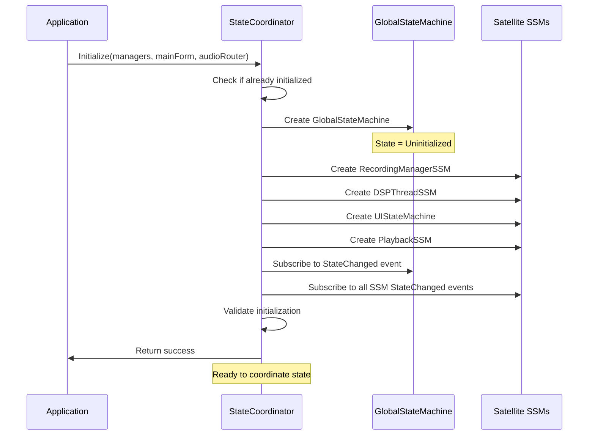
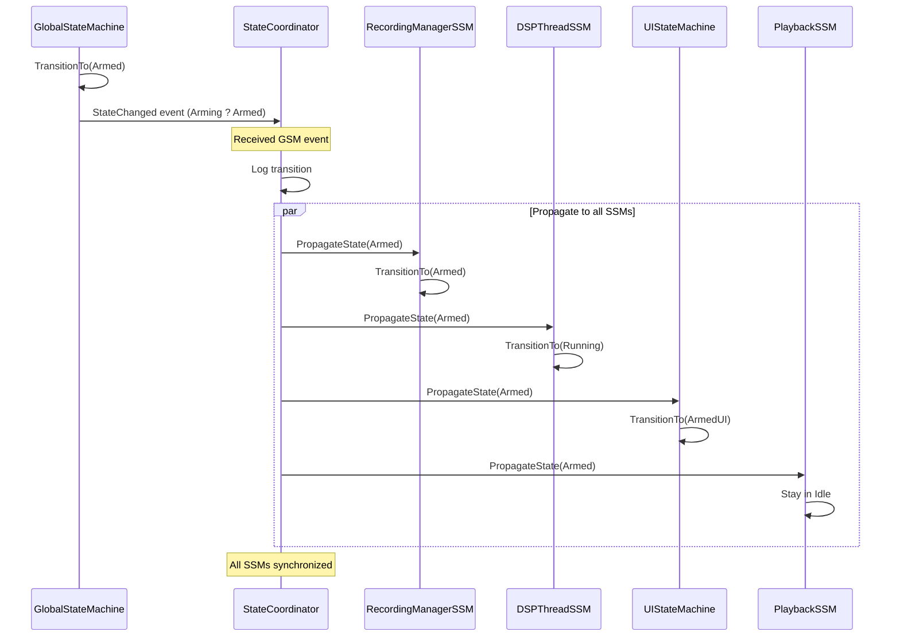
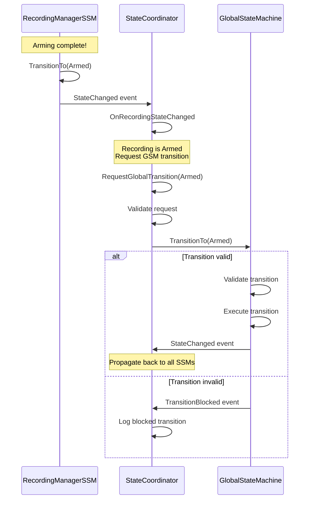
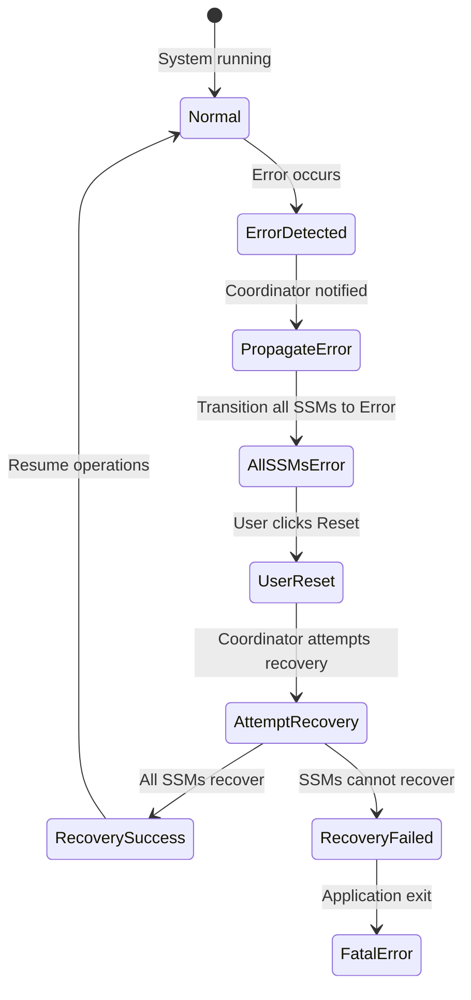

# StateCoordinator Design v1.3.2.1
## Event Propagation Hub

**Date:** 2026-01-17  
**Version:** 1.3.2.1  
**Status:** ?? DESIGN COMPLETE  
**Purpose:** Define the coordinator that manages communication between GlobalStateMachine and all Satellite State Machines

---

## ?? **OVERVIEW**

The **StateCoordinator** is the **communication hub** that:
1. **Initializes all state machines** - Creates and wires GSM and all SSMs
2. **Propagates GSM events to SSMs** - Broadcasts GlobalStateMachine state changes to satellites
3. **Forwards SSM requests to GSM** - Relays satellite transition requests to global machine
4. **Coordinates error recovery** - Manages error state propagation and recovery
5. **Provides debugging interface** - State dumps, telemetry, logging

**Singleton Pattern:**  
StateCoordinator is a **singleton** accessible via `StateCoordinator.Instance` to ensure single point of coordination.

---

## ?? **PART 1: COORDINATOR RESPONSIBILITIES**

### **Primary Responsibilities:**

| Responsibility | Description | Triggered By |
|----------------|-------------|--------------|
| **Initialization** | Create GSM, create all SSMs, wire events | Application startup |
| **Event Broadcasting** | GSM StateChanged ? all SSMs | GlobalStateMachine transitions |
| **Request Forwarding** | SSM requests ? GSM transitions | Satellite state changes |
| **Error Coordination** | Propagate Error state to all SSMs | Any state machine error |
| **State Queries** | Provide current state of all machines | Debugging, logging |
| **Telemetry** | Track state transitions, timing, failures | Always active |

### **NOT Responsible For:**

- ? Business logic (done in SSMs)
- ? UI updates (done by UIStateMachine)
- ? Audio processing (done by RecordingManager/DSPThread)
- ? State validation (done by GlobalStateMachine)

---

## ??? **PART 2: CLASS DESIGN**

### **StateCoordinator Class:**

```visualbasic
Namespace State
    ''' <summary>
    ''' Central coordinator for state machine communication
    ''' Singleton pattern - access via Instance
    ''' </summary>
    Public Class StateCoordinator
        Implements IDisposable
        
#Region "Singleton"
        Private Shared ReadOnly _instance As New Lazy(Of StateCoordinator)(
            Function() New StateCoordinator(),
            System.Threading.LazyThreadSafetyMode.ExecutionAndPublication
        )
        
        ''' <summary>Gets the singleton instance</summary>
        Public Shared ReadOnly Property Instance As StateCoordinator
            Get
                Return _instance.Value
            End Get
        End Property
        
        Private Sub New()
            ' Private constructor for singleton
        End Sub
#End Region

#Region "Private Fields"
        Private _globalStateMachine As GlobalStateMachine
        Private _recordingManagerSSM As RecordingManagerStateMachine
        Private _dspThreadSSM As DSPThreadStateMachine
        Private _uiStateMachine As UIStateMachine
        Private _playbackSSM As PlaybackStateMachine
        
        Private _isInitialized As Boolean = False
        Private ReadOnly _initLock As New Object()
        Private _disposed As Boolean = False
        
        ' Telemetry
        Private _totalTransitions As Long = 0
        Private _errorCount As Integer = 0
        Private ReadOnly _transitionLog As New List(Of TransitionRecord)
#End Region

#Region "Properties"
        ''' <summary>Gets the GlobalStateMachine</summary>
        Public ReadOnly Property GlobalStateMachine As GlobalStateMachine
        
        ''' <summary>Gets the RecordingManagerStateMachine</summary>
        Public ReadOnly Property RecordingManagerSSM As RecordingManagerStateMachine
        
        ''' <summary>Gets the DSPThreadStateMachine</summary>
        Public ReadOnly Property DSPThreadSSM As DSPThreadStateMachine
        
        ''' <summary>Gets the UIStateMachine</summary>
        Public ReadOnly Property UIStateMachine As UIStateMachine
        
        ''' <summary>Gets the PlaybackStateMachine</summary>
        Public ReadOnly Property PlaybackSSM As PlaybackStateMachine
        
        ''' <summary>Gets whether coordinator is initialized</summary>
        Public ReadOnly Property IsInitialized As Boolean
        
        ''' <summary>Gets total state transitions across all machines</summary>
        Public ReadOnly Property TotalTransitions As Long
        
        ''' <summary>Gets total error count</summary>
        Public ReadOnly Property ErrorCount As Integer
#End Region

#Region "Public Methods - Initialization"
        ''' <summary>
        ''' Initialize all state machines and wire events
        ''' Must be called before any state operations
        ''' </summary>
        Public Sub Initialize(
            recordingManager As Managers.RecordingManager,
            mainForm As MainForm,
            audioRouter As AudioIO.AudioRouter
        )
        
        ''' <summary>Check if all state machines are initialized</summary>
        Public Function ValidateInitialization() As Boolean
#End Region

#Region "Public Methods - Transition Requests"
        ''' <summary>
        ''' Request GlobalStateMachine transition (called by SSMs)
        ''' Thread-safe, validates before forwarding
        ''' </summary>
        Public Function RequestGlobalTransition(
            newState As GlobalState,
            reason As String,
            requestingSSM As String
        ) As TransitionResult
        
        ''' <summary>
        ''' Request error state (any component can call this)
        ''' </summary>
        Public Sub RequestErrorState(
            errorMessage As String,
            Optional exception As Exception = Nothing,
            Optional source As String = ""
        )
#End Region

#Region "Public Methods - State Queries"
        ''' <summary>Get current state of all machines</summary>
        Public Function GetSystemState() As SystemStateSnapshot
        
        ''' <summary>Check if system is in specific global state</summary>
        Public Function IsInState(state As GlobalState) As Boolean
        
        ''' <summary>Check if any machine is in error state</summary>
        Public Function HasError() As Boolean
        
        ''' <summary>Dump state of all machines for debugging</summary>
        Public Function DumpAllStates() As String
#End Region

#Region "Private Methods - Event Propagation"
        Private Sub OnGlobalStateChanged(sender As Object, e As StateChangedEventArgs)
        Private Sub PropagateToSatellites(oldState As GlobalState, newState As GlobalState, reason As String)
        Private Sub OnSatelliteStateChanged(sender As Object, e As StateChangedEventArgs(Of Object))
        Private Sub RecordTransition(machineName As String, oldState As Object, newState As Object)
#End Region

#Region "IDisposable"
        Public Sub Dispose() Implements IDisposable.Dispose
#End Region
    End Class
End Namespace
```

---

## ?? **PART 3: INITIALIZATION SEQUENCE**

### **Initialization Flow:**



### **Initialization Code:**

```visualbasic
''' <summary>
''' Initialize all state machines and wire events
''' </summary>
Public Sub Initialize(
    recordingManager As Managers.RecordingManager,
    mainForm As MainForm,
    audioRouter As AudioIO.AudioRouter
)
    SyncLock _initLock
        If _isInitialized Then
            Utils.Logger.Instance.Warning("StateCoordinator already initialized", "StateCoordinator")
            Return
        End If
        
        Utils.Logger.Instance.Info("Initializing StateCoordinator...", "StateCoordinator")
        
        Try
            ' Create GlobalStateMachine
            _globalStateMachine = New GlobalStateMachine()
            Utils.Logger.Instance.Info("GlobalStateMachine created", "StateCoordinator")
            
            ' Create Satellite State Machines
            _recordingManagerSSM = New RecordingManagerStateMachine(recordingManager)
            _dspThreadSSM = New DSPThreadStateMachine(recordingManager.DSPThread)
            _uiStateMachine = New UIStateMachine(mainForm)
            _playbackSSM = New PlaybackStateMachine(audioRouter)
            Utils.Logger.Instance.Info("All Satellite State Machines created", "StateCoordinator")
            
            ' Wire GlobalStateMachine events
            AddHandler _globalStateMachine.StateChanged, AddressOf OnGlobalStateChanged
            AddHandler _globalStateMachine.TransitionBlocked, AddressOf OnGlobalTransitionBlocked
            Utils.Logger.Instance.Info("GlobalStateMachine events wired", "StateCoordinator")
            
            ' Wire Satellite State Machine events
            AddHandler _recordingManagerSSM.StateChanged, AddressOf OnRecordingStateChanged
            AddHandler _dspThreadSSM.StateChanged, AddressOf OnDSPThreadStateChanged
            AddHandler _uiStateMachine.StateChanged, AddressOf OnUIStateChanged
            AddHandler _playbackSSM.StateChanged, AddressOf OnPlaybackStateChanged
            Utils.Logger.Instance.Info("Satellite State Machine events wired", "StateCoordinator")
            
            ' Validate initialization
            If Not ValidateInitialization() Then
                Throw New InvalidOperationException("State machine initialization validation failed")
            End If
            
            _isInitialized = True
            Utils.Logger.Instance.Info("? StateCoordinator initialized successfully", "StateCoordinator")
            
            ' Transition GSM from Uninitialized to Idle
            _globalStateMachine.TransitionTo(GlobalState.Idle, "Application initialized")
            
        Catch ex As Exception
            Utils.Logger.Instance.Error("StateCoordinator initialization failed", ex, "StateCoordinator")
            _globalStateMachine?.EnterErrorState("Initialization failed", ex)
            Throw
        End Try
    End SyncLock
End Sub
```

---

## ?? **PART 4: EVENT PROPAGATION (GSM ? SSMs)**

### **Propagation Flow:**



### **Propagation Code:**

```visualbasic
''' <summary>
''' Handle GlobalStateMachine state change
''' Propagate to all Satellite State Machines
''' </summary>
Private Sub OnGlobalStateChanged(sender As Object, e As StateChangedEventArgs)
    Try
        Utils.Logger.Instance.Info(
            $"?? GLOBAL STATE: {e.OldState} ? {e.NewState} ({e.Reason})",
            "StateCoordinator"
        )
        
        ' Record for telemetry
        Interlocked.Increment(_totalTransitions)
        RecordTransition("GlobalStateMachine", e.OldState, e.NewState)
        
        ' Propagate to all satellites
        PropagateToSatellites(e.OldState, e.NewState, e.Reason)
        
    Catch ex As Exception
        Utils.Logger.Instance.Error("Error propagating global state", ex, "StateCoordinator")
    End Try
End Sub

''' <summary>
''' Propagate global state to all satellite state machines
''' </summary>
Private Sub PropagateToSatellites(
    oldState As GlobalState,
    newState As GlobalState,
    reason As String
)
    ' Map global state to satellite states and transition each
    
    ' RecordingManagerSSM
    Select Case newState
        Case GlobalState.Idle
            _recordingManagerSSM.TransitionTo(RecordingManagerState.DeviceReady, $"GSM: {reason}")
        Case GlobalState.Arming
            _recordingManagerSSM.TransitionTo(RecordingManagerState.Arming, $"GSM: {reason}")
        Case GlobalState.Armed
            _recordingManagerSSM.TransitionTo(RecordingManagerState.Armed, $"GSM: {reason}")
        Case GlobalState.Recording
            _recordingManagerSSM.TransitionTo(RecordingManagerState.Recording, $"GSM: {reason}")
        Case GlobalState.Stopping
            _recordingManagerSSM.TransitionTo(RecordingManagerState.Stopping, $"GSM: {reason}")
        Case GlobalState.Playing
            _recordingManagerSSM.TransitionTo(RecordingManagerState.DeviceReady, $"GSM: {reason}")
        Case GlobalState.Error
            _recordingManagerSSM.TransitionTo(RecordingManagerState.Error, $"GSM: {reason}")
    End Select
    
    ' DSPThreadSSM
    Select Case newState
        Case GlobalState.Idle
            _dspThreadSSM.TransitionTo(DSPThreadState.Stopped, $"GSM: {reason}")
        Case GlobalState.Arming
            _dspThreadSSM.TransitionTo(DSPThreadState.Starting, $"GSM: {reason}")
        Case GlobalState.Armed, GlobalState.Recording
            _dspThreadSSM.TransitionTo(DSPThreadState.Running, $"GSM: {reason}")
        Case GlobalState.Stopping
            _dspThreadSSM.TransitionTo(DSPThreadState.Stopping, $"GSM: {reason}")
        Case GlobalState.Playing
            _dspThreadSSM.TransitionTo(DSPThreadState.Stopped, $"GSM: {reason}")
        Case GlobalState.Error
            _dspThreadSSM.TransitionTo(DSPThreadState.Error, $"GSM: {reason}")
    End Select
    
    ' UIStateMachine
    Select Case newState
        Case GlobalState.Idle
            _uiStateMachine.TransitionTo(UIState.IdleUI, $"GSM: {reason}")
        Case GlobalState.Arming
            _uiStateMachine.TransitionTo(UIState.ArmingUI, $"GSM: {reason}")
        Case GlobalState.Armed
            _uiStateMachine.TransitionTo(UIState.ArmedUI, $"GSM: {reason}")
        Case GlobalState.Recording
            _uiStateMachine.TransitionTo(UIState.RecordingUI, $"GSM: {reason}")
        Case GlobalState.Stopping
            _uiStateMachine.TransitionTo(UIState.StoppingUI, $"GSM: {reason}")
        Case GlobalState.Playing
            _uiStateMachine.TransitionTo(UIState.PlayingUI, $"GSM: {reason}")
        Case GlobalState.Error
            _uiStateMachine.TransitionTo(UIState.ErrorUI, $"GSM: {reason}")
    End Select
    
    ' PlaybackStateMachine
    Select Case newState
        Case GlobalState.Playing
            _playbackSSM.TransitionTo(PlaybackState.Playing, $"GSM: {reason}")
        Case GlobalState.Stopping
            If _playbackSSM.CurrentState = PlaybackState.Playing Then
                _playbackSSM.TransitionTo(PlaybackState.Stopping, $"GSM: {reason}")
            End If
        Case GlobalState.Idle
            _playbackSSM.TransitionTo(PlaybackState.Idle, $"GSM: {reason}")
        Case GlobalState.Error
            _playbackSSM.TransitionTo(PlaybackState.Error, $"GSM: {reason}")
    End Select
    
    Utils.Logger.Instance.Debug("State propagation complete", "StateCoordinator")
End Sub
```

---

## ?? **PART 5: REQUEST FORWARDING (SSMs ? GSM)**

### **Request Flow:**



### **Request Code:**

```visualbasic
''' <summary>
''' Request GlobalStateMachine transition (called by SSMs or managers)
''' Thread-safe, validates before forwarding
''' </summary>
Public Function RequestGlobalTransition(
    newState As GlobalState,
    reason As String,
    requestingSSM As String
) As TransitionResult
    
    If Not _isInitialized Then
        Utils.Logger.Instance.Warning("RequestGlobalTransition called before initialization", "StateCoordinator")
        Return New TransitionResult With {
            .Success = False,
            .FailureReason = "StateCoordinator not initialized"
        }
    End If
    
    Utils.Logger.Instance.Info(
        $"?? REQUEST: {requestingSSM} requests {newState} ({reason})",
        "StateCoordinator"
    )
    
    ' Forward to GlobalStateMachine
    Dim result = _globalStateMachine.TransitionTo(newState, $"{requestingSSM}: {reason}")
    
    If Not result.Success Then
        Utils.Logger.Instance.Warning(
            $"? REQUEST DENIED: {requestingSSM} ? {newState} blocked: {result.FailureReason}",
            "StateCoordinator"
        )
    End If
    
    Return result
End Function

''' <summary>
''' Request error state (any component can call this)
''' </summary>
Public Sub RequestErrorState(
    errorMessage As String,
    Optional exception As Exception = Nothing,
    Optional source As String = ""
)
    Utils.Logger.Instance.Error(
        $"?? ERROR REQUEST: {source} - {errorMessage}",
        exception,
        "StateCoordinator"
    )
    
    Interlocked.Increment(_errorCount)
    _globalStateMachine.EnterErrorState(errorMessage, exception)
End Sub
```

### **Satellite Event Handlers:**

```visualbasic
''' <summary>Handle RecordingManagerSSM state change</summary>
Private Sub OnRecordingStateChanged(sender As Object, e As StateChangedEventArgs(Of RecordingManagerState))
    RecordTransition("RecordingManagerSSM", e.OldState, e.NewState)
    
    ' Request GSM transition when Recording SSM reaches key states
    Select Case e.NewState
        Case RecordingManagerState.Armed
            ' Recording is armed, request GSM transition
            RequestGlobalTransition(GlobalState.Armed, "RecordingManager armed", "RecordingManagerSSM")
            
        Case RecordingManagerState.Recording
            ' Recording started, request GSM transition
            RequestGlobalTransition(GlobalState.Recording, "Recording started", "RecordingManagerSSM")
            
        Case RecordingManagerState.Error
            ' Recording error, request GSM error state
            RequestErrorState("RecordingManager error", Nothing, "RecordingManagerSSM")
    End Select
End Sub

''' <summary>Handle DSPThreadSSM state change</summary>
Private Sub OnDSPThreadStateChanged(sender As Object, e As StateChangedEventArgs(Of DSPThreadState))
    RecordTransition("DSPThreadSSM", e.OldState, e.NewState)
    
    ' Request GSM error state if DSP crashes
    If e.NewState = DSPThreadState.Error Then
        RequestErrorState("DSP worker thread crashed", Nothing, "DSPThreadSSM")
    End If
End Sub

''' <summary>Handle UIStateMachine state change</summary>
Private Sub OnUIStateChanged(sender As Object, e As StateChangedEventArgs(Of UIState))
    RecordTransition("UIStateMachine", e.OldState, e.NewState)
    ' UI state changes don't request GSM transitions
    ' UI follows GSM, doesn't drive it
End Sub

''' <summary>Handle PlaybackStateMachine state change</summary>
Private Sub OnPlaybackStateChanged(sender As Object, e As StateChangedEventArgs(Of PlaybackState))
    RecordTransition("PlaybackStateMachine", e.OldState, e.NewState)
    
    ' Request GSM transition when playback starts
    If e.NewState = PlaybackState.Playing Then
        RequestGlobalTransition(GlobalState.Playing, "Playback started", "PlaybackStateMachine")
    End If
End Sub
```

---

## ?? **PART 6: ERROR RECOVERY COORDINATION**

### **Error Recovery Flow:**



### **Error Recovery Code:**

```visualbasic
''' <summary>
''' Attempt to recover from Error state
''' Coordinates recovery across all state machines
''' </summary>
Public Function TryRecoverFromError() As RecoveryResult
    Utils.Logger.Instance.Info("?? Attempting system recovery...", "StateCoordinator")
    
    If Not _globalStateMachine.IsError Then
        Return New RecoveryResult With {
            .Success = False,
            .Message = "System not in error state"
        }
    End If
    
    Try
        ' Step 1: Attempt GSM recovery
        If Not _globalStateMachine.TryRecover() Then
            Return New RecoveryResult With {
                .Success = False,
                .Message = "GlobalStateMachine recovery failed"
            }
        End If
        Utils.Logger.Instance.Info("? GlobalStateMachine recovered", "StateCoordinator")
        
        ' Step 2: Recover all SSMs
        Dim failures As New List(Of String)
        
        ' RecordingManagerSSM
        If _recordingManagerSSM.CurrentState = RecordingManagerState.Error Then
            Dim result = _recordingManagerSSM.TransitionTo(
                RecordingManagerState.DeviceReady,
                "Recovery from error"
            )
            If Not result.Success Then
                failures.Add("RecordingManagerSSM")
            End If
        End If
        
        ' DSPThreadSSM
        If _dspThreadSSM.CurrentState = DSPThreadState.Error Then
            Dim result = _dspThreadSSM.TransitionTo(
                DSPThreadState.Stopped,
                "Recovery from error"
            )
            If Not result.Success Then
                failures.Add("DSPThreadSSM")
            End If
        End If
        
        ' UIStateMachine
        _uiStateMachine.TransitionTo(UIState.IdleUI, "Recovery from error")
        
        ' PlaybackStateMachine
        If _playbackSSM.CurrentState = PlaybackState.Error Then
            _playbackSSM.TransitionTo(PlaybackState.Idle, "Recovery from error")
        End If
        
        ' Step 3: Check results
        If failures.Count > 0 Then
            Dim failedSSMs = String.Join(", ", failures)
            Utils.Logger.Instance.Warning($"Partial recovery: {failedSSMs} failed", "StateCoordinator")
            
            Return New RecoveryResult With {
                .Success = False,
                .Message = $"Failed to recover: {failedSSMs}",
                .PartialSuccess = True
            }
        End If
        
        Utils.Logger.Instance.Info("? Full system recovery successful", "StateCoordinator")
        
        Return New RecoveryResult With {
            .Success = True,
            .Message = "All state machines recovered"
        }
        
    Catch ex As Exception
        Utils.Logger.Instance.Error("Recovery attempt failed", ex, "StateCoordinator")
        
        Return New RecoveryResult With {
            .Success = False,
            .Message = $"Recovery exception: {ex.Message}"
        }
    End Try
End Function

''' <summary>Result of recovery attempt</summary>
Public Class RecoveryResult
    Public Property Success As Boolean
    Public Property Message As String
    Public Property PartialSuccess As Boolean = False
End Class
```

---

## ?? **PART 7: STATE QUERIES & TELEMETRY**

### **System State Snapshot:**

```visualbasic
''' <summary>
''' Snapshot of all state machines at a point in time
''' </summary>
Public Class SystemStateSnapshot
    Public Property Timestamp As DateTime
    Public Property GlobalState As GlobalState
    Public Property RecordingState As RecordingManagerState
    Public Property DSPThreadState As DSPThreadState
    Public Property UIState As UIState
    Public Property PlaybackState As PlaybackState
    Public Property TotalTransitions As Long
    Public Property ErrorCount As Integer
    
    Public Overrides Function ToString() As String
        Return $"[{Timestamp:HH:mm:ss}] GSM={GlobalState}, Rec={RecordingState}, DSP={DSPThreadState}, UI={UIState}, Play={PlaybackState}"
    End Function
End Class

''' <summary>Get current state of entire system</summary>
Public Function GetSystemState() As SystemStateSnapshot
    Return New SystemStateSnapshot With {
        .Timestamp = DateTime.Now,
        .GlobalState = _globalStateMachine.CurrentState,
        .RecordingState = _recordingManagerSSM.CurrentState,
        .DSPThreadState = _dspThreadSSM.CurrentState,
        .UIState = _uiStateMachine.CurrentState,
        .PlaybackState = _playbackSSM.CurrentState,
        .TotalTransitions = _totalTransitions,
        .ErrorCount = _errorCount
    }
End Function

''' <summary>Dump complete state for debugging</summary>
Public Function DumpAllStates() As String
    Dim sb As New System.Text.StringBuilder()
    
    sb.AppendLine("=== STATE COORDINATOR DUMP ===")
    sb.AppendLine($"Initialized: {_isInitialized}")
    sb.AppendLine($"Total Transitions: {_totalTransitions}")
    sb.AppendLine($"Error Count: {_errorCount}")
    sb.AppendLine()
    
    sb.AppendLine("--- GlobalStateMachine ---")
    sb.AppendLine($"Current: {_globalStateMachine.CurrentState}")
    sb.AppendLine($"Previous: {_globalStateMachine.PreviousState}")
    sb.AppendLine($"History:")
    sb.AppendLine(_globalStateMachine.DumpStateHistory())
    sb.AppendLine()
    
    sb.AppendLine("--- RecordingManagerSSM ---")
    sb.AppendLine($"Current: {_recordingManagerSSM.CurrentState}")
    sb.AppendLine()
    
    sb.AppendLine("--- DSPThreadSSM ---")
    sb.AppendLine($"Current: {_dspThreadSSM.CurrentState}")
    sb.AppendLine()
    
    sb.AppendLine("--- UIStateMachine ---")
    sb.AppendLine($"Current: {_uiStateMachine.CurrentState}")
    sb.AppendLine()
    
    sb.AppendLine("--- PlaybackStateMachine ---")
    sb.AppendLine($"Current: {_playbackSSM.CurrentState}")
    sb.AppendLine()
    
    sb.AppendLine("=== END DUMP ===")
    
    Return sb.ToString()
End Function
```

---

## ?? **PART 8: USAGE EXAMPLES**

### **Example 1: Application Initialization**

```visualbasic
' MainForm.vb - Application startup
Public Class MainForm
    Private Sub MainForm_Load(sender As Object, e As EventArgs) Handles MyBase.Load
        Try
            ' Initialize managers first
            recordingManager = New RecordingManager()
            audioRouter = New AudioRouter()
            
            ' Initialize StateCoordinator (wires all state machines)
            StateCoordinator.Instance.Initialize(recordingManager, Me, audioRouter)
            
            ' Subscribe to global state changes for logging
            AddHandler StateCoordinator.Instance.GlobalStateMachine.StateChanged,
                AddressOf OnGlobalStateChanged
            
            Utils.Logger.Instance.Info("Application initialized successfully", "MainForm")
            
        Catch ex As Exception
            MessageBox.Show($"Initialization failed: {ex.Message}", "Error", 
                MessageBoxButtons.OK, MessageBoxIcon.Error)
            Application.Exit()
        End Try
    End Sub
End Class
```

### **Example 2: Request Recording Start**

```visualbasic
' MainForm.vb - User clicks Record button
Private Sub OnTransportRecord(sender As Object, e As EventArgs)
    Try
        ' Request global transition to Arming
        Dim result = StateCoordinator.Instance.RequestGlobalTransition(
            GlobalState.Arming,
            "User clicked Record button",
            "MainForm"
        )
        
        If Not result.Success Then
            MessageBox.Show($"Cannot start recording: {result.FailureReason}",
                "Invalid Operation", MessageBoxButtons.OK, MessageBoxIcon.Warning)
        End If
        
        ' StateCoordinator will propagate to all SSMs
        ' RecordingManagerSSM.OnEnterArming() will do actual arming
        
    Catch ex As Exception
        StateCoordinator.Instance.RequestErrorState(
            $"Failed to start recording: {ex.Message}",
            ex,
            "MainForm"
        )
    End Try
End Sub
```

### **Example 3: Error Recovery**

```visualbasic
' MainForm.vb - User clicks Reset button after error
Private Sub btnReset_Click(sender As Object, e As EventArgs) Handles btnReset.Click
    Try
        ' Attempt system recovery
        Dim result = StateCoordinator.Instance.TryRecoverFromError()
        
        If result.Success Then
            MessageBox.Show("System recovered successfully", "Recovery",
                MessageBoxButtons.OK, MessageBoxIcon.Information)
        ElseIf result.PartialSuccess Then
            MessageBox.Show($"Partial recovery: {result.Message}", "Warning",
                MessageBoxButtons.OK, MessageBoxIcon.Warning)
        Else
            MessageBox.Show($"Recovery failed: {result.Message}", "Error",
                MessageBoxButtons.OK, MessageBoxIcon.Error)
        End If
        
    Catch ex As Exception
        Utils.Logger.Instance.Error("Recovery attempt crashed", ex, "MainForm")
        MessageBox.Show("Recovery failed. Please restart application.", "Fatal Error",
            MessageBoxButtons.OK, MessageBoxIcon.Error)
    End Try
End Sub
```

### **Example 4: State Debugging**

```visualbasic
' Debug menu or crash handler
Private Sub DumpSystemState()
    Dim stateDump = StateCoordinator.Instance.DumpAllStates()
    Utils.Logger.Instance.Info(stateDump, "Debug")
    
    ' Or save to file
    System.IO.File.WriteAllText("state_dump.txt", stateDump)
    
    ' Or show in dialog
    Dim dumpForm As New Form With {.Text = "State Dump"}
    Dim textBox As New TextBox With {
        .Multiline = True,
        .Dock = DockStyle.Fill,
        .Text = stateDump,
        .Font = New Font("Consolas", 9)
    }
    dumpForm.Controls.Add(textBox)
    dumpForm.ShowDialog()
End Sub
```

---

## ? **PART 9: VALIDATION CHECKLIST**

Before implementation, verify:

- [ ] Singleton pattern implemented correctly
- [ ] Initialization sequence defined
- [ ] GSM ? SSM propagation complete
- [ ] SSM ? GSM request flow implemented
- [ ] Error recovery strategy defined
- [ ] State query methods designed
- [ ] Telemetry tracking included
- [ ] Dispose pattern implemented
- [ ] Thread safety ensured
- [ ] Usage examples complete

---

## ?? **REFERENCES**

**Related Documents:**
- Architecture-Assessment-v1_3_2_1.md - Problem analysis
- State-Machine-Design.md - GlobalStateMachine design
- Satellite-State-Machines.md - SSM designs
- Thread-Safety-Audit.md (next) - Thread safety patterns

**Implementation Files:**
- `State\StateCoordinator.vb` - Implementation (Step 15)

---

## ?? **NEXT STEPS**

1. **Review this design** - Validate coordinator patterns
2. **Proceed to Step 5** - Thread Safety Audit
3. **Continue Phase 1** - Complete remaining design documents (Steps 6-8)
4. **Phase gate review** - Validate all designs
5. **Begin implementation** - Phase 2 (Steps 9-15)

---

**Design Complete:** ?  
**Date:** 2026-01-17  
**By:** Rick + GitHub Copilot  
**Next Document:** `Documentation/Active/Issues/Thread-Safety-Audit.md`
