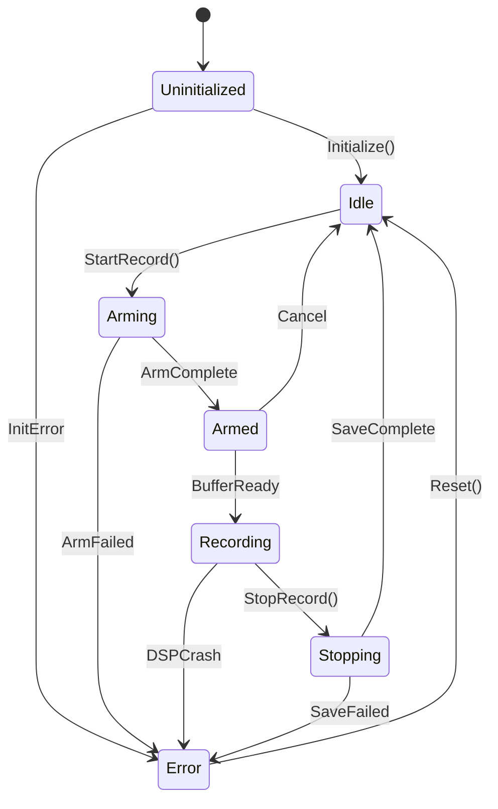
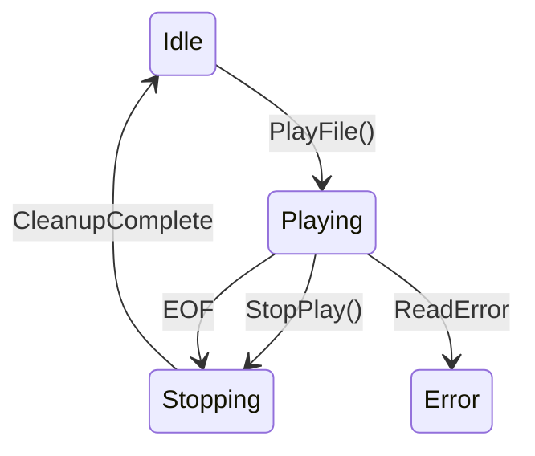
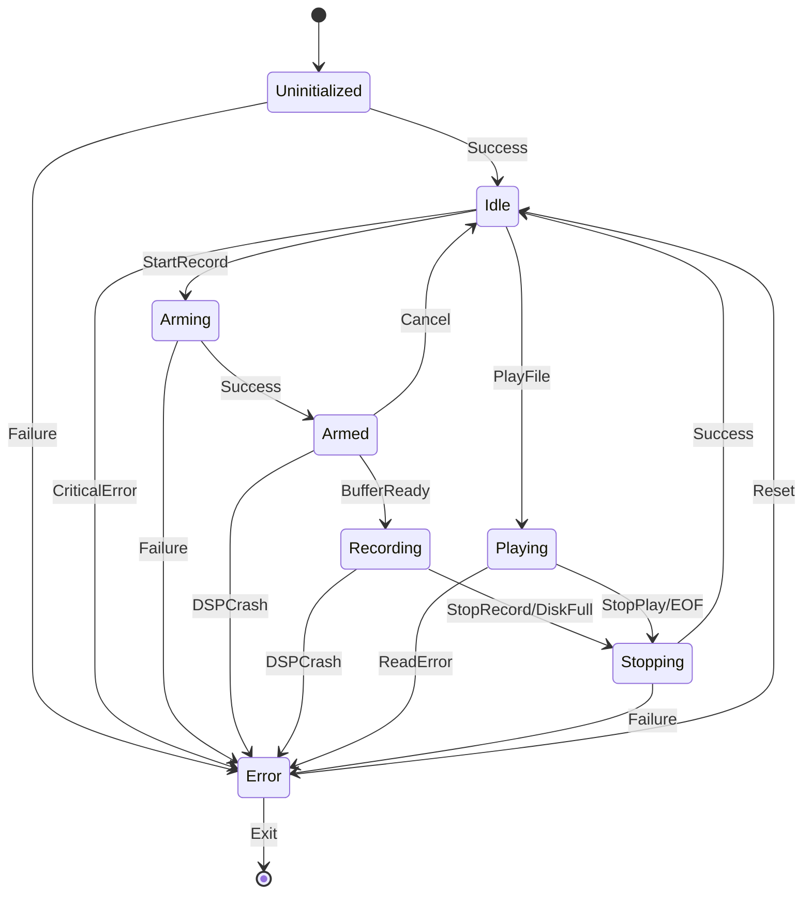
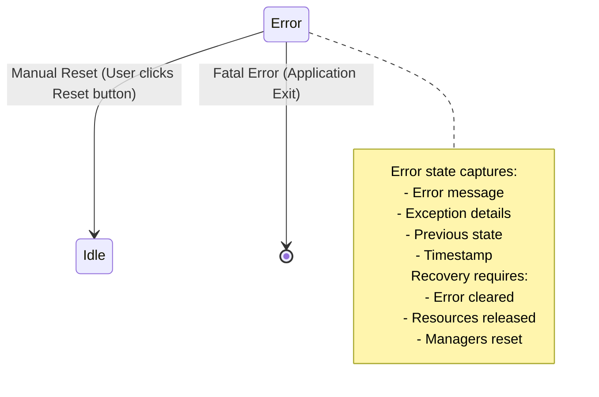

# GlobalStateMachine Design v1.3.2.1
## Hierarchical State Machine Architecture

**Date:** 2026-01-17  
**Version:** 1.3.2.1  
**Status:** ?? DESIGN COMPLETE  
**Purpose:** Define master state machine that controls entire application lifecycle

---

## ?? **OVERVIEW**

The **GlobalStateMachine (GSM)** is the **single source of truth** for the entire DSP Processor application state. It controls lifecycle, validates transitions, prevents invalid state combinations, and broadcasts state changes to all satellite systems.

**Key Principles:**
1. **One Master State** - Application can only be in ONE global state at a time
2. **Validated Transitions** - Only explicitly allowed transitions can occur
3. **Event-Driven** - State changes propagate via events, not polling
4. **Debuggable** - Full state history tracked
5. **Recoverable** - Error state with recovery paths

---

## ?? **PART 1: GLOBAL STATES ENUM**

### **State Definitions:**

```visualbasic
Namespace State
    ''' <summary>
    ''' Global application states - single source of truth
    ''' </summary>
    Public Enum GlobalState
        ''' <summary>Application starting, managers not initialized</summary>
        Uninitialized = 0
        
        ''' <summary>Ready, no activity, microphone not armed</summary>
        Idle = 1
        
        ''' <summary>Transitioning: arming microphone, initializing DSP</summary>
        Arming = 2
        
        ''' <summary>Microphone armed, DSP ready, waiting for record command</summary>
        Armed = 3
        
        ''' <summary>Actively recording audio to file</summary>
        Recording = 4
        
        ''' <summary>Transitioning: stopping recording, saving file, flushing buffers</summary>
        Stopping = 5
        
        ''' <summary>Playing audio file through DSP chain</summary>
        Playing = 6
        
        ''' <summary>Error state - requires manual recovery</summary>
        [Error] = 99
    End Enum
End Namespace
```

### **State Descriptions:**

| State | Purpose | UI Indicator | LED Color | Typical Duration |
|-------|---------|--------------|-----------|------------------|
| **Uninitialized** | App starting | "Initializing..." | Gray | 1-2 seconds |
| **Idle** | Ready, no activity | "Ready" | Orange | User-controlled |
| **Arming** | Arming mic, starting DSP | "Arming..." | Yellow (blinking) | <500ms |
| **Armed** | Ready to record | "Armed (Ready)" | Yellow (solid) | User-controlled |
| **Recording** | Recording to file | "Recording..." | Red | User-controlled |
| **Stopping** | Saving, flushing | "Stopping..." | Orange (blinking) | <500ms |
| **Playing** | File playback | "Playing: {file}" | Magenta | File duration |
| **Error** | Recoverable error | "Error: {message}" | Red (blinking) | Until recovery |

---

## ?? **PART 2: STATE TRANSITION TABLE**

### **Valid Transitions:**

| From State | To State | Trigger | Validation Required | Typical Time |
|------------|----------|---------|---------------------|--------------|
| **Uninitialized** | Idle | Initialization complete | All managers initialized | ~1s |
| **Uninitialized** | Error | Initialization failed | Exception caught | Immediate |
| **Idle** | Arming | User clicks Record button | Device available | Immediate |
| **Idle** | Playing | User double-clicks file | File exists, valid format | <100ms |
| **Idle** | Error | Device lost, critical error | - | Immediate |
| **Arming** | Armed | Microphone armed | DSP thread running | <500ms |
| **Arming** | Error | Arming failed | Device error | Immediate |
| **Armed** | Recording | Buffering complete | Input buffer filled | <1s |
| **Armed** | Idle | User clicks Stop | - | <100ms |
| **Armed** | Error | DSP crash | Thread exception | Immediate |
| **Recording** | Stopping | User clicks Stop | - | Immediate |
| **Recording** | Stopping | Disk full | Write error | Immediate |
| **Recording** | Error | DSP crash | Thread exception | Immediate |
| **Stopping** | Idle | File saved, cleanup done | Buffer flushed | <500ms |
| **Stopping** | Error | Save failed | IO error | Immediate |
| **Playing** | Stopping | User clicks Stop | - | Immediate |
| **Playing** | Stopping | Playback complete (EOF) | Natural end | Immediate |
| **Playing** | Error | File read error | IO error | Immediate |
| **Error** | Idle | User clicks Reset | Error cleared | <100ms |

### **Invalid Transitions (Must Be Prevented):**

| From State | To State | Why Invalid | Correct Path |
|------------|----------|-------------|--------------|
| **Recording** | Playing | Cannot play while recording | Recording ? Stopping ? Idle ? Playing |
| **Playing** | Recording | Cannot record while playing | Playing ? Stopping ? Idle ? Arming ? Armed ? Recording |
| **Armed** | Playing | Must disarm first | Armed ? Idle ? Playing |
| **Recording** | Armed | Cannot re-arm during recording | Recording ? Stopping ? Idle ? Arming ? Armed |
| **Arming** | Recording | Must complete arming first | Arming ? Armed ? Recording |
| **Stopping** | Recording | Must return to Idle first | Stopping ? Idle ? Arming ? Armed ? Recording |
| **Stopping** | Playing | Must return to Idle first | Stopping ? Idle ? Playing |

---

## ?? **PART 3: STATE TRANSITION DIAGRAMS**

### **Primary Flow (Recording):**



### **Secondary Flow (Playback):**



### **Complete State Machine:**



---

## ?? **PART 4: STATE MACHINE CLASS DESIGN**

### **Class Structure:**

```visualbasic
Namespace State
    ''' <summary>
    ''' Global state machine - master controller for entire application
    ''' </summary>
    Public Class GlobalStateMachine
        Implements IStateMachine(Of GlobalState)
        
#Region "Private Fields"
        Private _currentState As GlobalState = GlobalState.Uninitialized
        Private _previousState As GlobalState = GlobalState.Uninitialized
        Private ReadOnly _stateHistory As New List(Of StateTransition)
        Private ReadOnly _transitionRules As Dictionary(Of (from As GlobalState, to As GlobalState), TransitionRule)
        Private ReadOnly _stateLock As New Object()
        Private _errorMessage As String = String.Empty
#End Region

#Region "Events"
        ''' <summary>Raised BEFORE state transition (can be cancelled)</summary>
        Public Event StateChanging As EventHandler(Of StateChangingEventArgs)
        
        ''' <summary>Raised AFTER state transition (cannot be cancelled)</summary>
        Public Event StateChanged As EventHandler(Of StateChangedEventArgs)
        
        ''' <summary>Raised when invalid transition attempted</summary>
        Public Event TransitionBlocked As EventHandler(Of TransitionBlockedEventArgs)
#End Region

#Region "Properties"
        ''' <summary>Gets the current global state (thread-safe)</summary>
        Public ReadOnly Property CurrentState As GlobalState Implements IStateMachine(Of GlobalState).CurrentState
            Get
                SyncLock _stateLock
                    Return _currentState
                End SyncLock
            End Get
        End Property
        
        ''' <summary>Gets the previous state</summary>
        Public ReadOnly Property PreviousState As GlobalState
        
        ''' <summary>Gets the full state history (for debugging)</summary>
        Public ReadOnly Property StateHistory As IReadOnlyList(Of StateTransition)
        
        ''' <summary>Gets the error message (only valid in Error state)</summary>
        Public ReadOnly Property ErrorMessage As String
        
        ''' <summary>Gets whether machine is in Error state</summary>
        Public ReadOnly Property IsError As Boolean
#End Region

#Region "Public Methods"
        ''' <summary>Attempt state transition (thread-safe, validated)</summary>
        Public Function TransitionTo(newState As GlobalState, reason As String) As TransitionResult
        
        ''' <summary>Check if transition is valid without executing it</summary>
        Public Function CanTransitionTo(targetState As GlobalState) As Boolean
        
        ''' <summary>Get reason why transition would fail</summary>
        Public Function GetBlockedReason(targetState As GlobalState) As String
        
        ''' <summary>Enter Error state with message</summary>
        Public Sub EnterErrorState(errorMessage As String, exception As Exception)
        
        ''' <summary>Attempt to recover from Error state to Idle</summary>
        Public Function TryRecover() As Boolean
        
        ''' <summary>Dump state history for debugging</summary>
        Public Function DumpStateHistory() As String
#End Region

#Region "Private Methods"
        Private Sub InitializeTransitionRules()
        Private Function ValidateTransition(from As GlobalState, [to] As GlobalState) As TransitionValidation
        Private Sub RecordTransition(from As GlobalState, [to] As GlobalState, reason As String)
        Private Sub NotifyStateChanged(oldState As GlobalState, newState As GlobalState, reason As String)
#End Region
    End Class
End Namespace
```

---

## ?? **PART 5: TRANSITION VALIDATION RULES**

### **Transition Rule Class:**

```visualbasic
''' <summary>Defines a valid state transition with conditions</summary>
Public Class TransitionRule
    Public Property FromState As GlobalState
    Public Property ToState As GlobalState
    Public Property Description As String
    Public Property Validator As Func(Of Boolean)  ' Optional validation function
    Public Property RequiredConditions As List(Of String)
End Class

''' <summary>Result of transition attempt</summary>
Public Class TransitionResult
    Public Property Success As Boolean
    Public Property OldState As GlobalState
    Public Property NewState As GlobalState
    Public Property FailureReason As String
    Public Property Timestamp As DateTime
End Class
```

### **Validation Matrix:**

```visualbasic
Private Sub InitializeTransitionRules()
    ' Initialization flow
    AddRule(GlobalState.Uninitialized, GlobalState.Idle, 
        "Initialization complete",
        Function() ManagersInitialized())
    
    AddRule(GlobalState.Uninitialized, GlobalState.Error,
        "Initialization failed",
        Nothing)
    
    ' Recording flow
    AddRule(GlobalState.Idle, GlobalState.Arming,
        "Start recording requested",
        Function() DeviceAvailable())
    
    AddRule(GlobalState.Arming, GlobalState.Armed,
        "Microphone armed successfully",
        Function() DSPThreadRunning())
    
    AddRule(GlobalState.Armed, GlobalState.Recording,
        "Buffer ready, start recording",
        Function() InputBufferFilled())
    
    AddRule(GlobalState.Recording, GlobalState.Stopping,
        "Stop recording requested or disk full",
        Nothing)
    
    AddRule(GlobalState.Stopping, GlobalState.Idle,
        "Recording saved, cleanup complete",
        Function() FileWriteComplete())
    
    ' Playback flow
    AddRule(GlobalState.Idle, GlobalState.Playing,
        "File playback requested",
        Function() FileExists() AndAlso FileFormatValid())
    
    AddRule(GlobalState.Playing, GlobalState.Stopping,
        "Stop playback or EOF reached",
        Nothing)
    
    ' Error handling
    AddRule(GlobalState.Error, GlobalState.Idle,
        "Error recovered, reset to idle",
        Function() ErrorCleared())
    
    ' Cancel operations
    AddRule(GlobalState.Armed, GlobalState.Idle,
        "Recording cancelled",
        Nothing)
    
    AddRule(GlobalState.Arming, GlobalState.Error,
        "Arming failed",
        Nothing)
End Sub
```

---

## ?? **PART 6: EVENT SIGNATURES**

### **StateChanging Event (Cancellable):**

```visualbasic
''' <summary>
''' Raised BEFORE state transition - can be cancelled
''' Use this to prevent invalid transitions based on runtime conditions
''' </summary>
Public Class StateChangingEventArgs
    Inherits EventArgs
    
    Public Property OldState As GlobalState
    Public Property NewState As GlobalState
    Public Property Reason As String
    Public Property Cancel As Boolean = False  ' Set to True to block transition
    Public Property CancelReason As String = String.Empty
End Class
```

### **StateChanged Event (Not Cancellable):**

```visualbasic
''' <summary>
''' Raised AFTER state transition - informational only
''' All satellite state machines update based on this event
''' </summary>
Public Class StateChangedEventArgs
    Inherits EventArgs
    
    Public Property OldState As GlobalState
    Public Property NewState As GlobalState
    Public Property Reason As String
    Public Property Timestamp As DateTime
    Public Property TransitionDurationMs As Double
End Class
```

### **TransitionBlocked Event:**

```visualbasic
''' <summary>
''' Raised when invalid transition is attempted
''' Use for debugging and telemetry
''' </summary>
Public Class TransitionBlockedEventArgs
    Inherits EventArgs
    
    Public Property CurrentState As GlobalState
    Public Property AttemptedState As GlobalState
    Public Property BlockReason As String
    Public Property Timestamp As DateTime
End Class
```

---

## ?? **PART 7: STATE HISTORY TRACKING**

### **State Transition Record:**

```visualbasic
''' <summary>
''' Immutable record of a state transition (for debugging)
''' </summary>
Public Class StateTransition
    Public Property FromState As GlobalState
    Public Property ToState As GlobalState
    Public Property Reason As String
    Public Property Timestamp As DateTime
    Public Property DurationMs As Double
    Public Property ThreadId As Integer
    
    Public Overrides Function ToString() As String
        Return $"[{Timestamp:HH:mm:ss.fff}] {FromState} ? {ToState} ({Reason}) on Thread {ThreadId}"
    End Function
End Class
```

### **History Management:**

```visualbasic
Private ReadOnly _stateHistory As New List(Of StateTransition)
Private Const MAX_HISTORY_SIZE As Integer = 100

Private Sub RecordTransition(from As GlobalState, [to] As GlobalState, reason As String)
    Dim transition As New StateTransition With {
        .FromState = from,
        .ToState = [to],
        .Reason = reason,
        .Timestamp = DateTime.Now,
        .ThreadId = Thread.CurrentThread.ManagedThreadId
    }
    
    SyncLock _stateHistory
        _stateHistory.Add(transition)
        
        ' Keep only recent history
        If _stateHistory.Count > MAX_HISTORY_SIZE Then
            _stateHistory.RemoveAt(0)
        End If
    End SyncLock
    
    Utils.Logger.Instance.Info($"STATE: {transition}", "GlobalStateMachine")
End Sub

Public Function DumpStateHistory() As String
    SyncLock _stateHistory
        Return String.Join(Environment.NewLine, _stateHistory.Select(Function(t) t.ToString()))
    End SyncLock
End Function
```

---

## ?? **PART 8: ERROR STATE HANDLING**

### **Error State Entry:**

```visualbasic
''' <summary>
''' Enter Error state with message and optional exception
''' Records error details for debugging
''' </summary>
Public Sub EnterErrorState(errorMessage As String, Optional exception As Exception = Nothing)
    SyncLock _stateLock
        _errorMessage = errorMessage
        
        ' Log error details
        If exception IsNot Nothing Then
            Utils.Logger.Instance.Error($"Entering Error state: {errorMessage}", exception, "GlobalStateMachine")
        Else
            Utils.Logger.Instance.Error($"Entering Error state: {errorMessage}", "GlobalStateMachine")
        End If
        
        ' Force transition to Error (bypasses validation)
        Dim oldState = _currentState
        _currentState = GlobalState.Error
        _previousState = oldState
        
        RecordTransition(oldState, GlobalState.Error, errorMessage)
        NotifyStateChanged(oldState, GlobalState.Error, errorMessage)
    End SyncLock
End Sub
```

### **Error Recovery:**

```visualbasic
''' <summary>
''' Attempt to recover from Error state to Idle
''' Returns True if recovery successful
''' </summary>
Public Function TryRecover() As Boolean
    If CurrentState <> GlobalState.Error Then
        Utils.Logger.Instance.Warning("TryRecover called but not in Error state", "GlobalStateMachine")
        Return False
    End If
    
    ' Attempt transition to Idle
    Dim result = TransitionTo(GlobalState.Idle, "Error recovery attempted")
    
    If result.Success Then
        _errorMessage = String.Empty
        Utils.Logger.Instance.Info("Error recovery successful", "GlobalStateMachine")
        Return True
    Else
        Utils.Logger.Instance.Warning($"Error recovery failed: {result.FailureReason}", "GlobalStateMachine")
        Return False
    End If
End Function
```

### **Error Recovery Paths:**



---

## ?? **PART 9: THREAD SAFETY**

### **Thread-Safe State Access:**

```visualbasic
Private ReadOnly _stateLock As New Object()

Public ReadOnly Property CurrentState As GlobalState
    Get
        SyncLock _stateLock
            Return _currentState
        End SyncLock
    End Get
End Property

Public Function TransitionTo(newState As GlobalState, reason As String) As TransitionResult
    SyncLock _stateLock
        ' All state changes are atomic
        Dim oldState = _currentState
        
        ' Validate transition
        If Not CanTransitionTo(newState) Then
            Return New TransitionResult With {
                .Success = False,
                .OldState = oldState,
                .NewState = oldState,  ' State unchanged
                .FailureReason = GetBlockedReason(newState)
            }
        End If
        
        ' Execute transition
        _previousState = oldState
        _currentState = newState
        
        RecordTransition(oldState, newState, reason)
        NotifyStateChanged(oldState, newState, reason)
        
        Return New TransitionResult With {
            .Success = True,
            .OldState = oldState,
            .NewState = newState,
            .Timestamp = DateTime.Now
        }
    End SyncLock
End Function
```

---

## ?? **PART 10: USAGE EXAMPLES**

### **Example 1: Start Recording**

```visualbasic
' User clicks Record button
Dim result = globalStateMachine.TransitionTo(GlobalState.Arming, "User requested recording")

If result.Success Then
    ' Begin arming process
    Await ArmMicrophoneAsync()
    
    ' Arming complete, transition to Armed
    globalStateMachine.TransitionTo(GlobalState.Armed, "Microphone armed")
    
    ' Wait for buffer to fill
    Await WaitForBufferReadyAsync()
    
    ' Start recording
    globalStateMachine.TransitionTo(GlobalState.Recording, "Buffer ready")
Else
    ' Transition blocked
    ShowError($"Cannot start recording: {result.FailureReason}")
End If
```

### **Example 2: Error Handling**

```visualbasic
Try
    ' Some operation that might fail
    ProcessAudio()
Catch ex As Exception
    ' Enter Error state
    globalStateMachine.EnterErrorState("Audio processing failed", ex)
    
    ' Attempt recovery
    If globalStateMachine.TryRecover() Then
        ShowMessage("Error recovered, ready to continue")
    Else
        ShowError("Unable to recover, please restart application")
    End If
End Try
```

### **Example 3: Subscribe to State Changes**

```visualbasic
' Subscribe to state changes
AddHandler globalStateMachine.StateChanged, AddressOf OnGlobalStateChanged

Private Sub OnGlobalStateChanged(sender As Object, e As StateChangedEventArgs)
    Utils.Logger.Instance.Info($"Global state changed: {e.OldState} ? {e.NewState} ({e.Reason})", "StateObserver")
    
    ' Update UI
    Select Case e.NewState
        Case GlobalState.Idle
            panelLED.BackColor = Color.Orange
            lblStatus.Text = "Ready"
        Case GlobalState.Armed
            panelLED.BackColor = Color.Yellow
            lblStatus.Text = "Armed (Ready to Record)"
        Case GlobalState.Recording
            panelLED.BackColor = Color.Red
            lblStatus.Text = "Recording..."
        Case GlobalState.Playing
            panelLED.BackColor = Color.Magenta
            lblStatus.Text = "Playing..."
        Case GlobalState.Error
            panelLED.BackColor = Color.Red
            lblStatus.Text = $"Error: {globalStateMachine.ErrorMessage}"
    End Select
End Sub
```

---

## ?? **PART 11: INTEGRATION WITH SATELLITE STATE MACHINES**

### **Event Propagation Pattern:**

```visualbasic
' GlobalStateMachine raises StateChanged event
'     ?
' StateCoordinator receives event
'     ?
' StateCoordinator propagates to all SSMs:
'   - RecordingManagerSSM
'   - DSPThreadSSM
'   - UIStateMachine
'   - PlaybackStateMachine
'     ?
' Each SSM updates its local state accordingly
```

### **Example Mapping:**

| Global State | Recording SSM | DSP SSM | UI SSM | Playback SSM |
|--------------|---------------|---------|--------|--------------|
| Uninitialized | Uninitialized | Stopped | IdleUI | Idle |
| Idle | DeviceReady | Stopped | IdleUI | Idle |
| Arming | Arming | Starting | ArmingUI | Idle |
| Armed | Armed | Running | ArmedUI | Idle |
| Recording | Recording | Running | RecordingUI | Idle |
| Stopping | Stopping | Running | StoppingUI | Idle |
| Playing | DeviceReady | Stopped | PlayingUI | Playing |
| Error | Error | Stopped | ErrorUI | Error |

---

## ? **PART 12: VALIDATION CHECKLIST**

Before implementation, verify:

- [ ] All states have clear definitions
- [ ] All valid transitions are documented
- [ ] All invalid transitions are blocked
- [ ] Event signatures are complete
- [ ] Thread safety is enforced
- [ ] State history tracking is implemented
- [ ] Error recovery paths are defined
- [ ] Integration with SSMs is designed
- [ ] Logging is comprehensive
- [ ] Examples cover common scenarios

---

## ?? **REFERENCES**

**Related Documents:**
- Architecture-Assessment-v1_3_2_1.md - Problem analysis
- Satellite-State-Machines.md (next) - SSM designs
- State-Coordinator-Design.md (next) - Event propagation

**Implementation Files:**
- `State\IStateMachine.vb` - Interface (Step 9)
- `State\GlobalStateMachine.vb` - Implementation (Step 10)

---

## ?? **NEXT STEPS**

1. **Review this design** - Validate state definitions and transitions
2. **Proceed to Step 3** - Design Satellite State Machines
3. **Continue Phase 1** - Complete all design documents before implementation
4. **Phase gate review** - Validate all designs together
5. **Begin implementation** - Phase 2 (Step 9)

---

**Design Complete:** ?  
**Date:** 2026-01-17  
**By:** Rick + GitHub Copilot  
**Next Document:** `Documentation/Architecture/Satellite-State-Machines.md`
